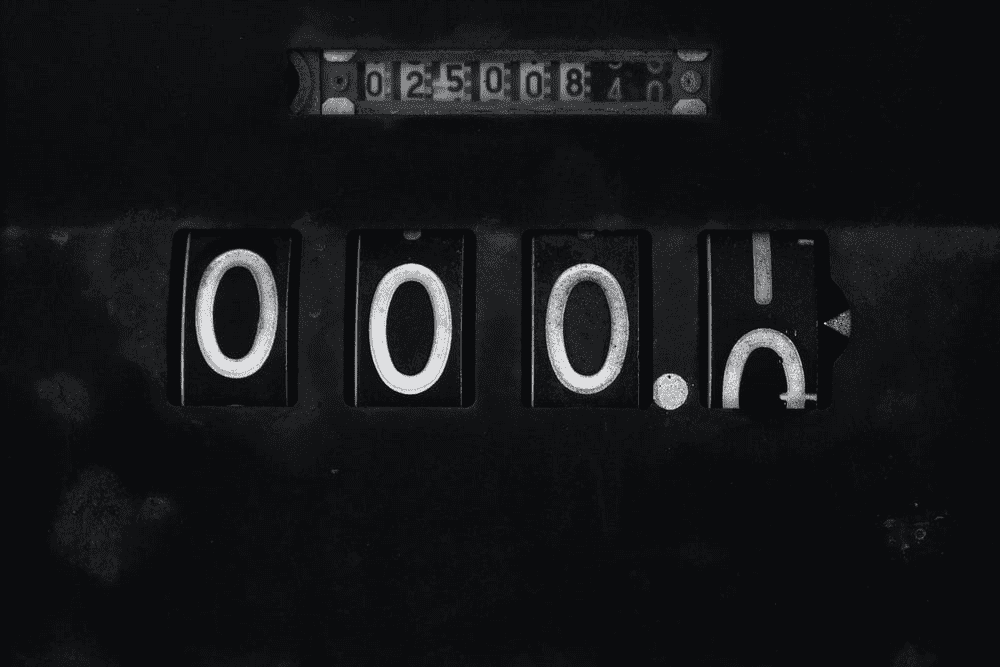

# 从头开始在 React 中重新创建动画数字计数器(比现有的库更好)

> 原文：<https://medium.com/geekculture/recreating-animated-numerical-counters-in-react-from-scratch-better-than-existing-libraries-2fa6d3056b33?source=collection_archive---------16----------------------->

## 另一天，另一个组件进行逆向工程

The classic odometer, the OG animated counter

与之前的帖子一样，这是因为我发现了一个想要复制的 UI 小部件。这一次，它是 Timothée Roussilhe 的美丽的[网站。引起我注意的部分是里程表一样的动画部分计数器:](https://timroussilhe.com/)

Screen-capped from [Tim Roussilhe — Interactive Developer](https://timroussilhe.com/)

*旁注:我知道里程表动画并不是特别新。如果你不想像我一样自己动手做，这里是你应该使用的库。* *(顺便说一下，那个站点是用页面堆砌的，* [*我在 React 之前的一个帖子里逆向工程过的东西*](/geekculture/recreating-page-piling-in-react-for-your-personal-sites-without-extra-libraries-23fcde868ed9) *！)*

我想到了通常的两个想法:1。很好。2.我大概能做到。我做到了！

# 要求

对里程表的要求很简单:

*   如果数字增加，数字应该向上移动到新值。
*   如果数字减小，数字应该向下移动到新值。

(使它成为区段计数器的分母并不重要，因为它是静态的。)

# 我的方法

[你可以在这里](https://weiming-odometer.netlify.app/)看到演示，在这里[看到 Github 回购](https://github.com/weimingw/weiming-odometer)。组件的[特定文件在这里。](https://github.com/weimingw/weiming-odometer/blob/main/src/components/odometer/Odometer.js)

我将在概念层面上解释该组件的作用:

*   像一个真正的里程表一样，我使用独立移动滚动的每个数字的列来重新创建大的数字，所以我为每个数字渲染两次从 0 到 9 的一列数字*(后面将解释原因)。*
*   *`overflow-y: hidden;`、`position: absolute;`和`transform: translateY(x)`创建一个可见窗口，其中列中只有一个数字可见。每个数字都有一个特定的行高(2em)，这使得计算对应于可见数字的`x`值变得很容易。*
*   *动画就是用`requestAnimationFrame()`反复调用一个函数(`tick()`)。`tick()`将“从现在到动画开始的时间”插入到值`x`中，通过一系列增加或减少`x`来创建动画。*

*要将高级描述翻译成代码:*

*   *将`RollingNumber`中的`x`翻译成`currentPosition`*
*   *将`target`解释为我们想要显示的数字。*
*   *`easeInOutCubic`是插值函数，需要存储一个`startPosition`和`endPosition`。(此外，如果`target`在动画中间发生变化，由于我们想要保持动画，我们必须在每次`target`发生变化时重新初始化`tick()`，并使旧的初始化无效。)*

## *现在我将解决房间里的复制大象:为什么渲染 0 到 9 两次？*

*考虑这样一种情况，你必须从 9 增加到 10，一位数从 9 增加到 0。如果列中只有一个 0，那么*动画将从底部数字 9 向上移动*到顶部数字 0，但是*我们希望它向下移动*，但是这要求组件在 9 下面总是有一个 0 数字，如果你在底部，这就不会发生，对吗？*

*第二次渲染 0 到 9，*我可以保证在 9* 下面有一个 0，因为即使窗口显示底部的 9 位数，*我也可以(对最终用户不可见)将* `*translateY*` *偏移到顶部的 9 位数并滚动到那个数字下面的 0！*(从 0 值到 9 值递减时，相同的原则适用于相反方向)。*

*一定要看看演示——它有一个暴露的里程表，你可以看到它在行动！*

# *比图书馆好吗？*

*为什么我声称它比现有的库更好？*

*js 通过只包含带有可视或动画数字的元素来操作 DOM。DOM 操作会导致回流，这是对可见 UI 最耗费性能的一种更新。我通过只操作`transform` CSS 属性来避免这种方法，它只触发一个重画，这是最不耗费性能的类型。*

*与此同时，Tim Roussilhe 的方法使用了`transform`，但是为每个支持的数字呈现了一个数字组合——为他的 19 个支持值呈现了 19 个数字！目前还不错，但当它开始达到数千个时，就根本无法扩展了。与此同时，我的将呈现 20 个新的数字每 10 个新的量级。*

# *外卖食品*

*我从这个练习中学到的是在我的 JS 编码生涯中第一次使用`requestAnimationFrame` 。弄清楚如何进行无限循环也是一次很好的脑力锻炼，我希望这能帮助你在遇到困难的项目需求时跳出框框思考。*