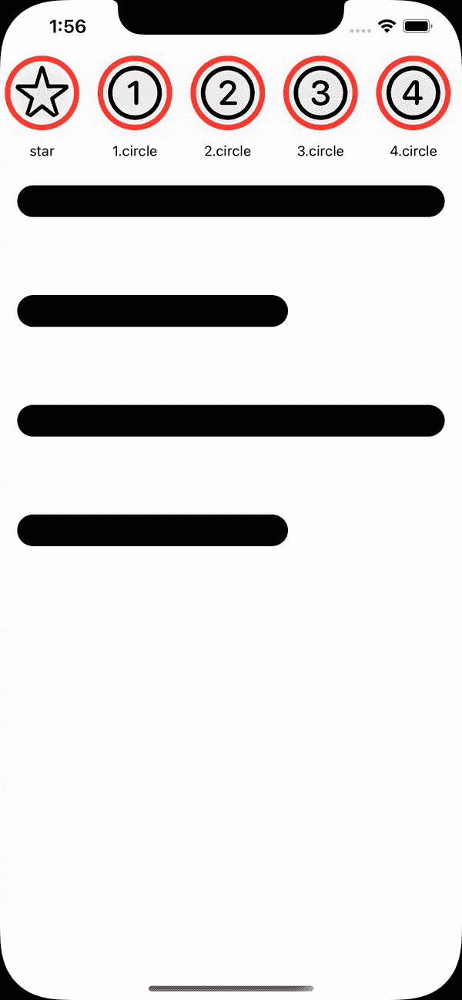

# 用 SwiftUI 重建 Instagram Stories 动画

> 原文：<https://medium.com/geekculture/recreating-instagram-stories-animation-with-swiftui-7f8724c91be8?source=collection_archive---------8----------------------->


Photo by [Alexander Shatov](https://unsplash.com/@alexbemore?utm_source=medium&utm_medium=referral) on [Unsplash](https://unsplash.com?utm_source=medium&utm_medium=referral)

Instagram 是使用最多的社交媒体应用之一。在 Instagram 中打开故事有漂亮的动画。让我们使用 SwiftUI 创建这个动画。

让我们使用非常简单的模型:

```
struct Person: Identifiable {var image: Stringvar id = UUID()}
```

这个动画可以使用匹配的几何效果来实现。我们将在动画出现地方创建一个名称空间。然后我们将创建一个人的样本数组。我们还需要一个状态变量来显示选定的人的故事。

```
@Namespace var namespacevar persons: [Person] = ["star","1.circle","2.circle","3.circle","4.circle","5.circle","6.circle"].map({Person(image: $0)})@State var selected: Person?
```

所以，我们需要两个屏幕。一个是主屏幕，故事显示在屏幕顶部，另一个显示所选人物的故事。为了简单起见，我们假设图像本身是一个故事，将出现在后面的屏幕上。

在上面的视图中，我们显示了人员列表，然后将 matchedGeometryEffect 修饰符添加到 person add 标记 person.id 的图像中。

以类似的方式，我们将 matchedGeometryEffect 添加到所选人员的图像中，并用所选人员 id 进行标记。与此同时，在动画块中包含选定变量的更改。

以下是输出:



这是完整的代码。

感谢阅读:)