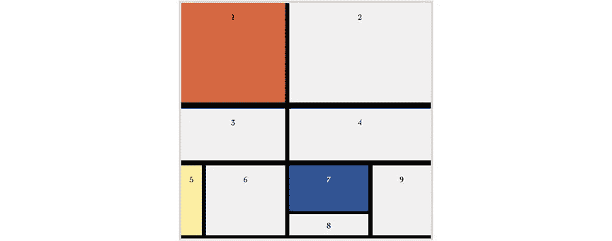

# 用 Bootstrap 5.0 重建蒙德里安

> 原文：<https://medium.com/geekculture/recreating-mondrian-with-bootstrap-5-0-b27f69fd48e3?source=collection_archive---------26----------------------->

Mondrian’s painting re-created in html & css.

# 将设计概念从正方形和线条扩展到行和列

作为设计师，我们可以自由地接触丰富的现代艺术历史。我们可以应用艺术家发明的概念，这些概念已经受到抽象和简化的启发。

## 现代设计的灵感