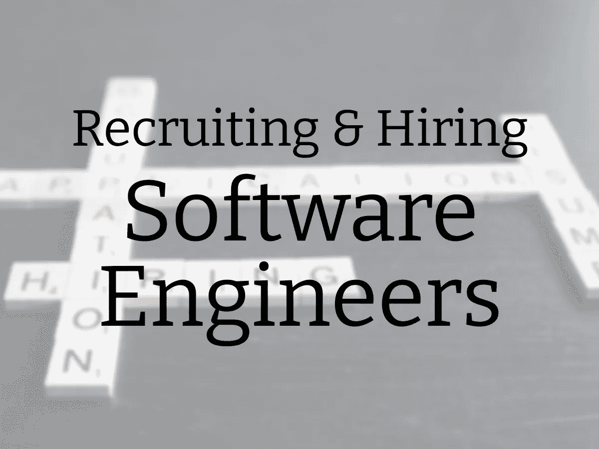

# 招聘和雇佣软件工程师

> 原文：<https://medium.com/geekculture/recruiting-and-hiring-software-engineers-3b6d9588b86d?source=collection_archive---------56----------------------->

===

当我在 2015 年担任第一个真正的管理角色 [Packback 的工程主管时，我继承了一个在我升职之前聘用的伟大的工程师团队。那年晚些时候，到了我自己招聘的时候，我不得不迅速采用一个流程来寻找和聘用新的软件工程师。](https://www.karllhughes.com/posts/packback-engineering)

我从我的前任使用的框架开始，并从 [*Peopleware*](https://www.karllhughes.com/posts/peopleware) 和 Josh Tyler 的 [*构建伟大的软件工程团队*](https://amzn.to/1XQAfT7) 中引入了一些沉重的影响。这些年来，我已经完善了我的招聘流程——主要是通过反复试验——来实现这里描述的迭代。

我的方法有点不合常规，但我希望它能启发你跳出框框思考。这将是一个很长的阅读，所以我把它分成五个部分:

1.  [招聘问题](https://www.karllhughes.com/#the-problem-with-hiring-software-engineers)
2.  [我寻找的技能](https://www.karllhughes.com/#skills-i-look-for-in-software-engineers)
3.  [我如何找到候选人](https://www.karllhughes.com/#how-i-find-software-engineers)
4.  [我如何雇佣工程师](https://www.karllhughes.com/#how-i-hire-software-engineers)
5.  [我犯过的错误](https://www.karllhughes.com/#mistakes-ive-made-when-hiring-software-engineers)

*注意:如果你正在寻找一些书籍来帮助你成为一名软件工程经理，* [*这里有一些我最喜欢的*](https://www.karllhughes.com/posts/reading-for-engineering-managers) *。*

赞助商

## 你的网站想要这样的好内容吗？

在 [Draft.dev](https://draft.dev/?src=karllhughes) ，我们为希望接触软件工程师的初创公司创建技术内容。不要再乞求你的工程师写博客了，现在就开始构建一个高质量、可靠的内容引擎吧。

[了解更多信息→](https://draft.dev/?src=karllhughes)

## 雇佣软件工程师的问题是

任何过去雇佣过员工的工程经理都会告诉你这很难。

有很多限制，没有办法公平地比较两个候选人，对一个团队来说合适的候选人对另一个团队来说可能很糟糕。因为太难了，这个过程已经演变成有利于像面试官一样思考的人，认识公司里的人，或者在高压面试中表现出色的人。这让非传统背景的人陷入困境，经常与不同的候选人竞争，而且与大多数工程师的日常工作完全不同。

例如，一次典型的面试可能需要与测试“软技能”的招聘人员进行电话筛选。接下来，工程经理可能会筛选基本的技术技能，然后候选人可能会被要求完成一个独立的项目或进入办公室进行白板会议。无论是哪种情况，**面试都不像一个工程师的典型工作日**(尽管“带回家”的项目在某些环境下可能是最接近的)。

软技能很重要，但是“告诉我一个……”问题更适合那些能快速编造故事的人，而且他们[不能展示真正的判断力或解决问题的技能](https://www.forbes.com/sites/lizryan/2014/03/04/why-i-hate-behavioral-interviewing/#7229c954693c)。在 30 分钟的电话屏幕中评估一个人的性格是不可能的，所以最好的情况是，你可以淘汰那些完全不可靠或者语言沟通能力差的人。

同样，在一个小时的技术筛选中，很难判断一个人在所有方面的技术能力。web 开发领域(以及一般的软件工程)是如此广阔，以至于没有人能够完全满足你的需求。你可以问他们熟悉哪些技术，看看他们是否能就技术话题进行连贯的对话，但你可能无法碰到他们所有知识的边缘，尤其是如果这些知识与你的知识不重叠的话。

最后，我从来没有和候选人一起做过白板或现场编码会议，但是[很多人真的讨厌他们](https://theoutline.com/post/1166/programmers-are-confessing-their-coding-sins-to-protest-a-broken-job-interview-process)，我认为这是有原因的。在现实世界中，程序员在观众面前用晦涩的算法解决问题，没有时间进行独立研究，也没有资源。如果这是我的日常工作，我绝不会做这份工作。

测试程序员不需要擅长的东西，并期望了解他们如何在你的公司工作是妄想。这种面试只会让招聘团队感觉自己高人一等，并确保拥有传统计算机科学背景的工程师获得更好的结果。

## 我在软件工程师身上寻找的技能

为了围绕软件工程中真正重要的技能重新设计我们的招聘流程，我把这个问题归结为第一原则。在一个软件工程师团队中，我需要哪些技能？

## 倡议

我从来不喜欢对人进行微观管理。我记得在大学时，我是一家餐厅的团队领导，我对那些在顾客排队时站在一旁的人感到不可理喻的恼火。“去，接单什么的！”

我跑题了。

大多数正在找工作的软件工程师都有一定程度的主动性，但是优秀的软件工程候选人总是会付出更多的努力。例如，我和 Packback 公司的一个家伙一起工作，他建立了一个网站和一个非常受欢迎的 Twitter 账户，以跟踪警方扫描仪上的聊天记录。他做这些都是为了好玩学习新东西。

采取主动的软件工程师不会等招聘经理给他们回邮件，他们会询问下一步的计划，并且在参加面试之前就已经了解了这家公司。其实没那么难，但是确实需要时间，很少有考生做到。

## 可靠性

主动是一个开始，但是[我不想要英雄](https://www.karllhughes.com/posts/hero-myth)。我想建立一个由始终可靠的工程师组成的团队，他们会随着时间的推移而改进。

有长期工作经历、强有力的推荐信和对项目的承诺的候选人通常会成为我招聘时的首选。

## 能力

当我还是一名新的工程经理时，我过度强调了技术技能。很容易陷入纯粹根据技术知识给工程师评级的陷阱，但晦涩难懂的琐事并不能造就一名音响工程师。

在这篇文章的后面，我会更多地谈论我如何评估候选人的能力，但我问的关键问题是，**我认为这个工程师能学会解决我们面临的问题吗？**

这不是关于他们是否在第一天就知道所有的答案，相反，我寻找的是充满好奇心的人，他们是终身学习者，有提高自己的动力。如果他们有，我会想办法让他们获得成功的信息。

## 对任务的兴趣

我过去称之为“激情”，但是在例外欢迎播客上的一次生动的谈话之后，我决定重新命名这个技能。

最终，我只想雇佣那些关心我们的行业、我们正在解决的问题以及我们实现目标的方法的软件工程师。如果在他们加入之前我们没有指向同一个方向，我不想花前六周去说服他们。

虽然我不想要绝对的忠诚或住在办公室的人，但我确实认为软件工程师对他们将要做的工作真正感兴趣是很重要的。这会让他们更快乐，这种积极性会感染到每个人。

## 我如何找到软件工程师

多年来，我已经使用了几种方法来寻找和招聘软件工程师。虽然我没有大量的数据来支持这些方法，但以下是我发现对我有效的方法。

## 工作列表

职位列表是求职者的 [*登陆页面*](https://unbounce.com/landing-page-articles/what-is-a-landing-page/) 。

一份引人注目的工作清单应该概述候选人应该知道的工具和语言，候选人将从事的项目，以及尽可能多的关于日常期望的合理信息。我试图让工作列表变得有趣和有创意，所以我通常使用 GitHub 存储库，里面有很多关于我们团队、我们公司和工作面试过程的信息([这里有一个我为 Graide Network](https://github.com/thegraidenetwork/job-openings) 建立的 repo 的例子)。

请记住，你不会只是与候选人分享这个列表。你还可以通过电子邮件将它发送给你网络中的每个人，在社交媒体上分享它，并从你的网站上链接到它。这是一个面向公众的文档，应该美观实用。

## 建立工作关系网

我从来没有花钱去推销一份工作清单，但我怀疑这是否值得，原因如下:

最优秀的软件工程师从来不会主动在求职网上找工作。

他们被锁在被称为“他们的网络”的看门人后面，其中包括前经理和同事、朋友以及在专业机构中认识他们的人。当他们信任的人告诉他们一个很好的机会时，或者当他们决定四处打听时，他们就会跳槽。高级软件工程师经常嘲笑我们从天真的招聘人员那里收到了多少 Linkedin 信息。

那么，建立一个全是软件工程师的网络有什么诀窍呢？

时间。

当我告诉他们[我每周花 4-8 个小时来建设和维护我的网络](https://www.karllhughes.com/posts/the-key-to-networking-keeping-in-touch)时，他们感到很惊讶，但是这项投资的回报是巨大的。每当我有新的职位空缺时，我都会写一份工作清单并开始分发。我有一个很大的名单，上面列着有一天我想一起工作的人，所以我浏览了一遍，然后找个借口去吃午饭。

如果你现在没有积极地建立你的人际网络，开始[写作](https://ctocraft.com/blog/how-to-use-writing-to-build-a-solid-talent-pipeline/)，[演讲](https://www.karllhughes.com/posts/speaking-guide)，和有趣的人会面。这是你职业生涯中最好的投资。

## 冷外联

另一个不受欢迎的寻找软件工程师的招聘工具是 cold outreach。我发现它可以工作，但你必须小心。这很容易给人留下垃圾邮件或令人讨厌的印象。

把冷淡的接触作为扩大你人际网络的借口，而不是直接跳到“要求”上。向人们伸出手，问他们真诚的问题；对他们的背景做一些研究；去了解他们。你只是在交谈，最终，你可能会顺带提到你在留意软件工程师。

在每次通话结束时，询问你是否能在几个月后跟进(令人震惊！)实际去做。我通过这种方式认识了一些杰出的人，即使我们最终没有在一起工作。

## 招聘人员

招聘人员在软件工程界名声不佳，因为他们可能相当烦人。我曾经让初级招聘人员在我工作的时候给我打电话，或者发工作请求到我公司的邮箱。不好看。

另一方面，也有一些人脉广泛、诚实的科技招聘人员。只要准备好支付一大笔钱，因为最好的工作可能是在[保持器上，而不是在应急](https://theundercoverrecruiter.com/contingency-vs-retained-recruiters-what-difference/)上。

即使你找到了招聘人员，你也需要继续招聘。如果你的招聘人员运气不好，你不希望你所有的线索都随着他们而消失。

## 我如何雇佣软件工程师

现在你知道我在寻找什么，我如何开始寻找软件工程候选人，招聘过程的下一步是工作面试。这些年来，我一直在调整这一流程，但在这一点上，我找到了招聘工程师的五个步骤。

## 第一步:信息面试

我没有安排“电话筛选”，而是把我们的第一次电话当作双向信息面试。

候选人需要知道我们是否会合作愉快，我需要知道他们是否具备我上面列出的四种技能。我不会试图去了解高深的技术知识，但如果他们的工作经历或简历中有什么突出的东西，我会问的。我在结束通话时向他们推销这个角色，看看他们对这份工作有多感兴趣。

## 第二步:面对面的配对项目

我曾经把一个“带回家”的项目分配给通过了我的初步电话筛选的候选人。我的想法是，这将给他们一些空间来展示他们的创造力，而且没有时间限制。此外，在候选人完成项目之前，我的团队不需要花太多时间与他们在一起，候选人可以在他们的时间表方便的时候完成工作。

这个独立项目的问题是**它没有告诉我任何关于候选人如何在团队环境中工作的事情**，所以我仍然必须与团队的其他成员进行会谈，以确定他们是否能与每个人融洽相处。

我们也失去了一些优秀的候选人，因为他们没有在项目的“正确”部分投入时间。例如，如果有人没有编写测试或者没有覆盖足够多的案例，他们可能看起来不如编写测试的人好，即使项目没有严格要求。

所以，在 2018 年，我开始为求职者使用面对面的结对编程项目。这更类似于我们团队成员在日常工作中所做的事情，通常比白板或带回家的项目有趣得多。

我通常会选择一个开源项目，其中包含一些我们可以在 2-3 小时内取得进展的问题，安排一个时间与候选人会面，并就一个问题进行结对编程。通过这种互动，我可以评估他们的批判性思维能力(尤其是当他们是领航员的时候)、他们的沟通技巧、他们获取新事物的速度以及我们紧密合作的能力。同样，这也让候选人看到他们是否愿意在接下来的几年里和我一起工作。

最后，如果在第一次信息会议中有任何问题没有得到回答，我们将用更多的问题来结束会议。

## 第三步:会见团队

通过信息面试和技术评估的候选人将与工程团队的其他成员见面。

这是一个机会，让其他工程师看看他们是否认为他们愿意与候选人一起工作，并提出自己的问题。我们通常使用一套问题列表来更容易地比较进入这一阶段的候选人。[杰夫·海曼的书《T3 招募摇滚明星](https://amzn.to/2GVgIQz) ，对于让你的面试问题更加客观有一些很好的见解。

在团队的其他成员见过候选人之后，我会单独询问他们的意见。我曾经让每个人都在一个房间里公开谈论候选人，但这导致了群体思维，最大声的工程师通常会对招聘产生巨大的影响。现在，我衡量我的团队的投入，但不让他们投票决定结果。

## 第四步:证明人调查和录用

在我决定发出聘书之前，我会询问候选人的推荐信。你可能会认为证明人调查是一个简单的步骤，但是我已经有多个候选人写下了不冷不热的证明人。这让我真的怀疑他们的判断，怀疑我是不是还遗漏了什么。

假设他们的推荐信证实了候选人的经历和陈述的工作经历，我会打电话给候选人，给他们一个机会。

我总是在电话里提出报价，然后用电子邮件跟进。在电话中给应聘者一个号码有助于我了解他们是否对此感兴趣，或者我的出价是否太低。这也给了他们一个机会，在花几天时间考虑之前提出任何直接的问题。

## 第五步:入职

当我提出报价并敲定薪酬时，入职流程已经开始。

我试着会见每一位新员工，列出他们头几周的期望，并开一个规划会议，帮助他们快速完成他们的第一个项目。从那时起，入职就取决于新员工的经验水平。如果你想深入了解这个问题，我在这里写了一篇很长的关于我的人才发展和入职流程的总结。

## 我在雇佣软件工程师时犯过的错误

我再说一遍，但是招聘很难。

即使有了完善的流程和相当多的经验，我还是做了一些非常糟糕的招聘。但是，错误是学习过程的一部分，所以如果你是招聘软件工程师的新手，也要做好犯错的准备。以下是我犯过的四个最明显的错误:

## 1.忽略危险信号

这是我迄今为止犯的最大的错误。我雇佣了一个面试迟到 30 分钟的候选人，因为他太忙于当前的工作。当我雇用他的时候，他总是“非常忙”，但从来没有专注于或致力于正确的事情。他做了很多工作，但什么事也没做成。

## 2.关注技术知识而非学习能力

在一轮招聘中，我放弃了几个很有潜力的训练营毕业生，因为我想要一个已经在这个领域工作了几年的人。这似乎是合理的，但我得到的是一个花了很多年用错误的方式做事的人，所以他们带着坏习惯而来，我必须努力去打破。

## 3.在我的网络之前吸引招聘人员

尽管在我的人际网络上投入了大量资金，但我在最初的几次招聘中并没有充分利用它。我很早就向招聘人员求助，虽然招聘人员*可以在*工作，但他们[不是小公司找到最初几名软件工程师的最佳途径](https://blog.ycombinator.com/how-to-hire-your-first-engineer/)。

## 4.没有定义我想要雇佣的技能

我花了很长时间才意识到我需要一个招聘规则。

相反，我寻找一个懂得一套特定语言和框架的候选人，这样我就不必从第一天开始就教他们所有的东西。这让我放弃了几个对我们的使命感到兴奋，但在技术技能上并不完全一致的候选人。

虽然雇佣软件工程师仍然具有挑战性，但拥有一个专注于你需要的技能(包括技术和非技术)的健壮流程会让事情变得更好。反思过去的工作总是有助于我了解如何在未来使我的过程更好，所以我想听听你的意见。

你的招聘流程是怎样的？[在 Twitter 上找到我](https://twitter.com/karllhughes)继续对话。

*注:这篇文章最初发表于 2016 年，但在 2017 年、2018 年以及最近的 2020 年 11 月进行了更新。*