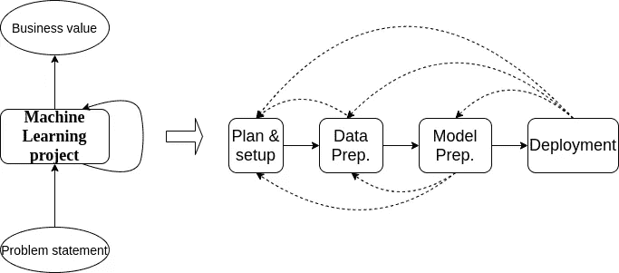

# 机器学习的循环圈

> 原文：<https://medium.com/geekculture/recurrent-circle-of-machine-learning-5aab2ab1a4ac?source=collection_archive---------15----------------------->

## 如何管理一个机器学习项目？

机器学习是通过将产品从规则驱动转向数据驱动来实现软件 2.0 的新工具。机器学习使应用程序和服务从仅仅是交互式的变成个性化的。

尽管机器学习是一个多么热门和时髦的话题，但在现实中，这些项目的失败率令人震惊。关于机器学习项目失败率的一些令人惊讶的数字:

*   Gartner 估计 85%的机器学习项目会失败。
*   [VentureBeat AI 称“87%的 ML 项目从未投入生产”。](https://venturebeat.com/2019/07/19/why-do-87-of-data-science-projects-never-make-it-into-production/)

这些失败以及高成本的主要原因是机器学习和软件开发之间的脱节。软件开发往往是可预测和可测量的。它的生命周期大多朝一个方向流动，**需求- >设计- >实现- >测试- >部署。**

然而，**机器学习仍在研究中**，期望 **100%的成功率是不现实的**。它的生命周期经历了一个循环往复的周期，其间有多次迭代和试验。如此著名的基于敏捷的项目交付可能是意料之外的。要求数据科学家或 ML 工程师在每次站立时展示进展只会导致“如果-否则”子句，而不是神经网络。甚至在规划机器学习项目之前，一些重要的先决条件是:

1.  寻找技术可行性。(在 2021 年，从文本中生成视频作为产品的辅助功能的项目在技术上可能不可行)。
2.  成功标准的清晰性。(应该有清晰度有多准确，推断时间等。在开始之前，情感分析模型必须投入生产。)
3.  领导层的明确期望。(商业领袖需要了解机器学习是如何工作的，以及该项目将带来什么商业利益。)

我们来讨论一个机器学习项目生命周期的轮回圈。

## 计划和设置

启动项目的第一步是要不要启动？你既不需要 JCB 来连根拔起番茄，也不需要机器学习来执行加法。一旦确信它将提供的价值，就应该有一个合适的项目目标。什么样的精度和速度的权衡是可以接受的，可以使用什么样的框架，如何设置代码库，在这个阶段需要所有这些答案。

## 数据准备

在这一步，我们需要从各种来源收集数据。

1.  根据问题陈述准备和处理数据。
2.  如果是监督问题，需要每个数据点的基本事实或标签。
3.  构建数据接收管道。

在做所有这些的时候，我们可能需要回到**计划&设置**阶段，例如:

1.  **获取标注数据太难了。**
2.  **更容易给一项不同的任务贴上标签，而这项任务却能带来相同的商业价值。**

## 模型准备

在这一步，我们有足够的所需格式的数据来为我们的目标任务建立机器学习模型。它包括几个子步骤，如模型构建和调试、模型训练和调整、测试和评估。

*建模调试中，*

1.  建立衡量绩效的基线模型。(例如，用于顺序任务的简单 LSTM，用于图像数据网络类架构等。)
2.  找出任务的 SOTA 模型(如果有的话)并试着复制它们。
3.  找出其他人正在尝试什么或任何预先训练好的模型可用于这项任务(如果有的话)
4.  在早期阶段快速尝试不同的孤立想法。
5.  实现模型并用一些数据点进行训练。
6.  调试实现(如果有)。(75%的时候，这将是一个关于库版本或张量形状的问题。)

*在模型训练和调优中，*

1.  获得所需的基础设施，为培训提供全部数据(如果需要，确定资源和 GPU)。
2.  根据在项目规划阶段定义的成功标准，定义度量标准，例如准确度、精确度等。
3.  训练模型并测量验证集上的指标。
4.  如果拟合不足，即训练数据的度量比基线差，则通过调整必要的超参数来增加模型的复杂性。它可能是层数或一层中神经元的数量等。
5.  如果过度拟合，即训练数据上的指标很棒，但在验证数据上不太好，这是大多数情况，请尝试处理它。你可以尝试不同的正规化方法或辍学方法。也许规范化(新出版的作品更喜欢规范化)会做得更好。
6.  反复调试模型，发现常见的故障模式。

*在测试和评估中，*

1.  评估模型在测试数据分布上的性能。假设您的测试数据分布模拟了真实世界的数据。
2.  重新访问已决定的模型评估指标，以确认模型的性能达到了期望的水平。
3.  还要测试**输入数据管道、模型推理功能、对生产中预期的显式场景的推理。**

在进行该步骤时，如果实现了**收集的数据不充分、特征要求不同或数据标签错误**，则重复回到**数据准备**阶段。

如果**任务太难解决或者无法达到折衷要求，**则返回到**计划&设置**阶段。

## 部署

在这个阶段，您已经准备好了数据管道，所需的模型也准备好了。在试点模式下运行模型几周，评估偏差，处理偏差，然后将模型推广到生产中。

在这个阶段，如果你需要**更精确或改进任何指标**，那么再次回到**模型准备**阶段。

如果生产数据和您的测试数据之间存在**数据不匹配，您收集了更多的数据，或者某些场景模型总是无法正确预测**请回到数据准备阶段并再次涵盖这些步骤。

在考虑了所有步骤后，**如果在准确性和速度方面性能仍然不好，或者在计划时定义的成功标准对于生产**不正确，那么需要从**计划&设置**阶段再次重做整个周期。

**PS:** 从我们之前在 [CSAT 的实验中学习。AI](https://www.csat.ai/) ，我们总是确保在开始项目之前，我们正确地定义了准确度、推理时间和推理成本之间的折衷。作为一名工程师，我们可能总是渴望最先进的东西，但在 GPU 上放置 BERT 以获得 1%的额外情感分析准确性可能不会提供所需的商业价值。

# 参考资料:

 [## 机器学习生命周期| DataRobot 人工智能 Wiki

### 机器学习生命周期是数据科学项目遵循的循环过程。它定义了…

www.datarobot.com](https://www.datarobot.com/wiki/machine-learning-life-cycle/)  [## 全栈深度学习

### 了解如何像专家一样设置机器学习项目。这包括对 ML 生命周期的理解，一个敏锐的…

fullstackdeeplearning.com](https://fullstackdeeplearning.com/spring2021/lecture-5/)