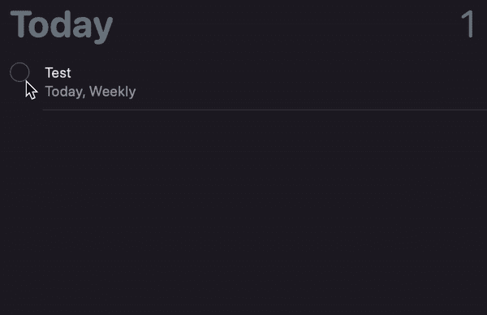

# iOS 开发中 Swift 的重复提醒

> 原文：<https://medium.com/geekculture/recurring-reminders-with-swift-in-ios-development-8deffcb9e8d6?source=collection_archive---------4----------------------->


Photo by [Towfiqu barbhuiya](https://unsplash.com/@towfiqu999999?utm_source=medium&utm_medium=referral) on [Unsplash](https://unsplash.com?utm_source=medium&utm_medium=referral)

在本文中，我们将使用 Swift 创建、更新和删除定期提醒。

处理定期提醒与在 Swift 中处理提醒一样简单。在前一种情况下，焦点主要集中在递归规则上。

# 创建定期提醒

## 递归规则

重复规则可以是简单的每周、每天、每年提醒，也可以是复杂的，如下所示:

```
EKRecurrenceRule(recurrenceWith: .weekly, interval: 1, daysOfTheWeek: [.init(.monday),.init(.tuesday)], daysOfTheMonth: nil, monthsOfTheYear: nil, weeksOfTheYear: nil, daysOfTheYear: nil, setPositions: nil, end: .none)
```

以上复现规则是每周一、周二提醒。

类似地，你也可以设置特定的月/周/日。

setPositions 参数可以与任何其他重复条件组合使用。这是进一步过滤循环条件的数组。

例如，如果提醒如下

```
EKRecurrenceRule(recurrenceWith: .yearly, interval: 1, daysOfTheWeek: [.init(.monday), .init(.tuesday), .init(.wednesday), .init(.thursday), .init(.friday)], daysOfTheMonth: nil, monthsOfTheYear: nil, weeksOfTheYear: nil, daysOfTheYear: nil, setPositions: [1,-1], end: .none)
```

重复仅在每年的第一个和最后一个工作日发生。

添加定期提醒时，以下几个参数非常重要。

1.  dueDateComponents:应完成提醒的日期的日期部分。类似地，也可以添加 startDateComponents。但在创建定期提醒时，dueDateComponents 是必需的。
2.  EKAlarm:添加 EKAlarm 时，建议使用相对于到期日的偏移量。

# 更新定期提醒

更新提醒是一项简单的任务。但是对于重复提醒，完成一个提醒会很有趣。

例如，如果提醒被设置为每周一运行。如果我们完成了那个提醒，它就完成了本周一的提醒，并立即更新到下周。



Completing Recurring Reminder

# 删除定期提醒

删除定期提醒与删除提醒相同。可以使用下面的代码。

感谢阅读:)