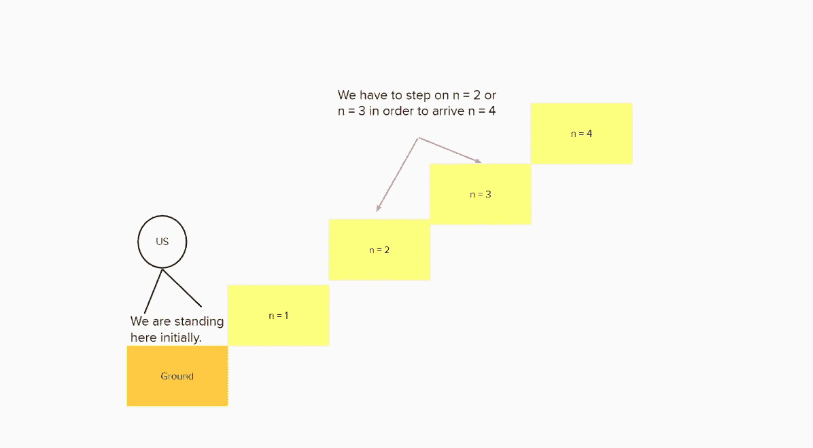
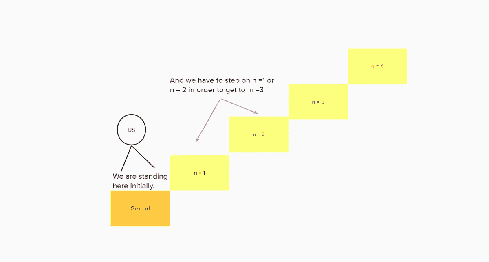
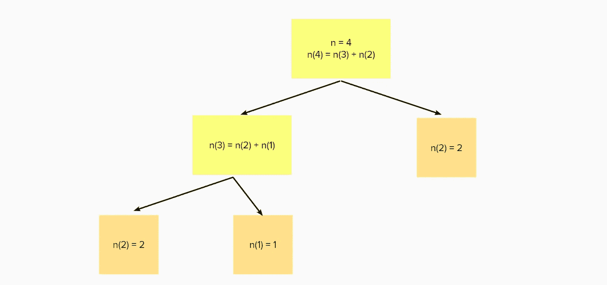
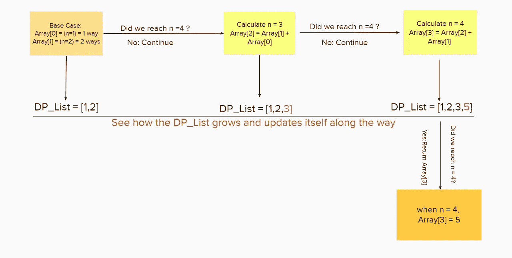
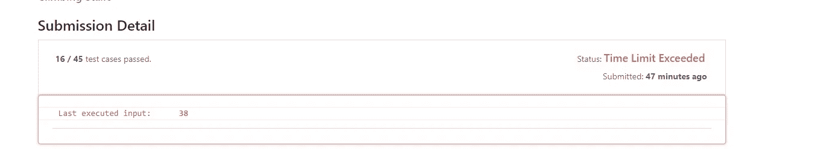
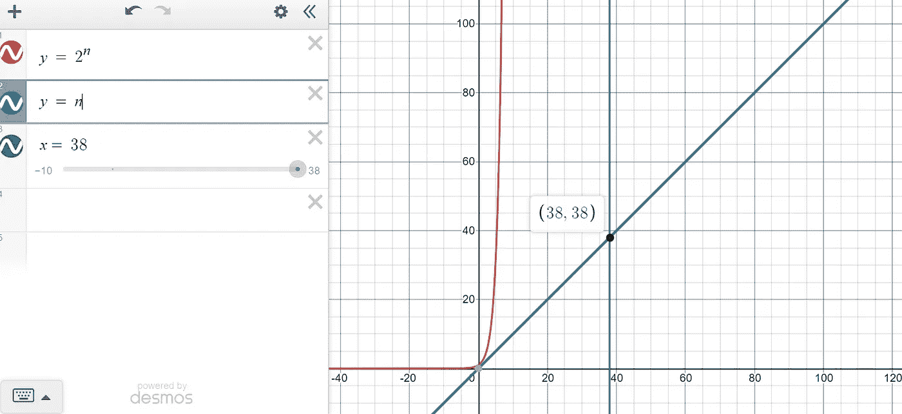
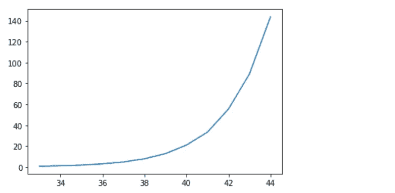
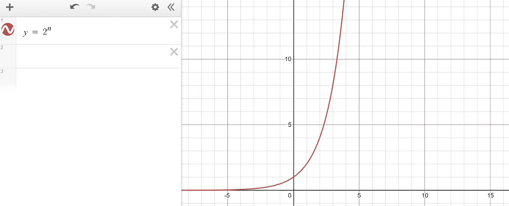

# 递归与动态编程——爬楼梯(Leetcode 70)

> 原文：<https://medium.com/geekculture/recursion-vs-dynamic-programming-climbing-stairs-48032b31db98?source=collection_archive---------2----------------------->

Recursion Pattern Plot, Image by Author

在这篇博客中，我将使用 Leetcode 70。以爬楼梯为例，说明用 Python 进行递归和动态编程的编码逻辑和复杂性。

该项目由**马树恒**建造。要查看使用的完整代码，请找到 [GitHub](https://github.com/hzmsh/DynamicProgramming) 。

**注**:如果你是递归或动态编程的新手，我强烈建议你先看看下面的博客:

> [递归 vs 动态规划——斐波那契](https://towardsdatascience.com/dynamic-programming-i-python-8b20387870f5)

# 第 1 节:递归和动态编程简介

## 1.1 背景

*让我们从什么是递归开始*

**递归**是一个函数调用自身直到到达基本用例的过程。而且在这个过程中，复杂的情况会被递归追踪，变得越来越简单。整个流程的结构是树状的。递归**不存储任何值**，直到到达最终阶段(基本情况)。

而**动态编程**相比简单递归主要是一种优化。主要思想是将原始问题分解成可重复的模式，然后**将结果存储为许多子答案**。因此，我们**不必在以后需要时重新计算**前一步的答案。在大 O 方面，这种优化方法一般将时间复杂度从指数级降低到多项式级。

# 1.2 如何编写递归/动态编程脚本

*动态编程和递归非常相似*

1.  递归和动态编程都是从我们初始化开始的基本情况开始的。

2.在我们写完基础案例之后，我们将试图找到问题逻辑流程所遵循的任何模式。一旦找到了，基本就完事了。

3.主要区别在于，对于递归，我们**不存储任何中间值**，而动态编程却利用了这一点。

让我们爬更深一点的楼梯。

# 第 2 部分:示例:Leetcode 70。爬楼梯

## 2.1 问题提示

> 你正在爬楼梯。到达顶端需要`n`步。
> 
> 每次你可以爬`1`或`2`台阶。有多少种不同的方式可以让你爬上顶峰？

## 2.2 示例

以下是一些易于理解的例子:

> 当 n = 1 时，我们有`*1*`的方法到达那里。我们可以走一步到达 n = 1。
> 
> 当 n = 2 时，我们有`*2*`种方法可以到达那里。我们要么走 1 + 1 步，要么走 2 步就是 n = 2。

# 第 3 节:两种方法

## 3.3 递归方法

让我们从递归方法开始。

## 递归代码

Recursion Code, Image by Author

从上面的代码中，我们可以看到，我们做的第一件事总是寻找**基本情况。**

在这种情况下，基本情况是当 n = 0 时，不需要采取任何步骤。当 n = 1 时，只有一种方法:向上步进 1 个单位。当 n =2 时，为了达到这个目的，我们可以向上 1 + 1 或者向上 2 个单位，总共 2 个方法。

在基本情况之后，下一步是考虑有多少种不同的方式来达到 n 的一般模式。与斐波那契不同，问题提示没有给出模式。

让我们检查一个比基本情况更复杂的情况来找出模式。

## 3.3.2 寻找模式

让我们想想，如果 n = 4 **递归**，我们应该如何处理。

为了步进 n = 4，我们必须步进 n = 3 或 n =2，因为我们每次只能步进 1 或 2 个单位。

Recursion Pattern Plot, Image by Author

为了踩 n =3，我们可以踩 n = 2 或者 n = 1。

Recursion Pattern Plot, Image by Author

但是请注意，我们已经有了 n = 2 和 n =1 的基本情况。

我们知道，如果有 2 个方法去踩 n = 2，有 1 个方法去踩 n = 1。因此，在 n = 3 上总共有三种方法，因为我们必须在 n = 2 或 n = 1 上进行。换句话说，有 2 + 1 = 3 种方法可以得到 n =3。

对于 n =4，我们基本上增加了 n = 3 和 n =2 的不同方法。最终，有 3 + 2 = 5 种方法可以得到 n = 4。

> 一般模式:第 n 级楼梯处的不同路线=路线@ (n-1) +路线@ (n-2)

让我们仔细看看下面的可视化。

## 递归程序图

Recursion Procedure Plot, Image by Author

我们从最上面开始，这里 n[4] = n[3] + n[2]。然后我们会试着求 n[3]的值。最终，当我们到达 n[2] = 2，n[1] = 1 的基本情况时，我们可以简单地从下往上求和，得到 n[4] = 5。

## 3.4 动态规划方法

## 递归代码

Dynamic Programming Code, Image by Author

从上面的代码中，我们可以看到，我们做的第一件事是再次寻找**的基本情况。**

在这种情况下，基本情况将是当 n =1 时，distinct ways = 1，当 n = 2 时，distinct ways = 2，为了实现该效果，我们将这两个条件显式地写在 if 下。

在我们完成基础案例后，我们将创建一个预填充的动态编程数组来存储所有的中间和临时结果，以便更快地进行计算。由于我们不知道可能有多少种不同的方式，我们将**不创建固定长度的数组**，相反，我们将创建**一个在此过程中不断增长的数组**。

我们已经知道 n = 1 有 1 路，n = 2 有 2 路，所以让我们把这两种情况放在 index = 0 和 index = 1 的数组中。

下一步是考虑第 n 级楼梯将产生多少不同路线的一般模式。幸运的是，我们已经在前面的递归部分中找出了模式。

> 一般模式:第 n 级楼梯处的不同路线=路线@ (n-1) +路线@ (n-2)

因此，我们可以使用上面的公式简单地生成每一个楼梯。我们可以将每个楼梯的不同路线的数量存储到沿途的 dp 数组中。

这实际上是动态编程和递归的主要区别。在递归中，我们不存储任何中间结果，而在动态编程中，我们存储所有中间步骤。

为了计算 n = 4，我们会先计算 n =3，**将值存储到我们事先创建的 DP 列表**中。

## 3.4.2 动态编程程序图

Dynamic Programming Procedure Plot, Image by Author

我们从最左边开始，这里数组[0]=1，数组[1] = 2。然后，我们将尝试查找数组[3]的值，对于 n =4，我们将首先查找数组[2]的值，并将它的值存储到 dp_list 中。最终，当我们到达 array[3] = 5 的右侧时，我们可以返回最终结果。

# 第四节:时间和空间复杂性

## 4.1 递归的大 O

对于递归，时间复杂度将是 O(2^(n)，因为每个节点将分裂成两个子分支*(为了精确，我们可以看到它是 O(2^(n-2)，因为我们已经提供了两个基本情况，但是在这一级上真的没有必要区分)*。

并且空间复杂度将是 O(n ),因为树的深度将与 n 的大小成比例

以下是两者的 Leetcode 运行时结果:

Leetcode Recursion Result, Image by Author

## 4.2 动态编程的大 O

对于动态编程，时间复杂度是 O(n ),因为我们只循环一次。正如你在动态编程程序图中看到的，它是线性的。

并且空间复杂度将是 O(N ),因为我们需要将所有中间值存储到 dp_list 中。所以我们需要的空间和给定的 n 一样。

以下是两者的 Leetcode 运行时结果:

Leetcode Dynamic Programming Result, Image by Author

为什么递归方法在 n = 38 时会失败？

让我们看看下面的可视化

## 4.2 时间复杂性的可视化

Time Complexity Speed Comparison, Image by Author

红线代表递归的时间复杂度，蓝线代表动态编程。x 轴表示 n 的大小，y 轴表示算法计算结果所需的时间。

当我们试图计算 **n = 38** 时，它需要我们的动态编程 **38 个单位**来计算值，因为我们有 O(n)用于动态编程。

然而，我们将无法找到解决方案，直到 **2 ⁸ = 274877906944** 递归可以产生一个解决方案，因为它有 O(2^n).这就是为什么 Leetcode 给了我们运行时错误。

# 第五部分:总结与结论

简单回顾一下，下面总结了一些要点:

从上面，我们可以观察到，尽管递归和动态编程都可以处理计算爬楼梯的任务，但是它们在处理中间结果和**时间消耗**方面有很大的不同。动态编程使用同样多的空间，但是它比 T4 快得多。

Recursion Real-Time Complexity Speed Plot, Image by Author

Recursion Method Theoretical Time Complexity Speed Plot, Image by Author

根据上面的图，x 轴表示 n = 35 到 41 时的情况，y 轴表示递归方法根据不同 n 的时间消耗。很明显，时间消耗曲线**更接近指数而非线性。**

尽管这两种算法都需要几乎相同难度的努力来理解逻辑(我希望我的博客能对你有所帮助)，但在你掌握了算法的核心之后，这是值得的，因为大量的数组问题可以通过动态编程优雅而高效地解决。

如果你觉得你完全理解了上面的例子，并且想要更有挑战性的例子，我计划在不久的将来使用动态编程和递归来解决一系列博客中更困难和现实生活中的问题。感谢您的阅读！