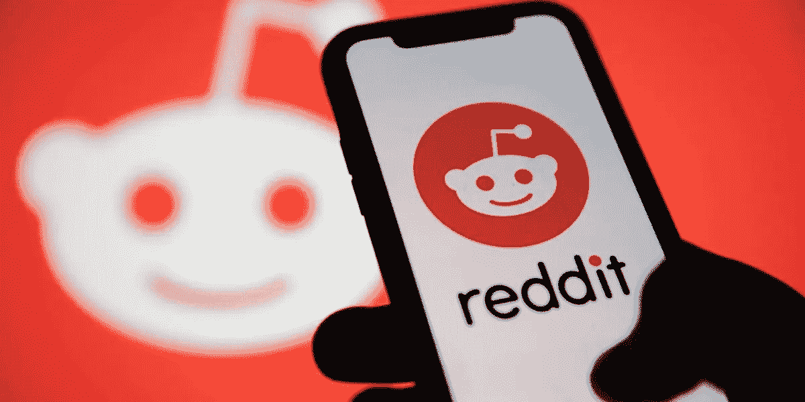
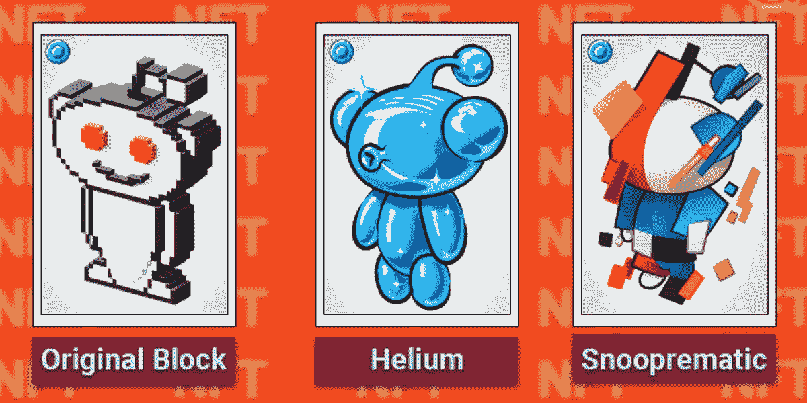

# Reddit 是最新加入 Reddit NFT 头像市场 NFT 竞赛的网站

> 原文：<https://medium.com/geekculture/reddit-is-the-latest-to-join-the-nft-race-with-reddit-nft-avatar-marketplace-b3650984b5b3?source=collection_archive---------12----------------------->

**Reddit Enters Into NFT Space**

Reddit 是一个在线平台，允许参与者发布链接、文本、图像和视频等内容。Reddit 参与者可以对其他平台成员的内容投赞成票或反对票。它目前是全球访问量排名第九的社交媒体平台。它成立于 2006 年 10 月。

参与者可以创建他们的社区，称为子 reddit。Reddit 平台上有超过 130，000 个活跃的子 Reddit。平台用户可以参与任何他们感兴趣的子 reddit，除了私人的。最近 Reddit 宣布他们正在进入 NFTs 的数字领域。它正在 NFT 为 NFT·区块链的用户推出一个虚拟形象市场。

# 为什么要进入 NFT 王国？

NFT 凭借其吸引潜在投资者和交易商的能力带来了巨额利润。NFT 领域吸引了来自不同行业的所有人，因为它的功能可以很容易地集成并从一个用户转移到另一个用户。许多社交媒体平台已经开始测试，并成功推出了连接到其平台的 NFTs 资产和市场。目前，分散的 NFT 市场约为 30 亿美元。NFT 创作者可以利用 [**NFT Reddit 营销服务**](https://www.infiniteblocktech.com/nft-reddit-marketing-services?utm_source=medium&utm_medium=guestblog&utm_campaign=vigneshraju) 来提高他们的项目在平台用户中的影响力。

# Reddit NFT 头像市场

Reddit 平台已经发布了 87 个由艺术家独特设计的 NFT，他们以 9.99 美元到 99.99 美元的固定价格限量发行 NFT。用户可以通过银行支付系统如卡来购买 NFTs。购买后，资产被存储在 Reddit 板载保险库中。买家可以在他们的个人资料上展示这些 NFT，并在 NFT 二级市场上出售。

用户可以参与子 Reddit r/collective avatars 来购买 NFTs，用户首先需要注册他们的钱包，选择他们的基于多边形的 NFT，并定制他们的个人资料。买方将获得购买的新 NFTs 的权利。用户可以在化身生成器中定制有限的 NFT 化身。每一个 NFT 都有独特的编号。这个收藏品在评论区有一个发光的效果。

**Reddit — NFT Avatars Marketplace**

NFT Reddit 的主要目标是将控制权授予为平台贡献作品的创作者。Reddit 发言人 Tim Rathschmidt 告诉 The Verge，它采取措施防止欺诈——这一直是 NFT 市场**的一个问题，也是 Twitter 推出 NFT 图片时的一个问题——与一小群艺术家合作，对他们的参与进行合规检查，并对“所有设计的真实性进行广泛的跨职能审查”。**

**Reddit NFT 头像市场是使用多边形区块链技术开发的，使交易更加节能和快速。在财务方面，Rathschmidt 告诉 The Verge，Reddit 的分成是 5%，包括铸造和区块链费用，并支持 creator 计划。与此同时，剩下的钱归那些有办法让自己的作品“活在 Reddit 虚拟墙之外(并从未来的作品销售中获得报酬)”的艺术家所有。Reddit 也不插手加密货币交易，所有购买都使用政府发行的货币，就像你购买 Reddit 硬币或溢价一样。**

****结论****

**NFT 市场也凭借其知名度吸引了 Reddit 社交媒体平台。Instagram 等许多其他社交网站也计划带着它们的市场和资产进入 NFT 世界。**