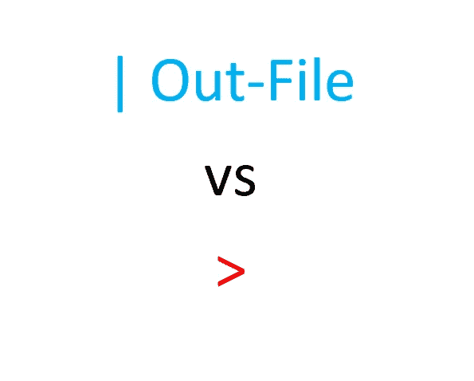

# 重定向 PowerShell 命令的输出

> 原文：<https://medium.com/geekculture/redirect-the-output-of-powershell-commands-779fbe860674?source=collection_archive---------17----------------------->

## 或者抑制它

如果你正在写一个 Powershell 脚本，并且想要**重定向**一些**输出**，这里是你如何做的。