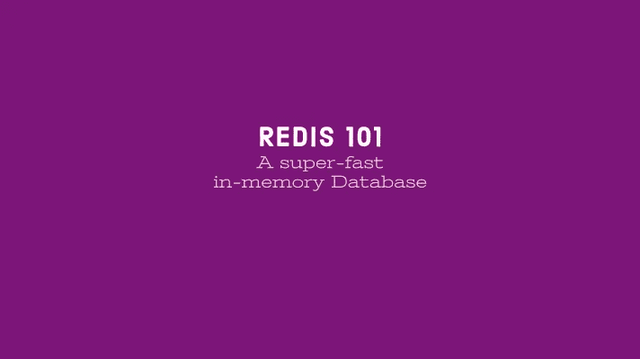

# Redis 101:一个超快的内存数据库

> 原文：<https://medium.com/geekculture/redis-101-a-super-fast-in-memory-database-8a692530805f?source=collection_archive---------12----------------------->

最初发表于 blog.shams-nahid.com 的

Redis 是速度最快的内存数据库之一，与传统的 SQL/非 SQL 数据库有很大不同。最初，它是为缓存而开发的，但简单性和速度使它成为一个完整的内存数据库。

# 为什么是 Redis

当我们将这个 Redis 数据库与传统数据库进行比较时，它在某种程度上是相似的，

*   为应用程序保留数据
*   我们运行查询并获取数据

但是它通过使用计算机内存在数据库中超级快速地存储和检索数据。

> Redis 是一个超快的临时数据库，使用计算机内存，而不是硬盘或任何其他永久存储硬件

Redis 很快，因为，

*   所有数据都存储在内存中
*   使用非常简单明了的数据结构
*   为查询数据提供有限的功能

Redis 将其中的数据结构缩小为 LinkedList、hashMap 或 set 类型结构。

所以 **Redis 很快，因为它很简单**。

# 设计方法学

这种简单性在我们设计数据库时带来了一些挑战，

*   在有限的内存量中拟合数据
*   利用简单的数据结构来保存数据
*   利用数据库及其有限的功能集

Redis 有以下数据集，

*   字符串:普通字符串或数字
*   列表:字符串列表
*   Hash:键值的集合
*   Set:唯一字符串的集合
*   排序集:如果唯一字符串排序，则设置
*   位图:一种布尔集合
*   超级日志:一种布尔集合
*   JSON:嵌套的 JSON 结构
*   索引:内部数据，用于搜索

它还支持使用`watch`和`lock`方法的并发性。

对于传统数据库，我们按如下方式设计数据库，

*   首先，我们将数据保存在表或集合中
*   根据我们需要什么数据来决定我们执行什么查询

对于 Redis，我们采取了相反的方法，

*   首先，确定我们将执行哪些查询
*   根据该查询设计数据

Redis 的另外两个问题是，

*   我们存储的数据类型
*   我们应该关注数据大小吗(例如，静态页面/动态页面)
*   我们什么时候让数据过期
*   我们如何命名密钥
*   任何对业务逻辑的考虑

# 最后的想法

当谈到一个超级快速的内存数据库解决方案时，Redis 可能是一个显而易见的。除了 Redis 本身，所有主要的云服务提供商都管理 Redis 服务。