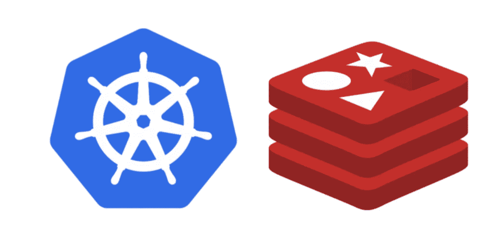

# Kubernetes 上的 Redis 集群

> 原文：<https://medium.com/geekculture/redis-cluster-on-kubernetes-c9839f1c14b6?source=collection_archive---------0----------------------->



在我的前一篇博文中设置了我的 Kubernetes 集群之后，我决定在其上部署一个 Redis 集群。做起来出奇的简单。

首先，我们需要创建一个包含以下内容的`ConfigMap`:

该配置将运行 Redis 集群，并使用 AOF 打开持久性(更多信息，请参见 [Redis 持久性](https://redis.io/topics/persistence))。

将上述内容放在名为`redis-config-map.yaml`的文件中，并在集群上创建它:

```
$ kubectl create -f redis-config-map.yaml
```

为了在 Kubernetes 上运行 Redis 集群，我们将使用一个 [StatefulSet](https://kubernetes.io/docs/concepts/workloads/controllers/statefulset/) 。使用以下内容创建一个名为`redis-sts.yaml`的文件:

这里将会发生的是，在集群的 6 个节点上，我们将运行一个 Redis 实例。这些实例都将使用单独的集群块存储设备来存储它们的 AOF。

继续创建有状态集合，如下所示:

```
$ kubectl create -f redis-sts.yaml
```

现在创建了有状态集，让我们定义我们需要的服务。创建一个名为`Redis-service.yaml`的文件，其中包含以下内容:

```
apiVersion: v1
kind: Service
metadata:
  name: redis-cluster
  namespace: redis
spec:
  type: ClusterIP
  ports:
  - port: 6379
    targetPort: 6379
    name: client
  - port: 16379
    targetPort: 16379
    name: gossip
  selector:
    app: redis-cluster
```

创建服务:

```
$ kubectl create -f redis-service.yaml
```

创建服务后，我们现在可以激活 Redis 集群:

注意，要收集每个 Redis 实例的`ClusterIP`，您必须安装`jq` (参见此处的)。

恭喜你！现在，您已经在 Kubernetes 安装上启动并运行了一个 Redis 集群。

```
selector:app: redis-cluster
```