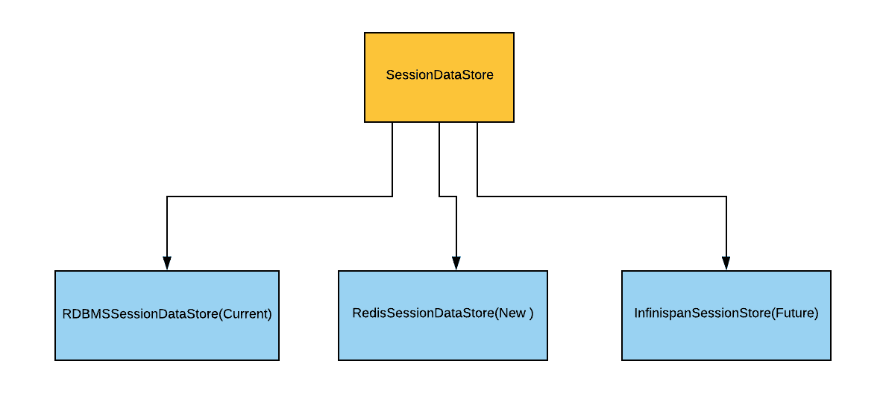
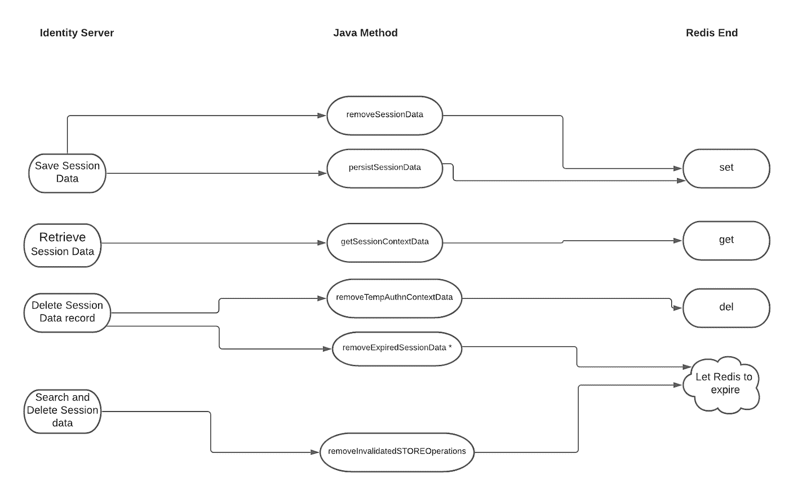

# WSO2 身份服务器的 Redis 会话数据存储实现

> 原文：<https://medium.com/geekculture/redis-session-data-store-implementation-for-wso2-identity-server-6ced4aaef768?source=collection_archive---------20----------------------->

## WSO2 身份服务器

## 在 [WSO2，Inc](https://medium.com/u/4571d92b14fa?source=post_page-----6ced4aaef768--------------------------------) 的 7 个月实习项目

大家好，今天我们要谈谈我在 [WSO2，Inc](https://medium.com/u/4571d92b14fa?source=post_page-----6ced4aaef768--------------------------------) 的实习项目。我们会看到实习从开始到结束，以及时间线里发生了什么。我们一个一个来看。

Photo by [Scott Graham](https://unsplash.com/@homajob?utm_source=medium&utm_medium=referral) on [Unsplash](https://unsplash.com?utm_source=medium&utm_medium=referral)

## 项目选择流程

在我们被选中参加实习后， [WSO2，Inc](https://medium.com/u/4571d92b14fa?source=post_page-----6ced4aaef768--------------------------------) 的不同团队成员进行了项目演示。按照我的要求，我把我最想要的五个项目交给了评选小组。我被分配到[用户会话数据持久化项目](https://github.com/wso2-incubator/identity-session-data-store-redis)。有一个包括我的导师在内的小型项目团队。

## 项目介绍

> 像会话这样的数据记录具有有限的生命周期，往往会呈指数级增长，并且需要高效地访问，因为它是身份认证流程中不可或缺的一部分，需要可靠的存储。目前，WSO2 Identity Server 会话数据存储实现由关系数据库系统提供支持。但是对于大规模部署，最好使用高性能数据存储来归档预期吞吐量。

这是给我的项目说明。描述的解释如下。

> 我需要评估不同的数据库相关解决方案，并选择最适合的解决方案来满足 WSO2 Identity Server 的会话数据存储实现及其功能的要求。

## 技术研究

会话存储必须具有高性能、足够的可扩展性、高[可用性、](https://blog.usejournal.com/availability-with-redis-66611f5a5e2b?source=your_stories_page-------------------------------------&gi=6f55084b3906)更重要的是，解决方案中还需要有[持久性](https://sthenusan.medium.com/data-persistence-with-redis-52b7d7cdfc53)特性。我花了很多时间进行技术研究，并选择了一些解决方案，如 Redis、Infinispan 和 Memcached。

经过项目组的大量讨论，我们最终决定使用 Redis，因为我们拒绝了 Memcached，因为它不具备[数据持久性](https://sthenusan.medium.com/data-persistence-with-redis-52b7d7cdfc53)特性，并且由于 Redis 的可用性特性，我们更喜欢 Redis 而不是 Infinispan。

## 雷迪斯

Redis 代表远程词典服务器。它是内存中的键值数据存储。Redis 支持应用程序的高吞吐量、可伸缩性和可用性。Redis 因其高性能主要用于实时应用。将 Redis 用于 WSO2 Identity Server 中的会话存储使得会话存储具有高可用性、高可伸缩性、高性能和持久性。你可以在这里阅读更多关于 T2 的信息。

Image Source: [https://en.wikipedia.org/wiki/Redis](https://en.wikipedia.org/wiki/Redis)

## 概念验证

在我们选择 Redis 作为最合适的技术后，我们转向了 POC。有效的概念证明可以证明提议项目的目标是可行的，并且将会成功。POC 的价值在于它可以帮助软件工程师识别过程中可能会影响成功的差距。

我只实现了数据持久化 SessionData 方法和 getSessionContextData 方法，以在 POC 级别检查 Redis 的插入和检索功能。我也被迫在 POC 级别做出一些重要的决定。有一个大问题是如何在 Redis 服务器中存储对象和相关的元数据？。经过与项目团队成员的长时间讨论，我们决定将对象存储为序列化数组，将元数据存储为 Redis 中可用的 hashmaps。你可以在这里找到更多关于对象序列化[的信息。我们选择 Redis 散列表来存储会话元数据。因为 Hashmaps 的 Redis 实现保存了大量数据，而不是简单地将其存储为键值对。](https://medium.datadriveninvestor.com/redis-as-object-storage-e6a084b46f8b)

概念验证成功后，我进入了设计阶段。

## 会话存储重新设计

项目团队希望将会话存储实现为可插拔组件，因此我创建了一个名为 SessionDataStore 的抽象父类，并创建了一个名为 redissiondatastore 的子类，它实现了会话存储。新的设计也能够在将来集成新的 SessionStore 实现。

Class Structure of Session Data Store for WSO2 Identity Server

## 系统迁移设计

Basic System Design

上面的设计图显示，数据的插入和删除发生在 Redis 端，通过Redis **Set** 和 **Get** 方法实现。但是数据删除以两种方式发生。这些是 Redis 和 Redis expires 特性的删除方法。让我们假设一个场景，

> 一个用户登录到一个系统，所以一个会话数据被创建，他/她在系统中做一些事情。然后关闭系统而不注销。这意味着会话已创建但未删除。

当这种情况定期发生时，数据存储中将存储大量不需要的会话数据。数据库的大小随着时间的推移而增长。所以我们需要从数据库中删除这些条目。这里我使用了 Redis Expire 特性。所有数据记录在创建时都与到期时间相关联。当一个特定数据被更新时，到期时间也被更新。当用户退出系统时，数据还是会被删除。但是过期的未删除数据将通过此功能自动删除。

## 履行

Photo by [Brett Jordan](https://unsplash.com/@brett_jordan?utm_source=medium&utm_medium=referral) on [Unsplash](https://unsplash.com?utm_source=medium&utm_medium=referral)

因为我们创建了会话数据存储作为高级抽象，所以我只需要为 Redis 的整个流实现 RedisSessionDataStore 类。通过新的设计，每个新的会话数据存储实现都可以简单地插入到 Identity Server 中。Redis 会话数据存储的基本框架能够从抽象父类中获取。实现是从框架开始的。

Redis 会话数据存储是作为 Identity Server 的孵化器而构建的。我创建了一个单独的会话数据存储，也没有 Redis 实现。这将有助于那些不想要基于 Redis 的数据存储，而想用 Infinispan 等其他会话数据存储的用户。因此，用户可以简单地使用 Redis included 实现 Redis 功能，也可以使用 Redis less 实现，然后将 Redis 作为孵化器添加到附加功能中。

我已经给了以下项目中所有可交付成果的网址。你可以从那里下载。

1.  此处给出的项目描述是 GitHub 中的一个问题。
2.  Redis 的会话数据存储实现在这里是。
3.  没有 Redis 的 Session DataStore 实现在这里是。
4.  Redis 孵化器实现在这里给出[。](https://github.com/wso2-incubator/identity-session-data-store-redis/pull/1)

带有 WSO2 身份服务器的 Redis 会话数据存储孵化器的配置在孵化器存储库的 readme 文件中给出[此处](https://github.com/wso2-incubator/identity-session-data-store-redis/blob/main/README.md)。

我相信你已经理解了今天讨论的主题。如果您有任何问题或任何澄清，不要犹豫，通过回复部分与我联系。感谢您花费宝贵的时间阅读这篇文章。

干杯…

Photo by [Nicholas Bartos](https://unsplash.com/@the_socialmotion?utm_source=medium&utm_medium=referral) on [Unsplash](https://unsplash.com?utm_source=medium&utm_medium=referral)