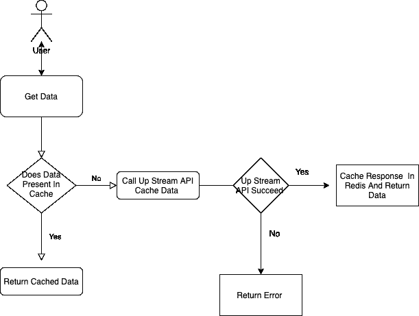
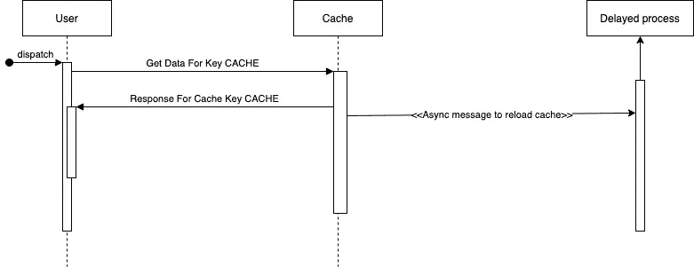

# 通过积极的缓存重载减少服务延迟。

> 原文：<https://medium.com/geekculture/reducing-service-latency-with-aggressive-cache-reload-8e53f0d4a7e6?source=collection_archive---------17----------------------->

Photo by [Morgan Housel](https://unsplash.com/@morganhousel?utm_source=unsplash&utm_medium=referral&utm_content=creditCopyText) on [Unsplash](https://unsplash.com/s/photos/time?utm_source=unsplash&utm_medium=referral&utm_content=creditCopyText)

我们建立了一个新的服务。服务有许多场景，在这些场景中，您的服务需要发出一个远程请求来满足它的需求。也许这些调用是针对另一个服务、某个第三方服务或您的服务数据库的。这些网络调用非常耗时，并且会给整体服务响应增加额外的延迟。

在简单的测试中，一切正常。但是过了一段时间后，由于数据库伸缩的问题，服务开始出现延迟问题，我们的服务所依赖的另一个远程服务也开始出现伸缩问题。这些依赖性开始严重影响服务，服务延迟增加。

所以我们认为缓存数据可以解决我们的问题。我们增加了一个缓存，我们的服务似乎有了很大的改善。我们观察到请求延迟降低了。过了一段时间，没有人能记得缓存前的生活。

我们的缓存工作流程如下所示。

Caching Workflow

但是有一个用例我们还没有处理。也就是说，当缓存中没有一个键的数据时，API 延迟就像以前一样。在这种特殊情况下，服务必须调用上游 API，获取数据，缓存数据并向客户端返回响应。

> 为了解决这个问题，我们增加了主动缓存重载。缓存将在到期前刷新。

下面是我们如何积极地重载缓存。

*   当我们缓存任意键的数据时。我们将添加一个额外的键，告诉我们何时积极地重新加载缓存。这个额外密钥将在实际缓存过期之前过期。
*   假设我们正在缓存 TTL 为 5 天的键“CACHE”的数据。我们还将创建一个 TTL 为 4 天的额外密钥“CACHE_RELOADS_AT”。这个“CACHE_RELOADS_AT”键将告诉我们何时积极地重新加载缓存。
*   当用户调用缓存获取数据时。然后，我们将从缓存中获取缓存的数据，并将其返回给客户端，但我们也会异步检查是否需要重新加载缓存。
*   我们将通过检查缓存中是否存在“CACHE_RELOADS_AT”键来检查这一点。
*   如果缓存中存在“CACHE_RELOADS_AT”键，则我们不会重新加载缓存。如果“CACHE_RELOADS_AT”键不在缓存中，那么我们将在后台异步重新加载缓存。

让我们用图表来看看激进的缓存重载流程。

Aggressive Cache Reload

通过积极的缓存重新加载，我们甚至可以在缓存中没有某个键的数据时减少延迟。

但我们仍然存在缓存首次重新加载时的延迟，我们没有处理此用例，因为我们认为在首次加载时有延迟是可以的，而不是增加我们缓存工作流的复杂性。

还有一种使用情形是，在实际缓存过期之前，用户没有访问缓存数据。在这种情况下，我们也会有延迟。
这个用例可以通过调度一个任务来解决，该任务定期运行以从缓存中扫描密钥，并积极地重新加载它们。
在我们的用例中，我们没有安排定期任务来重新加载缓存，因为我们不想为不太活跃的用户缓存数据。这将为我们节省一些空间。

这就是积极的缓存重新加载以减少服务延迟的全部内容。

如果您觉得有什么遗漏或可以进一步优化，请分享您的反馈。
如果这篇文章帮助你获得了一些信息，请不要忘记鼓掌。

快乐编码。！！！