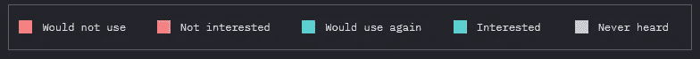
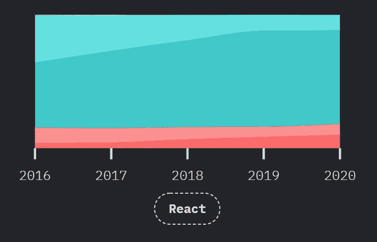
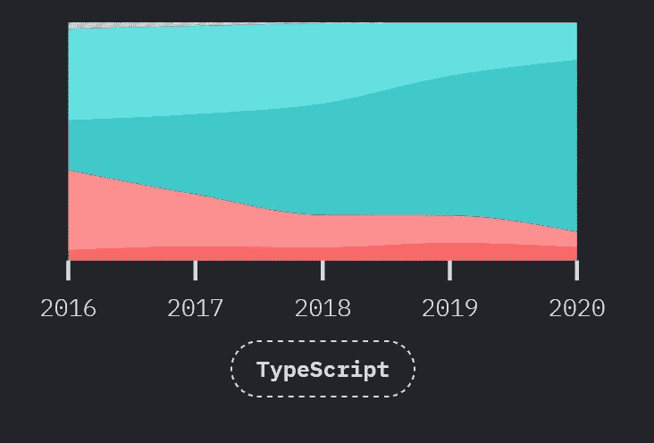
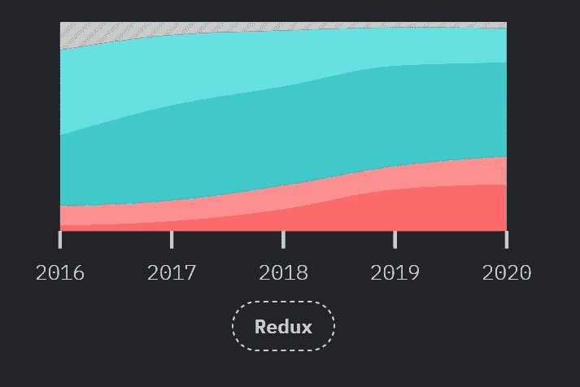
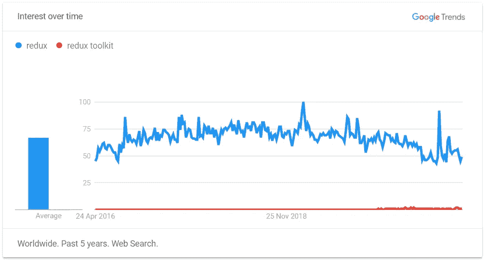
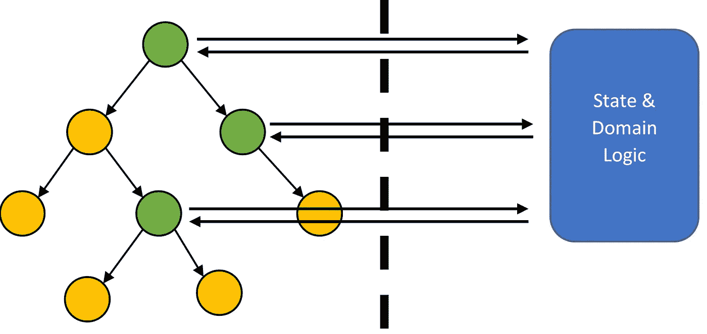
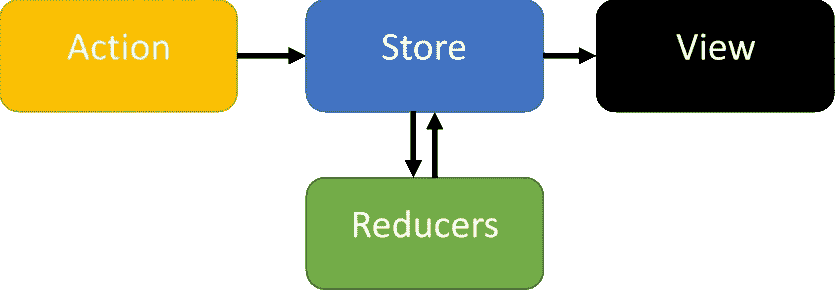
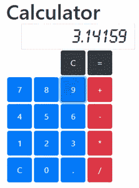

# Redux 重访:React + TypeScript + Redux 工具包

> 原文：<https://medium.com/geekculture/redux-revisited-react-typescript-redux-toolkit-5c813553b535?source=collection_archive---------2----------------------->

在这篇文章中，我将解释 [Redux Toolkit](https://redux-toolkit.js.org/) 如何简化基于 Redux 的应用程序的构建，以及如何将 React 和 TypeScript 完美地结合起来，形成一个全面的大堆栈。

注意:这篇文章最初是在 2020 年 10 月[这里](https://instil.co/blog/react-reduxtoolkit-typescript/)写的，但是为 2020 年发布的[JavaScript 状态](https://2020.stateofjs.com/)更新了。

# 我为什么要说这个？

我想在这里的[Instil](https://instil.co/)—React+TypeScript+Redux Toolkit 上宣传一个我们已经享受并取得巨大成功的堆栈。但是我不确定该谈论哪些方面或者向谁推销。看看 JavaScript 2020 的状态，我知道你们很多人都在用 React 构建应用程序，

[*Front End Frameworks*](https://2020.stateofjs.com/en-US/technologies/front-end-frameworks/)

我还知道，在语言方面，TypeScript 非常流行(虽然不一定和 React 一起)，

[*JavaScript Flavours*](https://2020.stateofjs.com/en-US/technologies/javascript-flavors/)

在管理数据方面，Redux 非常受欢迎，使用率最高，但下面一个有趣的数字是 22.2%的人以前使用过 Redux，但不会再次使用它。

[*Data Layer*](https://2020.stateofjs.com/en-US/technologies/datalayer/)

GraphQL 和像 Apollo 这样的框架越来越受欢迎，我们的一些项目也很喜欢 GraphQL。但是通常需要管理客户端状态。反对 Redux 的部分原因是样板文件的数量和编写完全不可变的 reducers 的不便。Redux Toolkit 可以在这方面提供很大帮助，但是看看 Google Trends，Redux 的搜索数量远远超过了 Redux Toolkit。

所以，在这篇文章中，我关注的是，

*   从视图中分离状态的好处通常
*   快速回顾 Redux 是如何做到这一点的
*   使用 Redux Toolkit 简化 Redux——如果您尝试过普通的 Redux 并发现它很难，这一点尤其重要
*   所有这些都出现在 React 和 TypeScript 的上下文中

我希望在本文结束时，您会发现 Redux 不那么可怕，并鼓励您在 React 项目中尝试将它与 TypeScript 一起使用。我为本文创建的示例应用程序是一个基本的基于 web 的计算器，

我假设你有 React 和 TypeScript 的基本工作知识(尽管可能不在一起或者不在愤怒中)。如果你想更深入地了解我所涉及的任何内容，请鼓掌并在下面留下评论。或者去看看我的[反应和打字教程](/swlh/react-tutorial-build-a-weather-app-from-scratch-part-1-e2f65cd3d112)。

# 分离状态和用户界面

React 是一个完全专注于构建视图的框架，它做得非常好。简洁的语法和 JSX 视图描述符与标准编程元素的交错简化了基于组件的 UI 的构建。

它做得不太好的是处理状态。将状态耦合到我们的视图并通过大型组件树传递状态是脆弱且笨拙的。每当状态由组件拥有时，更多的业务逻辑将驻留在组件中，这使得问题更加复杂。

一个更加优雅的解决方案，将我们的状态和领域逻辑从视图中分离出来。然后我们可以任意选择绑定到哪些组件— **我们只绑定需要的，需要的地方**。

解耦后，状态和域逻辑更容易开发。从业务逻辑中移除视图关注使得调试和测试变得更加容易，并且允许我们关注简单的数据转换。

我们可以将我们的系统建模为数据，并描述我们的数据如何基于进入系统的事件而变化。这允许我们在构建更复杂的应用程序时大大减少认知负荷。

该视图也更容易使用，因为组件更小，并且只关注于根据某种状态呈现模板。重构 UI、拆分或合并组件变得很容易。我们可以很容易地移动和共享状态在树中的位置，因为我们可以任意地将任何状态绑定到视图的任何部分。例如，从屏幕底部的一个组件复制一个购物篮总数到顶部的工具栏，或者利用几个组件的忙碌状态。

# Redux 复习工具

[Redux](https://redux.js.org/) 是一个常见的状态管理框架，通常与 React 成对使用(这也促进了 Redux 支持的功能性和不可变的思想)。

在我们的 Redux 模型中，

*   **商店** —这包含并管理我们的状态
*   **动作** —描述一个状态变化(你可以认为这是一个事件——一个描述变化的简单对象)
*   **动作创建器**功能使生成动作变得更加简单
*   **减速器** —一个 ***纯*** 函数，接受当前状态，一个动作，并将计算下一个状态

因此，总的流程是，我们从某个初始状态开始，然后我们可以**将**动作分派给存储，存储将使用 reducer 来计算新状态。视图监听存储，并在发生变化时得到通知。

不涉及太多细节，系统依赖于状态数据结构的不变性，这就是为什么 reducer 是一个纯函数(没有副作用)。当我们拥有不可变的数据结构时，检查某些东西是否已经改变(并因此知道 UI 是否必须重新呈现)是微不足道的，因为它只是一个引用比较——为了不同，它必须是一个不同的对象。

考虑到我们的计算器应用程序，我们将如何在 Redux 中呈现它？

**陈述——系统需要表现什么？**

*   正在输入的当前数字
*   先前的结果
*   当前操作

**动作——我们的应用程序会发生什么事件？**

*   按下计算器键—这些可以进一步分解，例如数字、运算、等于等

**Reducer —处理动作+状态产生下一个状态**

*   处理按键

# Redux 工具包

在 normal Redux 中实现 actions、reducer 和 state 需要编写大量样板代码。reducer 上的纯函数和不变性约束也使事情变得更加复杂。

在过去，我已经编写了自己的助手来减轻这种情况，但是 Redux Toolkit 现在已经不再需要自己动手了。它很容易添加到项目中:

`npm install --save @reduxjs/toolkit`

最棒的是它附带了 TypeScript 绑定。

# 动作、减速器和切片

工具包提供了创建标准元素的助手——存储、缩减、动作、异步动作等。更有用的是一个**片**的概念，它允许我们在一个容器中设置我们的状态、缩减器和动作。

`reducers`对象定义了函数，这些函数既定义了一个动作，也定义了该特定动作的归约逻辑。更重要的是，reducer 函数可以用不可变的风格编写，返回一个新的状态，或者可以用**可变的**风格编写。工具包使用了另一个库， [**Immer**](https://github.com/immerjs/immer) ，这样就可以使用简单的变异来编写函数。在幕后，Immer 将传递一个代理状态对象，跟踪变化，然后执行所需的不可变转换。这可以极大地简化一些操作，如在深度嵌套的对象结构或数组以及其他数据结构中进行更改。

切片生成纯粹的 reducer 函数和一组可以导出的 action creator 函数。例如，使用我们的计算器，我们最终会得到:

所有这些的伟大之处在于它是类型安全的(并且没有太多额外的注释)。生成的动作创建者，比如`keyPressed`，将基于 reducers 部分中的函数定义采用正确的参数类型。

我们还可以在我们的`createSlice`参数的`extraReducers`部分中包含外部创建的动作(在另一个切片中或者使用创建动作助手)。

# 商店

使用该工具包创建商店也变得更加容易。`configureStore`函数使用一个缩减器创建了一个商店，就像旧的`createStore`函数一样，但是它默认连接了有用的中间件。中间件是 Redux stores 可以扩展到以集中方式处理动作的方式。默认情况下，除了它所连接的工具包之外，您什么也没有:

*   Redux Thunk —允许我们提交函数作为异步动作的动作
*   Redux 开发工具—启用 Redux 开发工具浏览器扩展
*   不变性不变量—确保状态转换总是不可变的
*   可序列化性不变—确保操作和状态总是可序列化的

底部 3 个仅在调试模式下自动启用。

# 易测性

到目前为止，我已经能够在不太关注视图的情况下开发应用程序的核心逻辑。这种关注点的分离是非常强大的。它还有助于测试，因为 reducer 函数是纯函数，我们只需要指定输入和输出。

利用我们通过调用`it`(或`test`)函数来定义测试的事实，我们可以通过使用`forEach`调用来轻松编写参数化测试:

同样，所有这些在 TypeScript 中更好，因为测试数据对象可以是任何形状，但编译器仍然知道类型，并将为我们提供错误检查、自动完成、类型检查、重命名重构等功能。

注意，在 [Jest](https://instil.co/blog/typescript-testing-tips-mocking-functions-with-jest/) 中，`it`和`test`有一个内置的参数化机制，但是它们不像使用`forEach`那样适合复杂的测试数据。

# 连接以做出反应

既然我们已经介绍了如何构建我们的状态和域逻辑，那么让我们深入研究一下视图。该工具包没有帮助将状态连接到 react 视图，但是核心的`[react-redux](https://react-redux.js.org/)`库本身已经发展到支持 Redux 挂钩。这使得使用`useSelector`钩子函数将状态的任何部分连接到组件变得容易。

使用`useSelector`钩子，我们不仅在渲染时使用了这个状态，我们还设置了这个组件，如果这个状态改变了，它会自动重新渲染。请注意，如果有任何状态改变，则不会改变，只是提取的状态。

同样，使用`useDispatch`钩子很容易分派任何动作:

还要注意，这个组件是强类型的。React 也有很好的类型脚本支持，我们可以用`FC`键入我们的功能组件，并添加一个可选的 props 类型，在这里是`ButtonProps`:

TypeScript 将确保道具类型正确，易于销毁，并且我们的组件在 JSX 使用正确。

# 结论

我希望这篇文章能让您对在现代环境中一起使用 React 和 Redux 有所了解，利用 TypeScript 和 Redux 工具包来提高安全性并减少样板文件。我还可以介绍更多的细节，所以请喜欢这篇文章，并在下面为未来文章的其他主题留下评论。

查看我们的[反应](https://instil.co/courses/react-and-redux/)和[打字稿](https://instil.co/courses/typescript-introduction/)课程。我们几乎为世界各地的公司提供服务，并且很乐意根据您团队的水平和具体需求定制我们的课程。来看看我们是否能帮助你和你的团队。