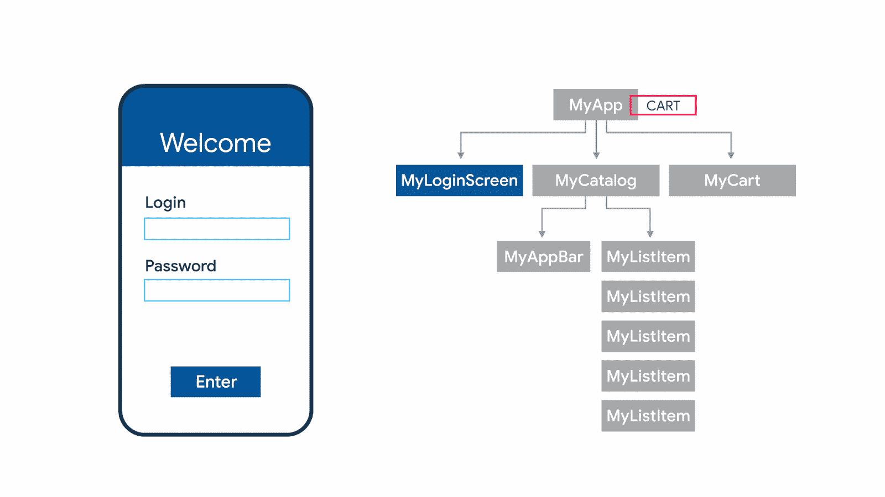

# Redux…简化！

> 原文：<https://medium.com/geekculture/redux-state-management-simplified-c779075ef658?source=collection_archive---------5----------------------->

## 用各种插图和演示来解释状态管理库

Sample E-commerce App Demonstration **©**docs.flutter.dev

在我们真正深入研究 Redux 之前，理解状态管理是很重要的。

状态管理是设计模式的实现，在它的帮助下，我们可以同步应用程序的状态。简单来说，就是对国家的管理…