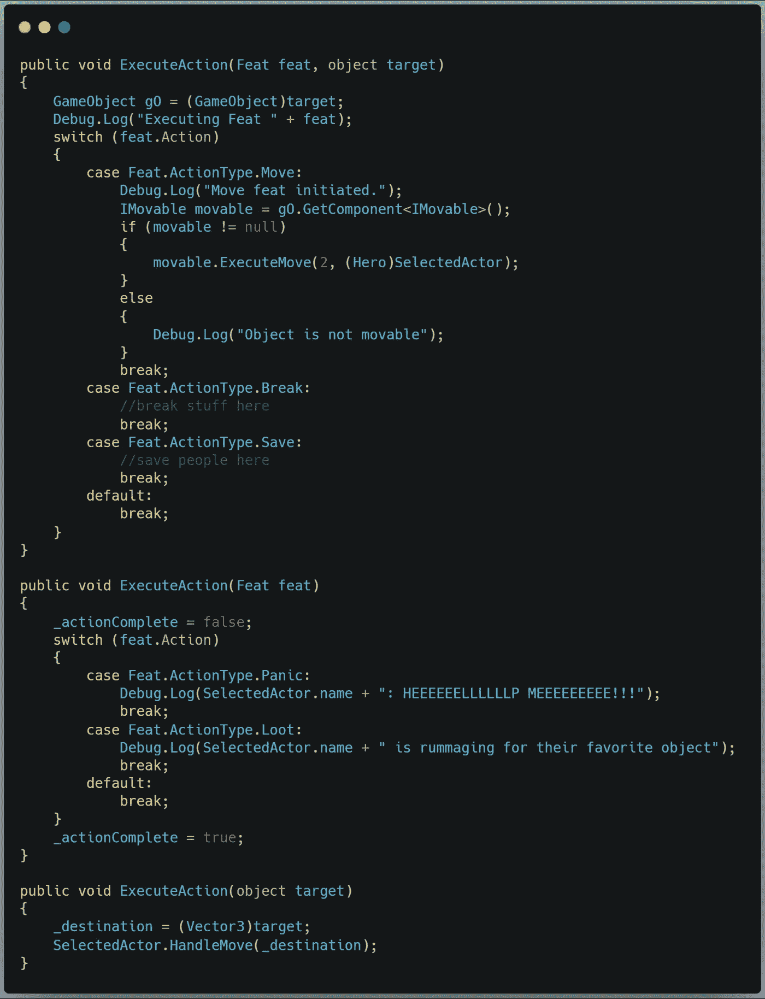
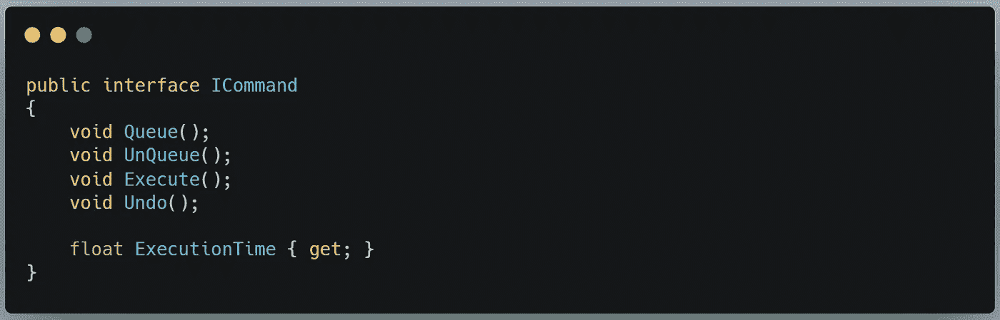
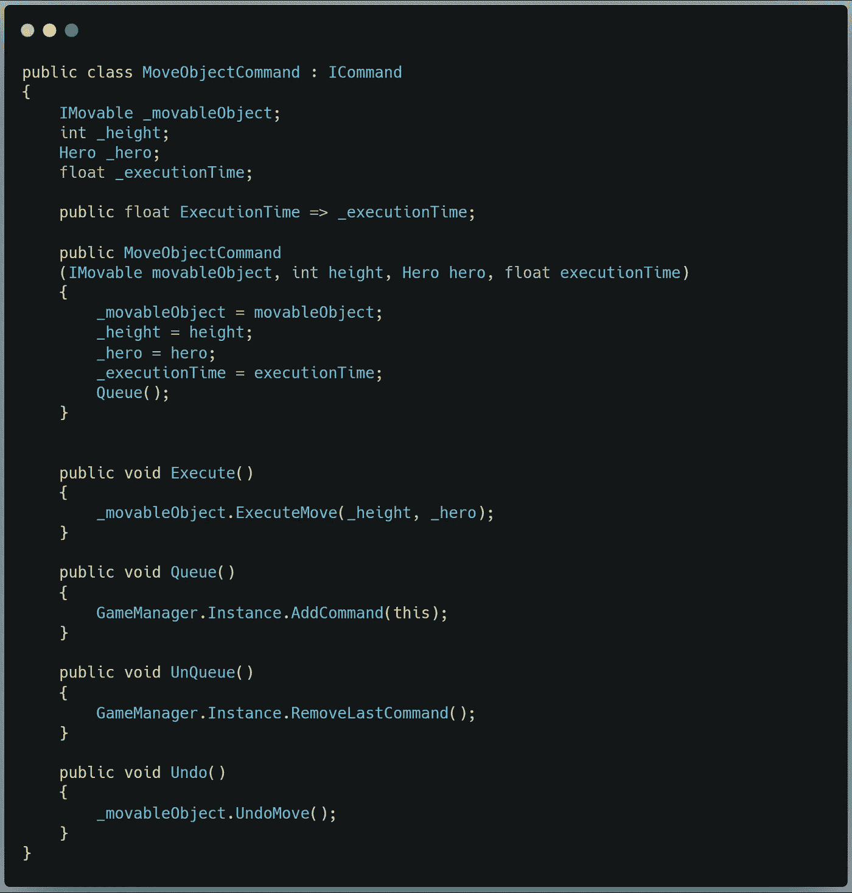
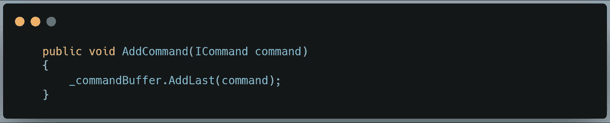
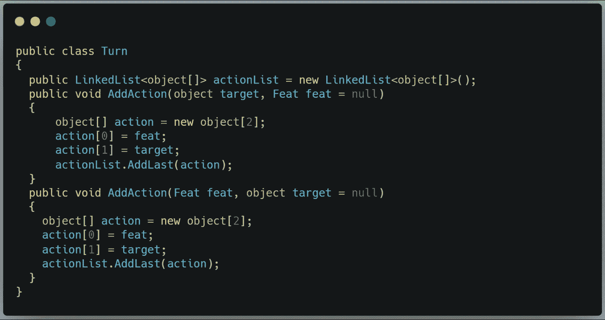
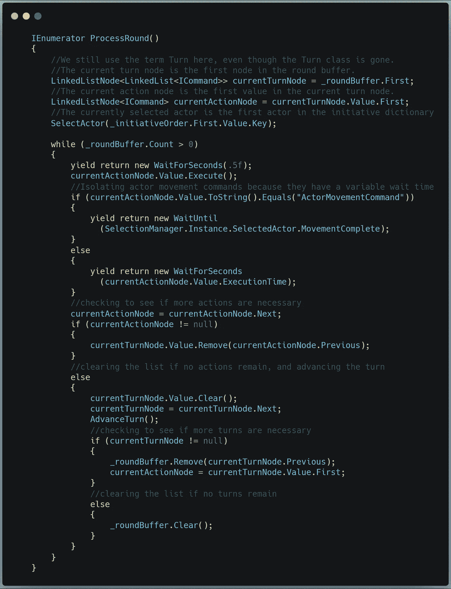

# 重构复杂的代码

> 原文：<https://medium.com/geekculture/refactoring-complicated-code-ad8b09a5b92b?source=collection_archive---------16----------------------->

## 从蛮力到形式优雅

情况是这样的:你已经花了一天左右的时间研究一个复杂的编码问题，并且你已经迭代进入了一个工作系统。任务完成了，对吧？

Right?

慢点，朋友。在您进一步深入之前，是时候清理这些代码了。

找到一个强力的解决方案并不是最终的结果。花一点时间寻找方法来简化你所创造的东西是值得的。搜索重复的代码，并可能将代码隔离到它自己的方法中。看看信息从哪里开始和停止，看看是否可以移动东西来消除依赖性。探索不同的数据结构，看看是否有一个可以帮助您避免昂贵的操作。

今天，我将对我在[之前的](/geekculture/scripting-a-turn-based-tactical-command-system-b14b33000a0f) [两篇](/geekculture/turn-based-tactical-command-system-part-2-f8c57abaec74)文章中概述的战术指挥系统做一些清理。最重要的是，我将重构命令执行系统，通过使用[命令模式](/nerd-for-tech/undo-redo-with-the-command-pattern-in-unity-c-d3b63beab7a4)，减少传递给经理的信息。

**淘汰旧的**

我们首先需要检查的是行尾。我们有两种执行动作的方法。ProcessRoundRoutine 收集所有相关信息，并将其提供给一个无所不包的执行方法。

如你所见，这对于一个班级来说是太多的责任了。我们不需要将所有信息传递到一个位置来执行它。我们可以让已经拥有这些信息的对象执行它们自己的动作。我们只需要获得封装到单个对象中的那些动作的列表，然后传递该对象。这是命令模式的本质。所以让我们准备一个界面和一系列命令对象。

**在用新的**

在这里，我们为这个接口定义了契约，包括添加和删除排队的动作，以及执行和撤销它们。我们还为 ExecutionTime 添加了一个属性，一旦添加了动画，这个属性将变得更加相关。就目前而言，它的作用是防止动作相互重叠。

现在，每种类型的操作仍然需要它自己版本的 execute 方法，所以我们将为每种类型创建一个命令。

下面是 *MoveObjectCommand* 脚本的一个例子:

当然，我们需要一种方法来将命令添加到列表中:

在这一点上，我们可以看到 Turn 类不再有目的。这是它曾经包含的内容:

所有这些信息对参与者都是可用的，参与者现在负责构造和执行他们自己的动作。我们可以完全抛弃这个类，简单地使用 *_commandBuffer* 作为未决动作的列表。

最后，这将我们带到新翻新的*流程 RoundRoutine* 协程:

现在更精简了。这里的大部分操作都发生在一行代码中: *currentActionNode。value . Execute()；*太棒了。不再需要检查含糊不清的通用*对象*类型，运行更少的列表，更少的依赖关系。

使用这个通用的过程，一定要花时间清理和重构你的代码。确保你在你的库的一个安全的分支上工作——当你“修复”它的时候，很容易破坏一些东西。制定一个强力的解决方案并把它留在那里是很容易的，但是如果你这样做了，从长远来看，你可能会让事情变得更难。重构一个刚刚构建好的新系统比以后被迫使用它要好。

今天到此为止。在下一篇文章中，我们将弄清楚处于危险中的人工智能受害者在等待被拯救的时候将如何决定如何处理自己。