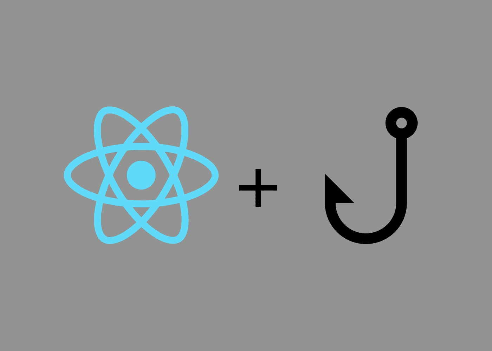

# 用 React 钩子重构你的组件

> 原文：<https://medium.com/geekculture/refactoring-your-component-with-react-hooks-563fa7311f29?source=collection_archive---------19----------------------->

## 以及如何用钩子替换 setState 的第二个参数



React hooks allow you to mimic the behavior provided by class components

# 使用状态

useState 钩子做的和它听起来一样。它允许您在功能组件中使用使用状态。让我们看看在一个类组件中通常是如何做到这一点的，然后使用 useState 钩子对一个功能组件进行修改。

```
import React from 'react'class MyComponent extends React.Component
  constructor(props) {
    super(props);    
   ** this.state = {      
      name: "",
      email: """,
      student: false,
    };** render() {
    return (
      <form>
        {Some JSX Code Here}
      </form>
    )
  }export default MyComponent
```

通常当在一个类组件中创建状态时，你使用构造函数，然后使用 this.state 声明一个状态对象。在这个对象中，你定义一些你想存储在状态中的属性。在这种情况下，我们将拥有 firstName、lastName 和 editingName 属性。

当您想在 React 中更新状态时，可以使用 React 提供的 setState 函数。下面一个更复杂的组件展示了这是如何正常工作的。

```
import React from 'react'class MyComponent extends React.Component
  constructor(props) {
    super(props);    
    this.state = {      
      name: "",
      email: """,
      studentStatus: false,
    }; handleChange(event) {
        event.preventDefault();
        let name = event.target.name;
        let value = event.target.value;

        **this.setState({name: value})**
    }

    handleSubmit(event) {
        event.preventDefault();
        console.log(this.state);
    }render(){
  return (
    <form onSubmit={this.handleSubmit}>
      <label> Name:
      <input type="text" name="name" value={this.state.name} onChange={this.handleChange)} />
      </label>
      <label>Email:
      <input type="text" name="email" value={this.state.email} onChange={this.handleChange}/>
      </label><br />
      <input className="btn" type="submit" value="Submit" />
     </form>
    )
  }export default MyComponent
```

上面的代码将在您使用 onChange 函数键入时更新 state 中相应的值。然后，当提交时，它会将您的更新状态的所有值记录到控制台。很简单。

现在让我们把这个组件修改成一个使用 useState 钩子的功能组件。

首先，我们需要从“react”导入 useState

然后，用 useState 的析构替换构造函数。useState 函数返回一个包含 2 个元素的数组。第一个元素是当前状态，第二个是用于更新第一个状态值的函数。您可以随意称呼它们，但是您将看到的一般语法是['variableName '，' setVariableName']。我们将在这里使用该语法。你也可以传递一个参数给 useState，无论你传递什么，数组中的第一个值将被初始化为等于那个值。

例如，如果您说“[count，setCount] = useState(10)”，您将获得一个名为 count 的状态变量，它将被设置为等于 10。然后，您可以使用 setCount 来更新状态，如下所示:“setCount(count + 1)”，每次调用它时，计数都会增加 1。

```
import React, **{useState}** from 'react'**const MyComponent = () => {**

 **[name, setName] = useState("")
   [email, setEmail] = useState("")
   [studentStatus, setStudentStatus] = useState(false)** fCh(event) { <-- shortened to fit(usually called changeHandler)
        event.preventDefault();
        let name = event.target.name;
        let value = event.target.value; ** if (name === 'name'){
           setName(value)
        } else {
           setEmail(value)
        }** }

    handleSubmit(event) {
        event.preventDefault();
        console.log(this.state);
    }render(){
  return (
    <form onSubmit={handleSubmit}>
      <label> Name:
      <input type="text" name="name" value={name} onChange={fCh)}/>
      </label>
      <label>Email:
      <input type="text" name="email" value={email} onChange={fCh}/>
      </label><br />
      <input className="btn" type="submit" value="Submit" />
     </form>
    )
  }export default MyComponent
```

您会注意到，现在我们有 3 个离散变量来表示状态中的每个值，并且我们有 3 个独立的函数来更新每个值，而不是将状态中的所有值都存储在一个对象中，然后使用 setState 来更新。有很多方法可以设置它，使得每个值仍然包含在一个对象中，并且只有一个函数更新每个值，但是对于初学者来说，我认为用我上面的方法将它分开会更清楚。

# 使用效果

useEffect 钩子是我们如何模仿 React 类组件的生命周期方法的。默认情况下，每个使用效果将在组件首次呈现后运行，然后在组件的每次更新或更改后再次运行。(如果这听起来很像 componentDidMount 和 componentDidUpdate，那你就对了！)

我们在组件内部定义了 useEffect 挂钩，这样它就可以访问我们需要的状态变量。

假设我们想要显示一些依赖于状态的信息，但是要在组件呈现出来之后。在我们的旧类组件中，我们将这样处理它:

```
import React from 'react'class MyComponent extends React.Component
  constructor(props) {
    super(props);    
    this.state = {      
      name: "",
      email: """,
      studentStatus: false,
    };handleChange(event) {
        event.preventDefault();
        let name = event.target.name;
        let value = event.target.value;

        this.setState({name: value})    }

    handleSubmit(event) {
        event.preventDefault();
        console.log(this.state);
    }render(){
  return (
<div>
  **<h1> {document.title} </h1>**
    <form onSubmit={this.handleSubmit}>
      <label> Name:
      <input type="text" name="name" value={this.state.name} onChange={this.handleChange)} />
      </label>
      <label>Email:
      <input type="text" name="email" value={this.state.email} onChange={this.handleChange}/>
      </label><br />
      <input className="btn" type="submit" value="Submit" />
     </form>
    )
  }**componentDidMount(){
  document.title = `{name}'s Profile`
}**export default MyComponent
```

这是一个很傻的例子，因为我们可以用 state，但是主体是一样的。当组件挂载时，componentDidMount 将使用从 state 获取的信息设置文档的标题。

如果您想在您的功能组件中模仿这种行为，您只需使用 useEffect。

```
import React, {useState, **useEffect**} from 'react'const MyComponent = () => {

   [name, setName] = useState("")
   [email, setEmail] = useState("")
   [studentStatus, setStudentStatus] = useState(false)fCh(event) { <-- shortened to fit(usually called changeHandler)
        event.preventDefault();
        let name = event.target.name;
        let value = event.target.value; if (name === 'name'){
           setName(value)
        } else {
           setEmail(value)
        } }
    handleSubmit(event) {
        event.preventDefault();
        console.log(this.state);
    } **useEffect(() => {** **document.title = `{name}'s Profile`****;  
   });**render(){
  return (
  <div>
    **<h1> {document.title} </h1>**
    <form onSubmit={handleSubmit}>
      <label> Name:
      <input type="text" name="name" value={name} onChange={fCh)}/>
      </label>
      <label>Email:
      <input type="text" name="email" value={email} onChange={fCh}/>
      </label><br />
      <input className="btn" type="submit" value="Submit" />
    </form>
    )
  }export default MyComponent
```

同样的事情会发生在上面，文档的标题会被更新，但是只有在组件渲染后才会更新。

## 使用 useEffect 重新创建 setState 的第二个参数

假设您有一个组件，该组件有一个功能，当您单击它时聚焦在文本框上，当您单击外部时移除焦点。

```
useEffect(() => {
  document.addEventListener("mousedown", handleClickOutside);

  return () => {
    document.removeEventListener("mousedown", handleClickOutside);
  };
});
```

首先，您需要添加一个 useEffect，将这些侦听器添加到您的页面中，并调用相应的函数。

使用 useEffect 时，如果您的函数在卸载后需要清理(例如，如果您想清除一个计时器的时间间隔，或者删除一个事件侦听器)，您可以将清理函数放在 useEffect 挂钩的返回值中，该挂钩添加了您想要清理的功能。以上就是你看到的。该代码添加一个 mousedown 事件侦听器，然后在组件从页面卸载后移除它。

在这个组件中还有

```
onTextChange = (event) => {    
  if (event.target.value !== this.state.textContents + "\n") {
      this.setState({ textContents: event.target.value }, () =>
        this.textInput.current.focus()
      );
    }
  };
```

这里你会看到 setState 函数有一个回调函数的第二个参数，它的作用是关注包含文本输入框的 ref。之所以将它放在 setState 函数中，是因为只有通过这个特定的函数才能在状态更新后立即调用这个函数，并且它可以访问更新后的状态值。由于 setState 是异步的，如果这个函数不在 setState 函数中，您不能保证它将使用最新版本的 State 运行。

现在这个有点难以模仿，但我们可以通过创建另一个 useEffect 来实现相同的效果，但只在特定状态属性更新时运行，而不是在每次更新或第一次渲染时运行。

[这篇栈溢出文章](https://stackoverflow.com/questions/59677451/setstate-second-argument-callback-function-alternative-in-state-hooks)非常好地解释了如何更详细地完成这项工作，但是你想要做的是创建一个 useEffect 函数，并给它一个所谓的*依赖数组。*依赖数组是您希望更新以触发此特定 useEffect 的所有变量的列表。

这是我们新功能组件的外观:

```
const onTextChange = (event) => {
  if (event.target.value !== textContents + "\n") {
    setTextContents(event.target.value);
    setEditingText(false)
  }
};useEffect(() => {
  const textInput = textInput.current;
    if (textInput && editingText) {
      textInput.focus();
      const endOfInput = textInput.textLength;
      textInput.setSelectionRange(endOfInput, endOfInput);
    }
 }, [editingText]);
```

因此，第一个 onTextChange 函数使用 useState 提供的 setTextContents 函数来更新 TextContents 状态变量，并使用 setEditingText 函数将 EditingText 变量更改为 false。这意味着我们已经完成了对组件的编辑。

然后，具有 editingText 的依赖数组的 useEffect 将注意到 editingText 已更改，它将运行代码，以便在用户编辑文本时聚焦于文本框并添加光标，或者在更新完成时不聚焦于文本框并移除光标。

使用“const textInput = textInput . current”的原因是，在定义 textInput ref 导致错误之前，代码不会在初始呈现时运行。

现在你知道了。您的组件应该使用 React 钩子完全重构为一个功能组件！