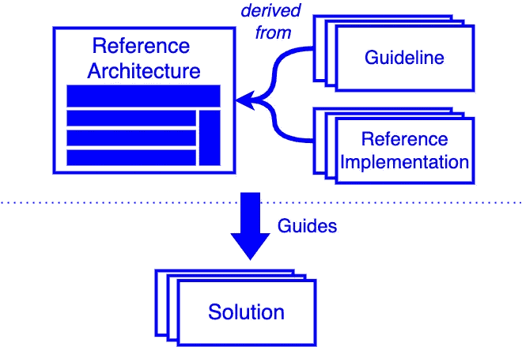

# 参考架构

> 原文：<https://medium.com/geekculture/reference-architectures-e98595545baa?source=collection_archive---------2----------------------->

## 不要重新发明轮子——使用一种经过尝试和测试的方法

Image by author

随着技术的普及、集成复杂性的增加和分布式多供应商开发，组织比以往任何时候都更需要“千篇一律”的解决方案。

这篇文章概述了参考体系结构(RA)，包括优点、示例和实用指南…