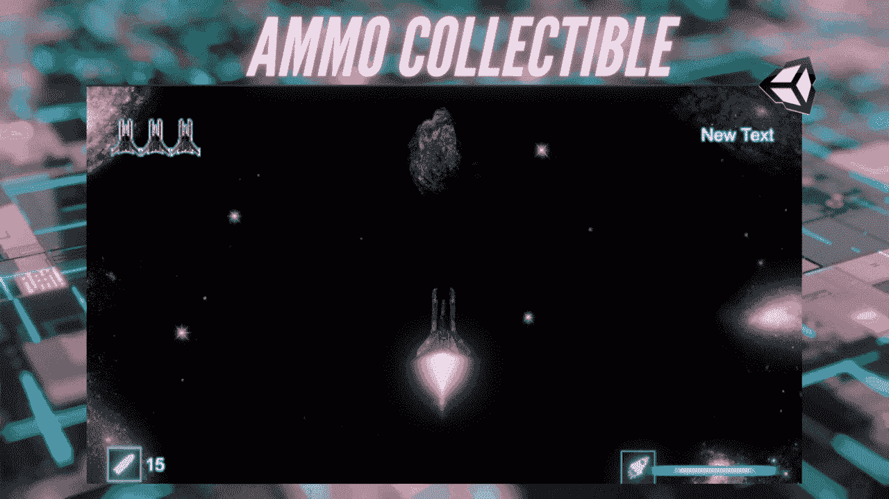
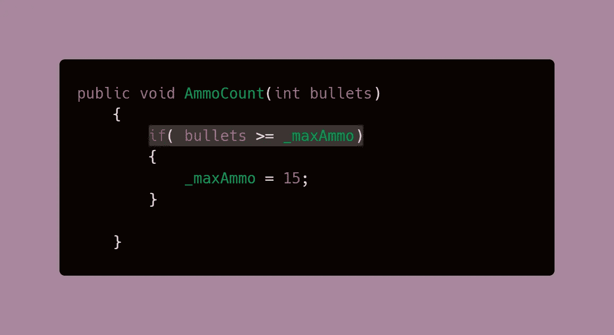
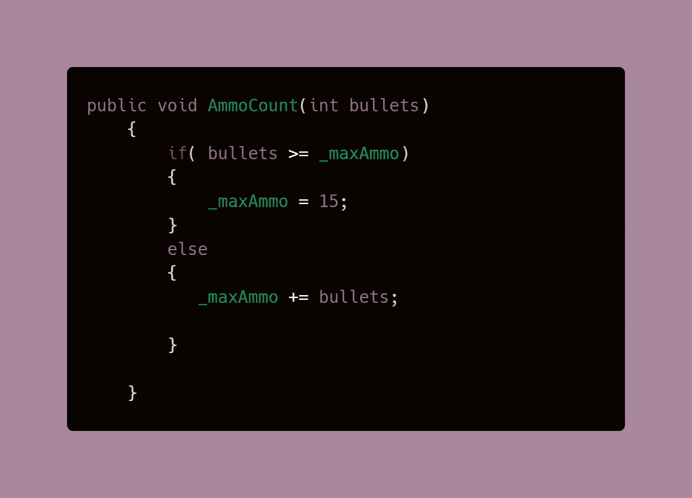
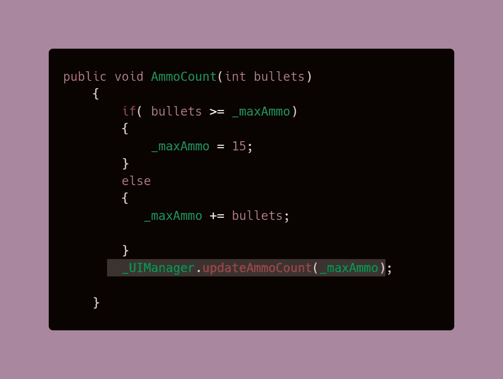
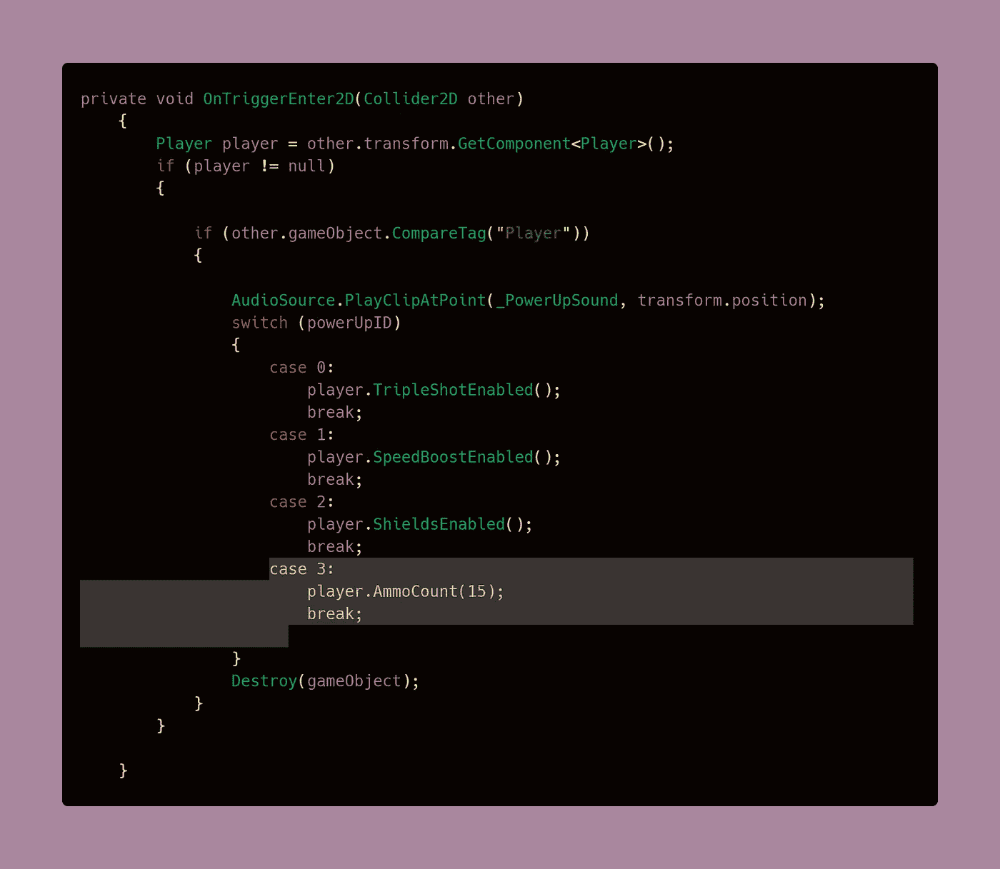
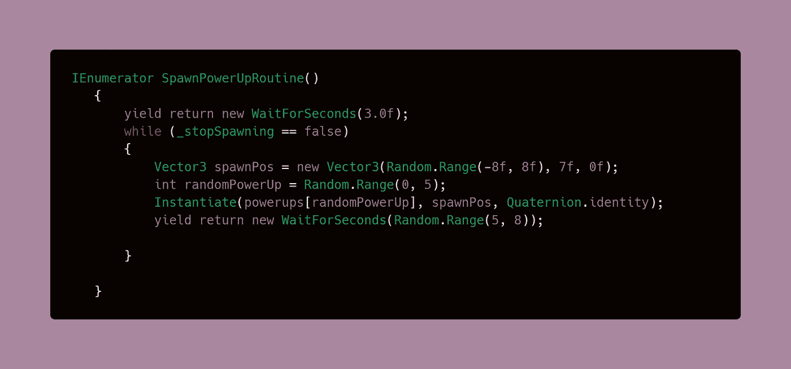
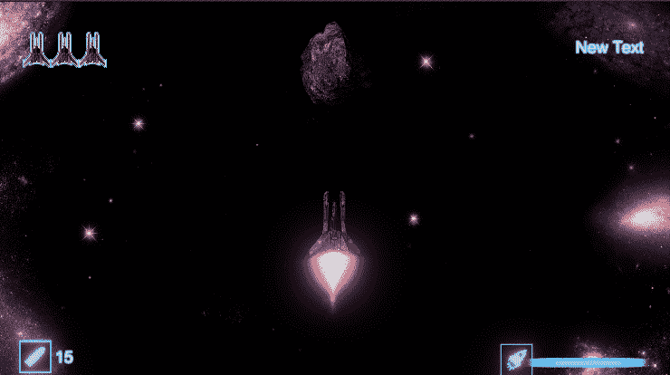

# 在不超出弹夹容量的情况下补充玩家弹药

> 原文：<https://medium.com/geekculture/refill-player-ammo-without-overshooting-the-clip-capacity-1e9a890857d2?source=collection_archive---------49----------------------->

在[的前一篇文章](/geekculture/simple-ammo-count-system-in-unity-af48844c0dd6)中，我谈到了如何编写一个弹药计数 UI，当玩家开枪时，它会减少，当子弹用完时，它会停止射击。有限的弹药带来了补充的弹药收集来平衡游戏——我们不能让玩家在没有子弹的情况下无限期的跑来跑去，对吗？

**目标**:创造一个弹药收集物，为玩家补充弹药。

# 防止该值超过限幅容量

本教程使用了 Unity 中 [**简单弹药计数系统的代码，重点放在编程方面。因此，之前已经介绍过的**](/geekculture/simple-ammo-count-system-in-unity-af48844c0dd6) **[**精灵动画**](/codex/animating-a-sprite-with-unitys-animation-window-b049493f69a1) 就不在本文介绍了。**

1.  因为我们这次增加了弹药数量，我们需要确保弹药不会超过弹夹的容量。为了实现这一点，我们可以对简单弹药计数系统代码中的 AmmoCount 方法进行简单的修改。

这个 if 语句检查增加的子弹数量是否大于或等于武器的最大弹药容量。如果是的话，最大弹药将总是被赋予它的默认值，这样它就不会超过这个数。

> **注**:在上一篇文章中 **_maxAmmo** 变量**曾被称为 _ammoCount** 。这一次我改变了它来可视化武器的弹夹容量或最大弹药。然而，这种名称的改变并不会改变任何功能，不管您如何命名，都应该完成相同的功能

2.AmmoCount 方法的后续代码将仅在位置上发生变化。现在，只有当项目符号不超过最大值时，它们才会被增加或减少。

3.更新 UI 的方法将被放在 if-else 语句之外，因为我们需要它来更新显示的数字，而不管它是被减、加还是缺省。

# 为收藏品编程

我的弹药收藏品将以加电的形式出现，因为我目前正在开发一款复古的 2D 太空射击游戏，然而，这段代码适用于任何类型的收藏品，只要它使用[碰撞系统](https://levelup.gitconnected.com/oncollisionenter-vs-ontriggerenter-when-to-use-them-56d42772dd22)来检测玩家何时捡起它。由于是加电，本节将使用来自[模块化加电系统的代码，带有开关语句](https://levelup.gitconnected.com/switch-statements-to-the-rescue-277cb924c312)和[添加加电](https://levelup.gitconnected.com/adding-power-ups-e4af4ccbd7cb) s

1.  这个想法是在碰撞检测中调用方法，并专门检测玩家标签。您可以直接调用 AmmoCount 方法，并在其中分配您希望恢复的金额，就像在[上一篇文章](/geekculture/simple-ammo-count-system-in-unity-af48844c0dd6)中一样，我们将调用带有减法金额的方法。在我的情况下，加电完全重新填充弹药，但你可以指定任何你喜欢的值。

2.最后，使用一个[协程](/codex/coroutines-with-unity-b5a2b3fc3426)随机实例化加电来处理生成。

## 结果是:

