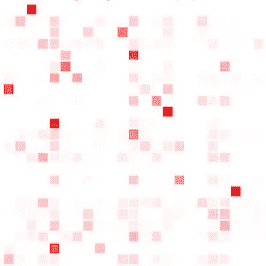

# 改进我的基于数学的名称生成器…

> 原文：<https://medium.com/geekculture/refining-my-math-based-name-generator-ae223f0a4e02?source=collection_archive---------11----------------------->

## 因为数据驱动的算法非常依赖…数据，谁能猜到呢？

[本周早些时候](/codex/generating-random-names-using-maths-8872a8f3b981)，我谈到了我最近做的一个小 JavaScript 工具，`**rangen-name**`(在 Github 上可以作为 [NPM 包](https://www.npmjs.com/package/@mpecheux/rangen-name)或[获得)。正如我在之前的帖子中解释的，这个库是一个基本的随机名称生成器，它使用**马尔可夫链**来创建可信的名称。](https://github.com/MinaPecheux/rangen-name)