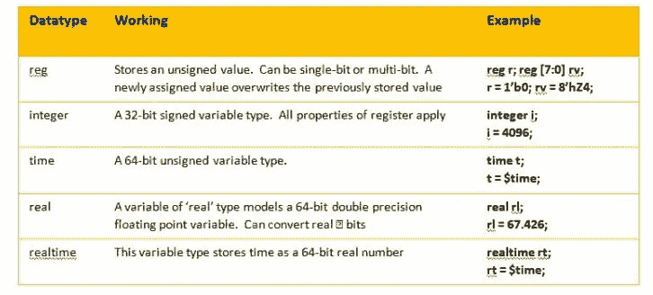
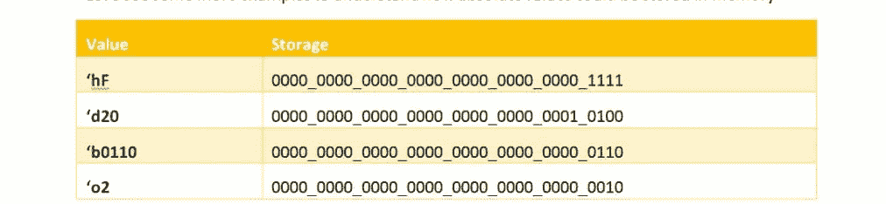

# Verilog Reg 数据类型

> 原文：<https://medium.com/geekculture/reg-types-handling-5b7c91a534aa?source=collection_archive---------15----------------------->

嗨，伙计们，

这是一本很长的读物。我正在报道 Verilog 的 reg 和 integer 关键字。这两个题目都是相当庞大的，但是我在这里总结了使用最多的方式。我建议你在阅读时打字并练习来确定你自己。如果您有任何问题，请在下面的评论中提出，我们将会解答。

快乐阅读，

在 Verilog 中处理“reg”类型

Verilog 中的“reg”类型之一是“integer”。如果你理解处理整数，同样的原则可以应用于所有的 reg 类型。Verilog 中的注册类型列表如下，供快速参考:

本文更侧重于前两种类型。我会再写一篇关于后三者的博客。

Verilog 中的整数可以有大小也可以无大小，它们是 4 态变量。Verilog 整数的默认大小是 32 位。有大小的整数值的一个例子是 8'd10。未调整大小的整数值的一个例子是“hF44”。

Verilog 允许您以任何支持的基数指定值——十进制、二进制、八进制或十六进制。Verilog 中典型的整数运算是–

1.  将整数值赋给整数变量
2.  将一个整数变量赋给另一个整数变量

让我们首先考虑这两个用例，然后进一步探索。让我们从一个例子开始——

**整数 I；**

**I = 1；**

在 Verilog 中，如果你没有指定基数，它会认为你是在说十进制。在上面的例子中，我们将 decimal 1 的值赋给一个 32 位的整数。该值以 32 位格式存储在 Verilog 运行时内核中。存储值为–

0000_0000_0000_0000_0000_0000_0000_0001

让我们看更多的例子来理解绝对值是如何存储在内存中的

如何使用这个值并不重要；用什么基数指定值并不重要；储物永远像上面那样。事实上，不管模拟器实现如何处理这种存储，最好是像上表所示的那样理解它。

让我们通过一些例子来看看这种整数的一个非常简单的用法

> **整数 I；**
> 
> **I = 10；**
> 
> **$display("十进制中 I 的值为%0d "，I)；**
> 
> **$display("六进制中 I 的值是%x "，I)；**

你会注意到‘I’可以用任何你想要的格式打印出来。但是，这会改变 I 的绝对值存储在内存中的机制吗？不要！因此，首先要理解的是，不管值被转换成什么基数(当使用值或变量时)，该值都被称为绝对值，如上所示。

另一种用法是这样的

> **整数 I；reg[3:0]r；**
> 
> **r = 10；**
> 
> **I = r；**
> 
> **$ display(" I 的值为%b "，I)；**

这里，我们在 RHS 上有一个 4 位值，它被分配给一个 32 位变量。如果运行这段代码，控制台上显示的 I 的值是 000000000000000000000000000001010。这是为什么呢？

当一个位宽较小的向量被分配给一个位宽较大的向量时，模拟器执行以下步骤(假设块分配如上述代码所示):

1.  对 RHS 进行评估。这里，RHS 值是 4 位二进制 1010(如上面存储方法中所述)
2.  比较了 LHS 和 RHS 的大小。在我们上面的例子中，LHS 位宽更大。
3.  如果位宽较大，RHS 的绝对值会填充足够的位，使其等于 LHS 的位宽。在这个例子中，4 位二进制 1010 的值必须用 28 个附加的 MS 位来填充
4.  这种填充位必须被赋予一个不会影响我们原始绝对值的值。因此，填充的最终值是 0000000000000000000000000000001010
5.  这个新导出的值(正好等于原始值)被分配给 LHS

如果你这样做了，情况也没什么不同

**I = 4’D10；**

想试试吗？

如果你在这里尝试一些奇怪的东西会发生什么？让我们检查下面的代码

> **整数 I；reg[3:0]r；**
> 
> **I = 32 ' bx 110；**
> 
> **$ display(" I 的值为%b "，I)；**

猜测产量？我已经把它贴在下面了——

xxxxxxxxxxxxxxxxxxxxxxxxxxxxxxxxxxx x 110

我们该如何推理？Verilog 规范规定:如果一个位向量必须向最高有效端填充，填充规则如下

1.  如果要扩展的向量的 MS 位具有逻辑 1 或逻辑 0 的值，则新填充的位将携带逻辑 0 的值
2.  如果要扩展的向量的 MS 比特具有值 x 或 z，则新填充的比特将分别携带值 x 或 z

这意味着，如果<value>必须左扩展，扩展位的值取决于<value>的最高有效位。如果<value>的最高有效位携带 1 或 0，则<value>用零向左扩展。事实上，这是处理这种情况的绝对正确的方法。如果你想保持<value>不变，你必须在左边加零。</value></value></value></value></value>

除此之外，另一种情况是最高有效位携带 1'bx。在这种情况下，Verilog 指定您应该将 x 的值分配给所有向左扩展的位。类似地，对于具有 z 值的 MS 比特的情况，新填充的比特将携带 z。

如果你正确理解了这一点，那么将窄向量分配给宽向量就没有什么新东西可学了。在将较宽的向量分配给较窄的向量的情况下，RHS 的额外最高有效位被截断。这不需要太多解释。

# 岔路

想知道 Verilog 模拟器如何模拟 4 态值吗？如果您打开一个 PLI 头文件(该文件的名称和位置特定于模拟器)，您将会发现如下定义:

> **/*向量值的数据结构*/**
> 
> **typedef 结构 t_vecval**
> 
> **{**
> 
> **int avalbits；/*向量每个比特的比特编码:*/**
> 
> **int bvalbits；/* ab: 00=0，10=1，11=X，01=Z */**
> 
> **} s_vecval，* p _ vecval**

如果您不知道在哪里可以找到它，只需在模拟器安装文件夹中 grep for t_vecval，您就可以找到该文件。

这是返回 Verilog 模拟器内核中每个位的 4 态逻辑值的数据结构。当然，我们还没有力量等属性。它只是存储值。当您使用 PLI TF 例程在 Verilog 和 C/C++世界之间交换数据时，您将使用这个结构来实现目标。本文的目的不是讨论 PLI 或数据交换，我只是认为了解这些是有帮助的。祝大家学习愉快！

科技酒吧，

[Proxelera](https://proxelera.com)