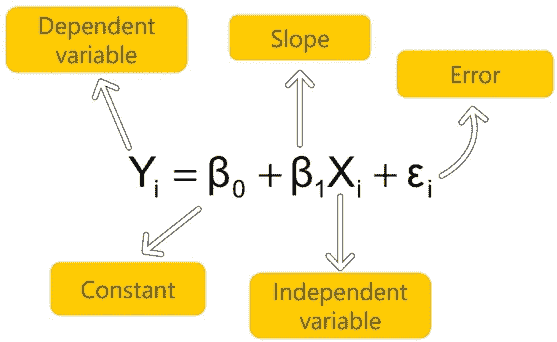
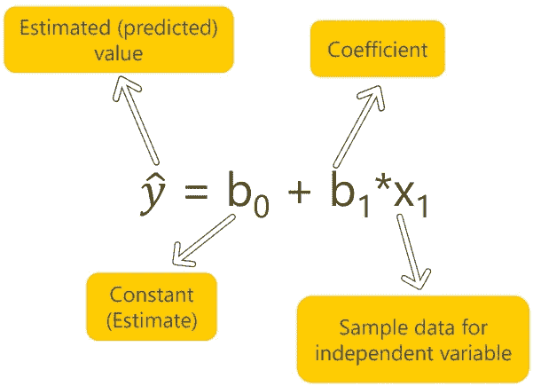
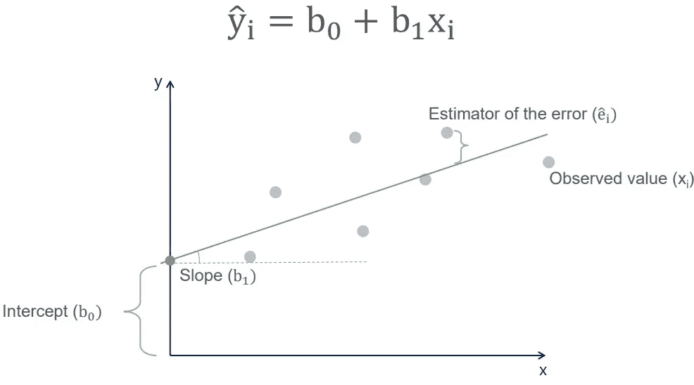

# 回归分析导论

> 原文：<https://medium.com/geekculture/regression-analysis-57841ec34d1b?source=collection_archive---------11----------------------->

# 线性回归

回归分析是广泛使用的预测方法之一。线性回归可能是最基本的机器学习方法，也是每个有抱负的数据科学家的高级分析学习路径的起点。

线性回归是两个或多个变量之间因果关系的线性近似。

回归模型非常有价值，因为它们是进行推断和预测的最常用方法之一。除此之外，回归分析也被用来以有意义的方式确定和评估影响某一结果的因素。

与许多其他统计技术一样，回归模型帮助我们根据样本数据对总体进行预测。

## 线性回归模型

注意:当我们提到人口模型时，我们使用希腊字母。

## 线性回归方程

## 线性回归的几何表示

注:平均而言，误差的期望值(平均值)为 0，这就是为什么它没有包含在回归方程中。

# 相关和回归

## 相互关系

*   表示两个变量之间的关系。
*   显示两个变量一起移动(无论哪个方向)。
*   对称 w.r.t .这两个变量: *p(x，y) = p(y，x)。*
*   一个点(一个数)。

## 回归

*   表示两个或多个变量之间的关系。
*   显示原因和结果(一个变量受另一个变量影响)。
*   一种方法——总是只有一个随机因变量。
*   一条线(在 2D 空间中)。

# 线性回归汇总表

# OLS 假设

OLS(普通最小二乘法)是估计线性回归方程最常用的方法之一。然而，它的简单性意味着它不能总是被使用。因此，在我们可以依赖这种估计方法之前，所有的 OLS 回归假设都应该满足。

*   线性-指定的模型必须代表线性关系
*   无内生性-自变量不应与误差项相关
*   正态性和同方差性-误差的方差应该在观测值之间保持一致
*   无自相关-误差项的值之间不应存在可识别的关系
*   无多重共线性-任何预测变量都不应被其他预测变量完美解释。

# 回归线备选方案

OLS 只是一个开始。OLS 是最简单的，虽然往往足以估计回归线的方法。事实上，有更复杂的方法更适合某些数据集和问题。

*   广义最小二乘(GLS)
*   最大似然估计
*   贝叶斯回归
*   核回归
*   高斯进度回归

这个帖子到此为止。感谢您的阅读。

*更多内容尽在*[*plain English . io*](http://plainenglish.io/)