# MYSQL 中的正则表达式

> 原文：<https://medium.com/geekculture/regular-expression-in-mysql-b1d8f3594b84?source=collection_archive---------16----------------------->

Image from [Shutterstock](https://www.shutterstock.com/image-illustration/conceptual-business-illustration-words-regular-expression-1012948930)

## 使用这些查询改进您的模式匹配

正则表达式:

正则表达式是用于定义搜索模式的字符序列/模式，主要用于 C++和 python 等编程语言中的字符串搜索算法和模式匹配。

模式匹配也广泛用于 SQL 查询中，以查找以特定模式出现的数据。

本文试图解释 MySQL 中的所有正则表达式，并在 Employees 数据库和 Olympics 数据库中执行相同的操作。

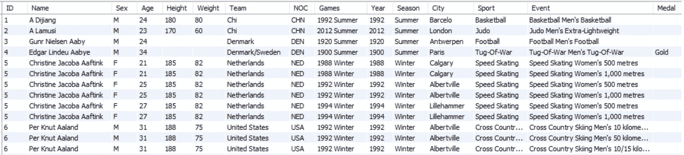

Snippet from the Olympics Database

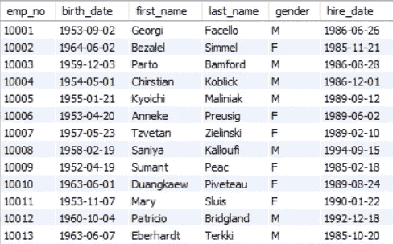

Snippet from the Employee Database

> ^ :

匹配字符串的开头。

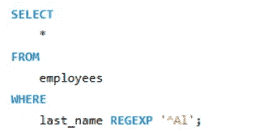

Query to obtain all the records that has last name starting with Al

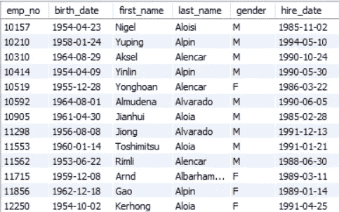

Answer for the above query

需要注意的重要一点是 MySQL 中的 regexp 不区分大小写，所以下面的查询给出的输出与上面的一样。

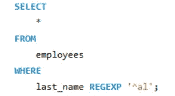

Here instead of Al, al is used but since regexp in MySQL is not case sensitive this query gives the same output as the last one

Answer for the above query

> $ :

匹配字符串的结尾。

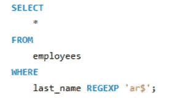

query to return records with last_name ending with ar

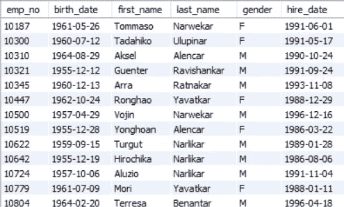

answer for the above query

> 。或者。{} :

点字符匹配除新行之外的任何单个字符，可用于定义您希望一个字符串包含的字符数，

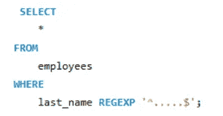

query to obtain last_name having 5 characters

此查询使用^和$匹配姓氏的开头和结尾以及五个'.'定义 5 个字符

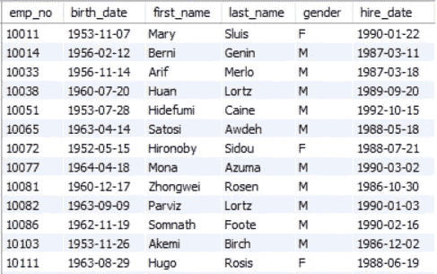

answer for the above query

如您所见，该查询返回的记录在姓氏中只有 5 个字符。

这个查询也可以写成这样

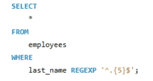

query to obtain last_name having 5 characters

。可以用{n}代替重复(。)n 次

answer for the above query

> [ ] :

使用方括号来进一步优化模式匹配。

> 名字中包含特定字符的记录:

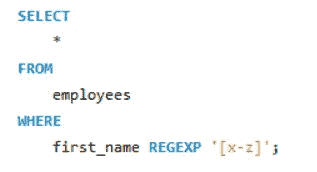

query to return first_name containing x,y,z .

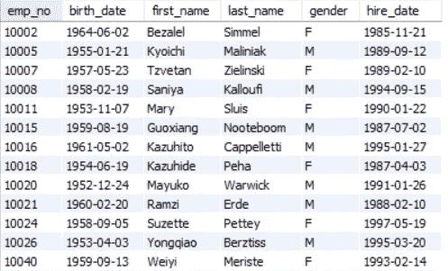

answer for the above query

> 名字以特定字符开头的记录:

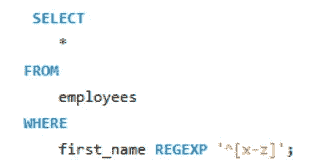

query to return first_name containing starting with x,y,z

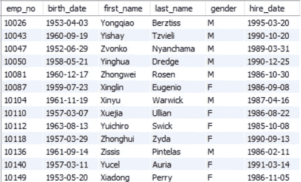

answer for the above query

> 名字以特定字符结尾的记录:

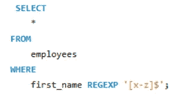

query to return first_name containing ending with x,y,z

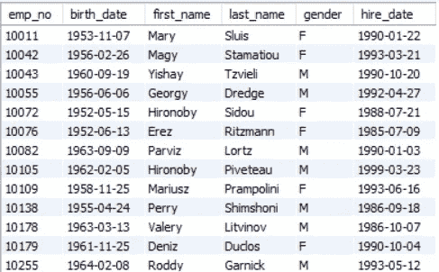

answer for the above query

结论:

这篇文章包含了一些基本的正则表达式模式，希望这篇文章对你有所帮助。

谢谢你……