# 正则表达式

> 原文：<https://medium.com/geekculture/regular-expressions-f4299eae9f14?source=collection_archive---------20----------------------->

## 为什么和如何…

Photo by [Joshua Aragon](https://unsplash.com/@goshua13?utm_source=medium&utm_medium=referral) on [Unsplash](https://unsplash.com?utm_source=medium&utm_medium=referral)

前几天在处理 leetcode 问题时，我不得不使用正则表达式(简称 regex ),并开始思考我对它们的了解是多么的少。所以我决定研究它们，弄清楚它们是什么以及它们为什么会出现。我还想举例说明如何在你的程序中使用它们。

正则表达式是由一系列字符指定的搜索模式。您通常会在用于查找或查找和替换的字符串搜索算法中使用它们。这个概念最早出现在 20 世纪 50 年代，当时正则语言的想法是由 Stephen Cole Keene 提出的。它开始普遍用于 Unix 测试处理实用程序。它在 20 世纪 80 年代开始流行，当时开发了不同的语法，其中使用最广泛的是 [Perl](https://en.wikipedia.org/wiki/Perl) 语法。一旦你掌握了正则表达式，它可以使搜索和替换变得轻而易举，甚至在此之前就很有用。我要复习一些例子。这些图片来自一个名为 Rublar 的 ruby regex 网站。我将在下面链接它，以及我为 javascript 找到的一个。

# 单字搜索

第一个例子是搜索一个单词。只是向您展示一个使用 regex 的基本搜索。如你所见，我正在搜索单词“the ”,大写的“T”。这就是为什么它只突出了“这个”。

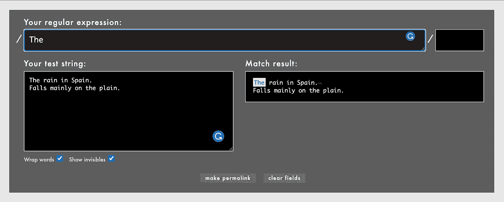

如果我在正则表达式的末尾添加一个“I”标志，它将忽略大小写并突出显示两个“the”

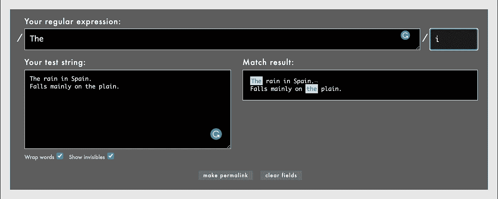

这些例子展示了一个基本的单词搜索。接下来，我将展示如何进行字符搜索，以及您可以添加的一些修饰符，以找到您正在寻找的内容。

# 字符搜索

在这一部分，我们将只搜索一个特定的字符。我们将添加一些修饰语来显示如何缩小搜索范围。在这个例子中，我去掉了“I”标志，而是将“E”和“E”放在括号中，这样它就可以搜索小写和大写。

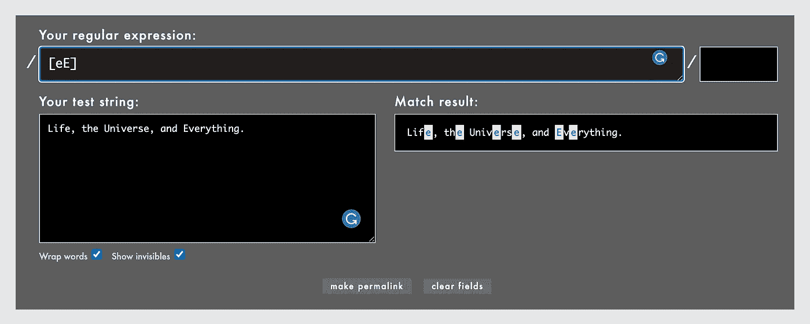

在本例中，我们搜索一组两个字符长的字母。方括号标记组，花括号标记组的大小。

你也可以搜索所有的字符。这个只搜索小写字母。

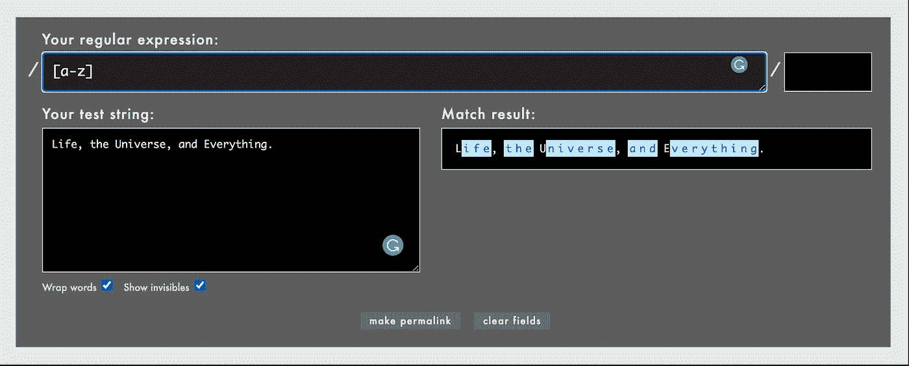

你也可以同时搜索上层和下层。

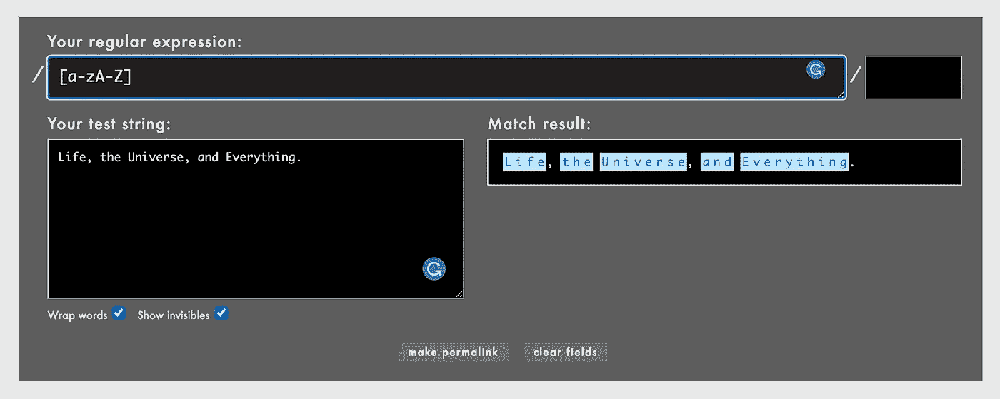

对于最后一个示例，我们将搜索一个电话号码。这给格式化带来了挑战。电话号码可以以多种方式输入，必须确保你考虑到了所有的方式。首先，我们将只搜索一个十位数，我们将使用数字选择器“\d”和数字修饰符“{10}”。你会看到它只会给出第一个数字，因为它没有看到破折号。

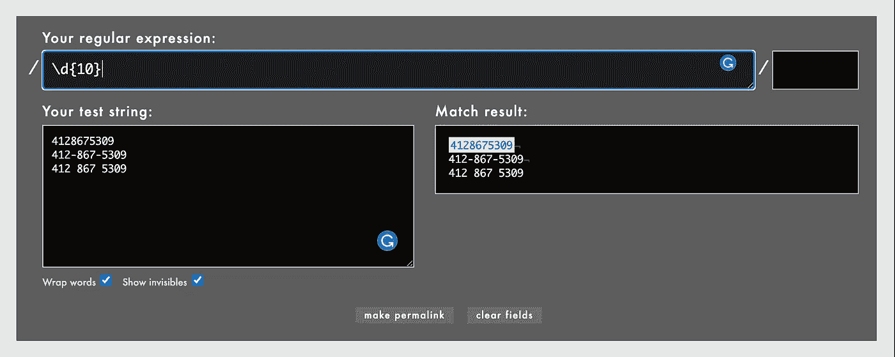

我们可以通过要求正则表达式查找破折号以及指定一个分组中有多少位来解决这个问题。你也会注意到“？”的用法，这只是意味着破折号是可选的。

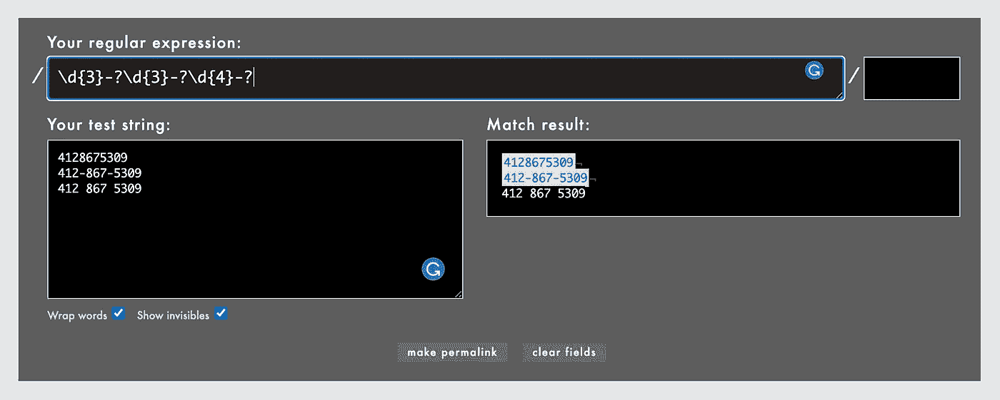

好了，现在我们可以搜索一个不带任何其他字符的数字，和一个带破折号的数字。现在我们需要搜索一个带空格的数字。其语法非常相似，我们只需要添加空格的参数。

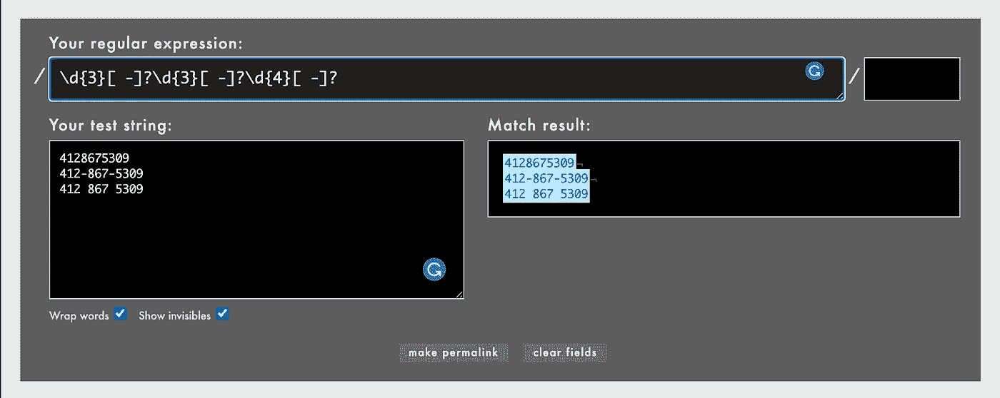

现在，搜索参数中增加了一个空格，这款手机的三个版本都可以被搜索到。

# 特殊选择器

我只是想展示一些特殊的选择器。我想展示的第一个是" \ "选择器，它将选择所有内容。

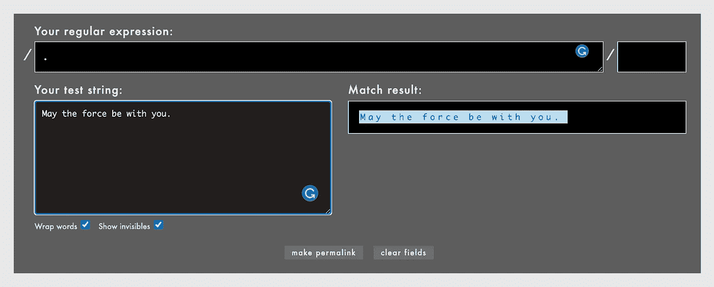

您还可以对任何单词字符(字母、数字、下划线)使用“\w”。

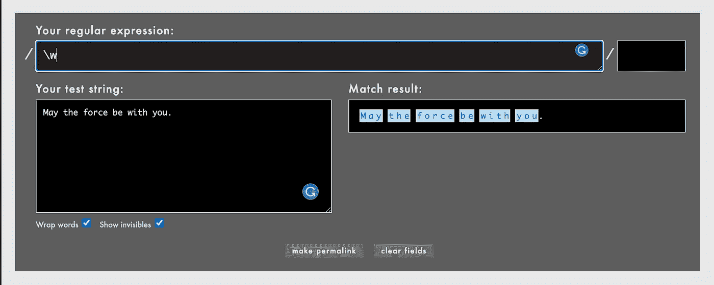

或者反过来，您可以使用“\W”来表示任何非单词。Digit 与我们在电话号码示例中使用的“数字”和“非数字”一样，都是“\d”。

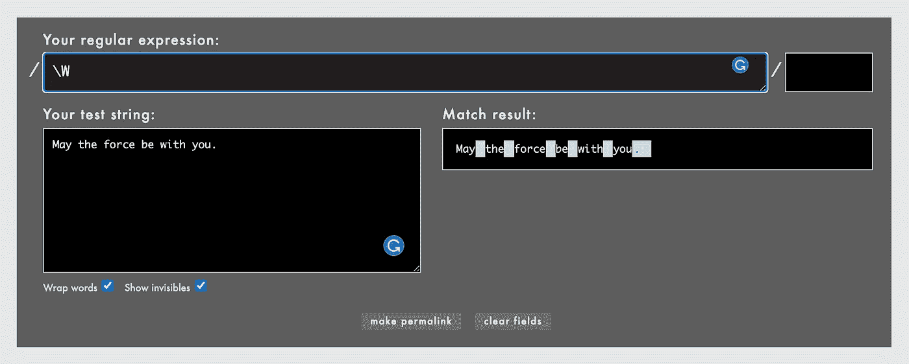

# 结论

这是对 regex 的介绍。我鼓励你投入进去。真的很有趣，很有用。我知道我计划尝试将更多的这些融入到我的程序中。

# 资源

 [## Rubular

### 基于 Ruby 的正则表达式编辑器/测试器

rubular.com](https://rubular.com/)  [## 学习、构建和测试正则表达式

### 正则表达式测试器，语法高亮，PHP / PCRE & JS 支持，上下文帮助，备忘单，参考…

regexr.com](https://regexr.com/)  [## Ruby 正则表达式

### 正则表达式是一个特殊的字符序列，帮助您匹配或查找其他字符串或字符串集…

www.tutorialspoint.com](https://www.tutorialspoint.com/ruby/ruby_regular_expressions.htm)  [## 正则表达式教程-学习如何使用正则表达式

### 本教程教你所有你需要知道的，以便能够精心制作强大的省时的正则表达式。它开始…

www.regular-expressions.info](https://www.regular-expressions.info/tutorial.html)