# 面向非程序员的正则表达式。

> 原文：<https://medium.com/geekculture/regular-expressions-for-non-programmers-ed2047d2181f?source=collection_archive---------11----------------------->

## 处理长文本时有用的知识。

这篇文章是写给那些**不想成为专家**却以最小的努力获得最大的回报的人。互联网上有很多关于这个主题的教程，也有很多非常好的资源。我将在底部列出其中的一些。我看到的“问题”是，它们大多不是真正针对非技术用户的。他们试图在一篇文章中解释一切。你读了开头几段，然后想:“嗯……改天吧，也许。”

这篇文章的目标是让你能够轻松地读完，理解所有的东西，并继续你的生活，获得实际的生产力提升。我将只涉及一些方便的事情。正则表达式对于经常处理文本的人来说非常有用，大多数编辑器都支持它们，就像所有流行的办公套件一样。对于本文中的例子，我将使用 Google Docs。

# 一个特殊的角色

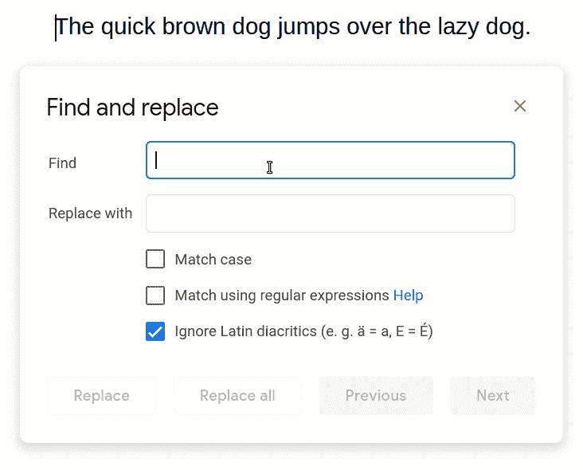

在我们启用正则表达式之前，一切都表现正常。突然间，不仅仅是“狗”这个词(末尾有一个点)匹配，但也匹配第一个，其中没有点，但有一个空格。这是因为点在正则表达式中有特殊的含义。它就像一个占位符，可以匹配任何字符，甚至空格和……是的，点。这是另一个例子:

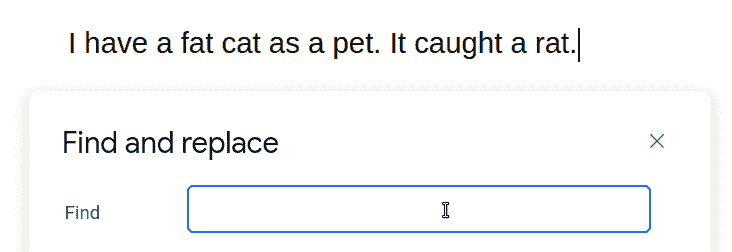

最后，我们搜索最后一个字符是“t”的三个字符的任意组合。注意它是如何与“catch”中的“ght”甚至“it”匹配的，因为它以空格字符开头。

这本身在某些情况下已经很有用了，但它肯定也有缺点。大多数时候，匹配“任何东西”并不是你真正想要的。

# 其他特殊字符

## 

如果将它比作点，以及它是任何字符的占位符，那么您可以说字符集只是一些选定字符的“自定义占位符”。

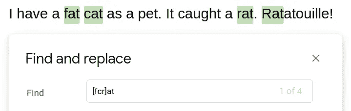

这整个事情现在是一个占位符，代表“f”、“c”或“r”。结合它后面的“at”，这个表达式只和“胖”、“猫”、“鼠”三个词完全匹配。但是，正如你所看到的，**也作为其他单词**的一部分。你马上就会知道如何避免这种情况。

您也可以定义字符的范围。要为字母表中的任何字母创建占位符，不需要写`[abcdefghijklmnopqrstuvwxyz]`。你可以简单地写`[a-z]`。对于数字，它是`[0-9]`，你甚至可以很容易地组合它们。`[a-z0-9]`是所有字母和数字的占位符，
T5 是从 b 到 f 的所有字母和从 1 到 6 的所有数字的占位符。

哦，还有…在本文的第一个截图中，你可以看到“区分大小写”是如何被禁用的。否则，`[a-z]`和`[A-Z]`就不一样了。在这种情况下，不要尝试像`[A-z]`这样的东西。它并不像你所希望的那样。但是你可以使用`[a-zA-Z]` …或者只是勾选那个框。

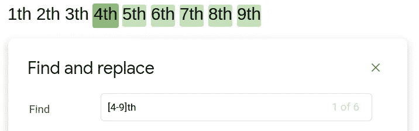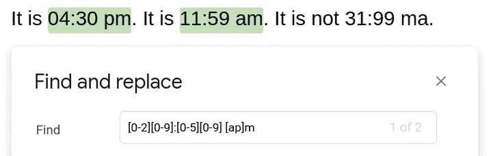

我想最后一个例子非常清楚地说明了正则表达式是怎么回事。你不一定要精确的单词或短语。您可以在文本中搜索复杂的模式。这个例子也展示了它的强大之处。你还会如何搜索…次？

## ？* +(可选/重复字符/占位符)

只需在第一个占位符后加上一个问号，这样当小时数小于 10 时，前导“0”就是可选的。

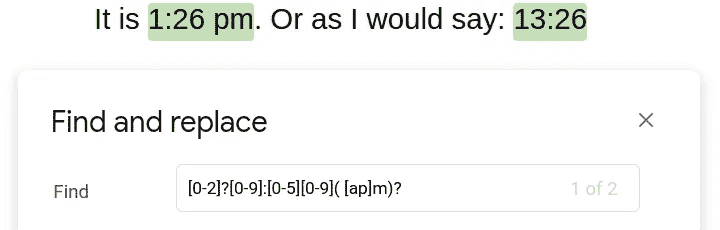

就像问自己:“这真的在这里吗……问号”

那些括号？接得好。你可以把东西组合在一起，这样问号就可以作为一个整体应用于它。

同样方便的是:加号和星号。`[0-9]+`或`[a-z]*`
你可以搜索“至少出现一次”(加号)或“任何次数或根本不出现”(星号)的东西。如果这还不够，你可以用`{`和`}`来表示“两到四次”:`[0-9]{2,4}`或者“至少三次”:
`[a-z]{3,}`。

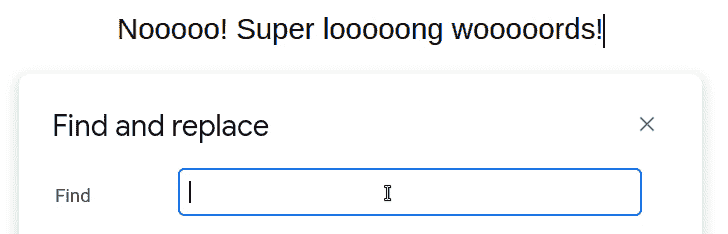

## \b(单词边界)

现在回到“也作为其他词的一部分”的问题。

`\b`“助手”并不真正匹配任何字符。它的意思是“单词在这里结束”或“单词在这里开始”，取决于你把它放在哪里。如果你把它放在两边，那就说明你在找一个“全字”。

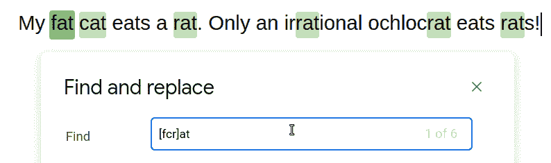

问题解决了。

## |(这个或那个)

管道字符仅仅表示“或”。基本上可以同时搜索多个东西。

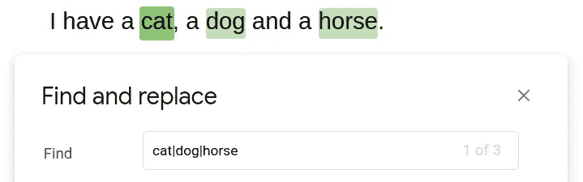

您的“搜索选项”可以是简单的单个字符，如`a|b`，也可以是更复杂的表达式。这里结合几件事说一下。

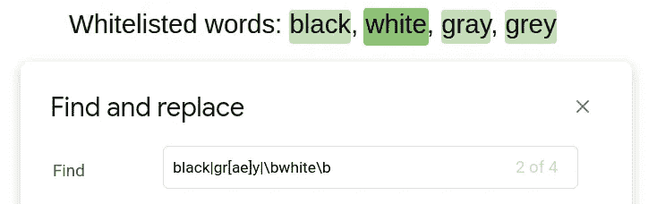

## \(转义)

最后一件事。所以，有一些特殊的字符有着特殊的含义。对了，这些都是:`.+*?()[{^$|\`也就是说不能随便搜。要做到这一点，你必须在它们前面加一个反斜杠。这样，我们可以解决第一个例子中的问题。

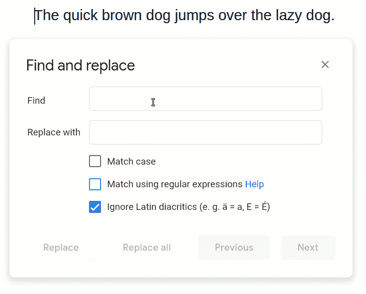

# 结束了。

我们就此打住。我希望这篇文章“容易理解”，但我相信已经有很多有用的东西了。您可以只搜索整个单词，或者搜索以某物开头或结尾的单词，或者搜索多个单词、可选/常见(错误)拼写、时间和日期等模式。如果你想进一步探索兔子洞，下面有一些有用的资源。

# 其他资源

## [regextester.com](https://www.regextester.com)和[regex101.com](https://regex101.com/)

可怕的工具来建立自己的，更复杂的正则表达式。当鼠标悬停在表达式字段上时，它会向您显示具体发生了什么。它们都有一个常用正则表达式库，您可以探索并尝试理解它。

## 【https://www.regular-expressions.info/quickstart.html 

最佳快速入门指南和备忘单，但是视觉风格已经把你吓跑了。不需要正则表达式。嗯……虽然很实用。

## [https://www.youtube.com/watch?v=M7vDtxaD7ZU](https://www.youtube.com/watch?v=M7vDtxaD7ZU)

很棒的谈话。需要一些经验来跟进。

*如果你打算成为中等会员，可以使用我的推荐页面支持我:*[*https://markus-kottlaender.medium.com/membership*](https://markus-kottlaender.medium.com/membership)