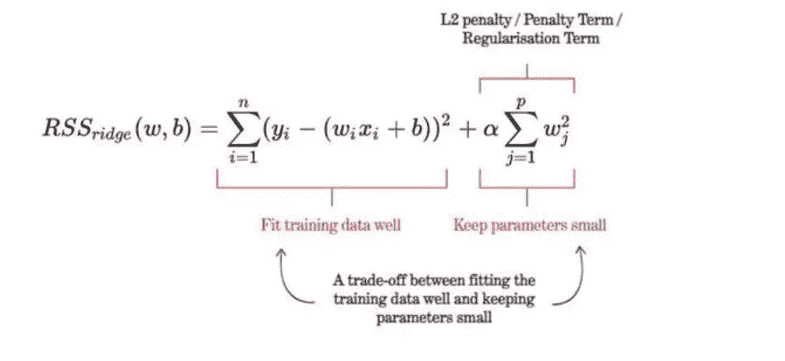
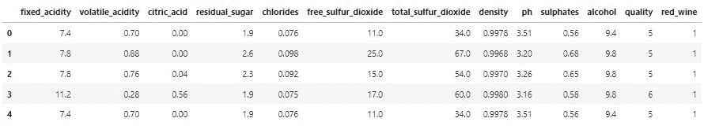
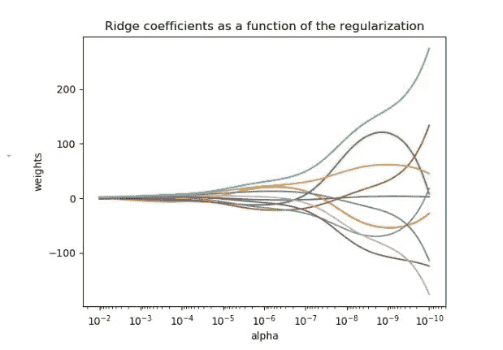

# 使用管道和 GridSearchCV 进行正则化

> 原文：<https://medium.com/geekculture/regularization-using-pipeline-gridsearchcv-f377946e39d1?source=collection_archive---------8----------------------->

当一个模型受到高方差的影响时，通常会使用一种称为正则化的技术来克服过度拟合的倾向。例如，Ridge 和 Lasso 是线性回归的两种经典形式，它们通过向损失函数添加惩罚项来降低模型的复杂性。

Source: [https://vitalflux.com/wp-content/uploads/2022/04/Ridge-regression-cost-function-2.png](https://vitalflux.com/wp-content/uploads/2022/04/Ridge-regression-cost-function-2.png)

以 Ridge 为例，通过在其损失函数中添加一个惩罚项，可以使系数缩小到更接近于零，从而最终降低模型的复杂性。因此，在正则化之前对数据集进行标准化至关重要，以确保每个预测值或变量都得到平等公平的处理/惩罚。换句话说，你要避免仅仅因为一个变量性质的大小/范围而惩罚它。

在本文中，我将演示如何通过在 sklearn 中使用 Pipeline 和 GridSearchCV 包装所有步骤，在一个简单的步骤中预处理数据、验证和训练模型。

# 资料组

这个特殊的[葡萄酒质量数据集](https://archive.ics.uci.edu/ml/datasets/wine+quality)由 6497 个样本和 13 个特征组成。出于本文的目的，我将红葡萄酒和白葡萄酒的质量数据集合并在一起。我还将葡萄酒/红色类别二进制化为 1 和 0，其中 1 表示“红色”，0 表示“白色”。最后，需要注意的是，数据集中的每个特征描述了每个葡萄酒样本的某个特征。

Wine Quality Dataset

# 设置

在这个练习中，我将设置“质量”作为我的目标变量(y ),并使用剩余的特征作为我的预测值(X)。此外，请注意，为了突出正则化的效果，我故意使我的测试集比我的训练集大得多，并添加了次数为 2 的乘法交互项。

顺便提一下，对数据执行的任何转换都必须在训练/测试分割数据之后进行，这一点非常重要。否则，您将自己暴露在[数据泄露](https://stackoverflow.com/questions/49444262/normalize-data-before-or-after-split-of-training-and-testing-data)之下，这可能会扭曲您的模型的性能。

# 线性回归

正如所料，训练集和测试集之间的两个 R2 分数之间的巨大差异表明该模型非常过拟合。因此，应用正则化技术并看看我们如何以增加偏差为代价降低方差是有意义的。

# 管道包裹的山脊& GridSearchCV

以 Ridge 为例，通过将 Pipeline 和 GridSearchCV 功能合并到代码中，您可以完成所有必要的数据预处理、训练和验证模型。对于岭，α可能是搜索最多的超参数，因为它代表正则化的“强度”。

[https://stackoverflow.com/questions/61828493/plot-ridgecv-coefficients-as-a-function-of-the-regularization](https://stackoverflow.com/questions/61828493/plot-ridgecv-coefficients-as-a-function-of-the-regularization)

该过程的第一步是创建一个将数据转换器和模型结合起来的管道。在这个例子中，我使用 StandardScaler 和 PolynomialFeatures 作为转换器，使用 Ridge 作为我的回归模型。

第二，您希望获得一个可以进行网格搜索的所有参数的列表。为了保持这个例子的干净和清晰，我选择了探索不同的山脊阿尔法值。但是正如你在上面看到的，我可以选择搜索许多其他参数。

第三，使用您的管道作为您现在的“新”模型，您希望将 piepline 包装在 GridSearchCV 中，以便您可以同时进行交叉验证和训练。GridSearchCV 将默认为 KFold，但是如果您愿意，也可以选择使用其他验证方法。在我的例子中，我坚持使用默认的 KFold 方法进行 5 次折叠。

此外，请注意，当我适合时，我只是使用 X_train 而不是 Z_train_pf，因为变压器被包裹在管道中。您可以想象当您必须执行比我的例子中的两个转换更多的转换时，这种方法是多么有用和方便。

最后，基于交叉验证，GridSearchCV 现在是您最好的“估计器”。请注意，与常规线性回归相比，测试集的 R2 分数有所提高。虽然改进不多，但它展示了正则化的力量，以及为什么它是一种经常在这些类型的情况下部署的技术。

# 摘要

Pipeline 和 GridSearchCV 的结合可以成为一个强大的工具。这种组合也可以应用于许多其他各种情况，而不仅仅是在正规化的背景下。每当您的数据需要大量转换时，我认为这种方法可以在保持代码整洁和消除逐步转换数据的艰巨任务方面增加很多好处。