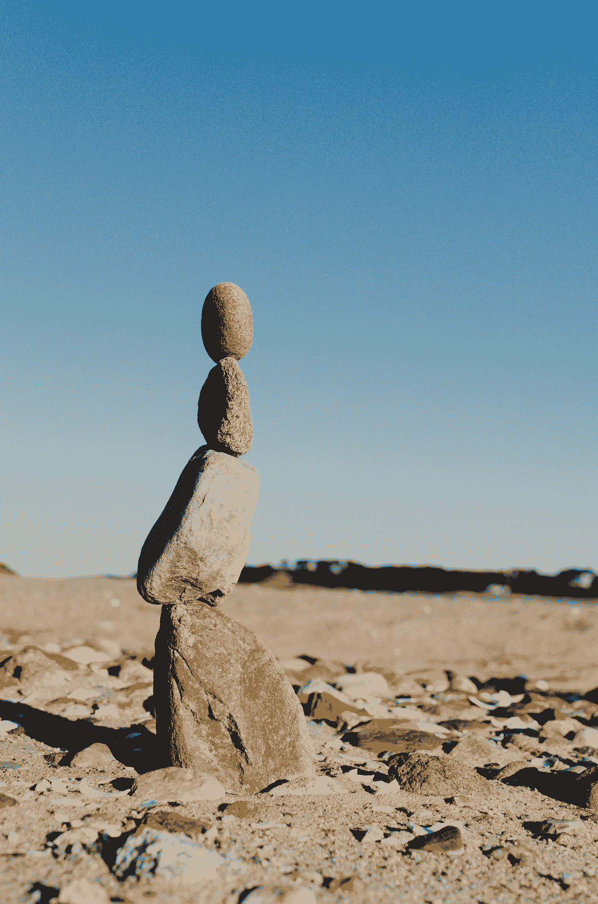

# 重塑电池——第一部分

> 原文：<https://medium.com/geekculture/reimagining-batteries-part-one-1d62708af56e?source=collection_archive---------47----------------------->

## **当前能源网和可再生能源的问题**

Photo by [Kelly Sikkema](https://unsplash.com/@kellysikkema?utm_source=medium&utm_medium=referral) on [Unsplash](https://unsplash.com?utm_source=medium&utm_medium=referral)

尽管迫切需要向可再生能源过渡，但要成功过渡，还需要解决许多问题。我们目前的系统非常依赖化石燃料为我们的电网提供能源。理想情况下，我们希望转向可再生能源，如太阳能、风能、水电、地热等…