# 用 web3 重新想象教育的未来

> 原文：<https://medium.com/geekculture/reimagining-the-future-of-education-with-web3-536d46c87df6?source=collection_archive---------0----------------------->

前几天在网上看到这个漫画。

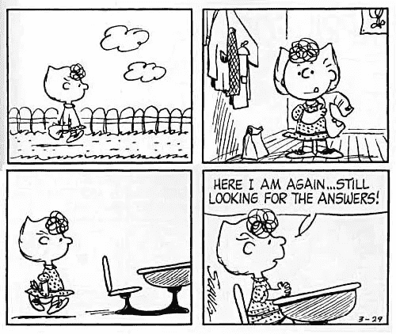

by Schultz

这让我开始思考教育在我们社会中的作用，以及学习真实世界技能的承诺，这些技能旨在让学生在不断变化的世界中取得成功(显然，这是我的第一个想法😅).

最有趣的部分不是漫画，而是查理·布朗漫画中的老师，他被描绘成一种没有面孔、没有感情、单调乏味的怪物，专门让孩子们受苦。学校被视为某种监狱，在那里学生被迫违背自己的意愿学习和工作，但仍然…永远得不到他们想要的答案。

最近，我在 web3 和区块链的帮助下，对教育的未来有了一些非常有趣的想法(由于推特上的[韦斯·考](https://twitter.com/wes_kao)和[弗瑞蒂·萨拉夫](https://twitter.com/VritiSaraf?ref_src=twsrc%5Etfw%7Ctwcamp%5Etweetembed%7Ctwterm%5E1460643746928893954%7Ctwgr%5E%7Ctwcon%5Es1_&ref_url=https%3A%2F%2Fed3.mirror.xyz%2F0U3QG8-4K6CD_ltU6SJyKN3-uBD3x6nEFs-YeShzYmk))。

为了将 web3 整合到教育中，我创建了一个 web 应用程序来存储可验证的证书，如区块链的文凭和学位。但是，在我开始之前，这有什么关系呢？教育出了什么问题，web3 的承诺所提供的机会能做什么？

在每天上学的近**10 亿**儿童中，超过[6 亿](http://uis.unesco.org/en/news/6-out-10-children-and-adolescents-are-not-learning-minimum-reading-and-math)无法达到阅读和数学的最低熟练水平。这一学习危机被联合国确定为让儿童为生活、工作和积极公民做好准备的最大全球性挑战。

> 长话短说——正如保罗·d·斯皮尔斯所说，“教育是人类繁荣的一个关键因素。”

即使在受教育程度最高的国家，大多数公民也没有大学文凭(2020 年 25 岁以上的美国人中只有约 37%是大学毕业生)。

提高生活水平和促进公平的最简单方法之一是通过教育，谢天谢地，基于 Web3 去中心化特性的新教育模式正在迅速出现。

# 嗯…..web 3 是什么？🤔

如果 web2 是我们当前用来访问互联网服务的系统，那么从哲学和技术的角度来看，web3 是 web2 的进化。

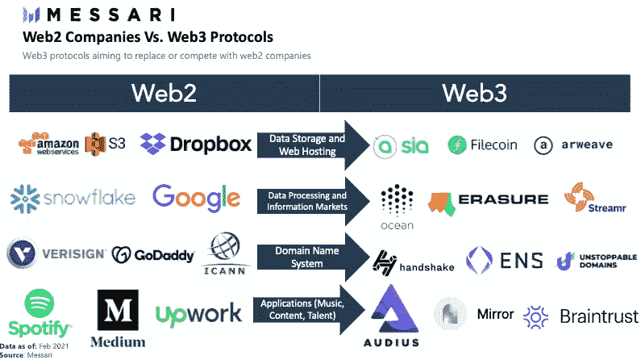

Web1 是关于显示或呈现信息的(比如网站)。Web2 是关于交流和分享的(就像 Instagram 和脸书)。Web3 是关于创造和所有权的，用户可以保留控制权。

从技术角度来看，web1 和 web2 都使用集中化来支持各种在线活动。Web3 使用去中心化来支持可验证的交易和所有权。

# 为什么重要？

这对教育有什么帮助？

经济力量和 web2 给了大型实体获得权力和控制如何使用我们的信息的机会。 **Web3 使个人用户能够对他们的在线活动做出决定，而不必在实用性方面做出妥协**。它有能力拆除那些使教育等系统停滞不前的有问题的系统。

想象一下，如果大学被细分，你可以获得对你的职业生涯最重要的微观证书，只为你需要的东西付费，并拥有终身投资组合，这些证书可以在所有机构和行业之间转移和接受？

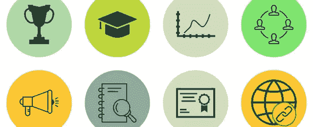

from Rodel

分散式基础设施的兴起可能会使元宇宙在未来几年成为主流，其世界可以被构建，并允许一切事情就像在现实世界中一样发生，除了更好地提供更个性化和沉浸式的数字体验。

# 但是…为什么是现在？

Web3 是继 web2 之后迈向一个公平世界的下一步，在这个世界中，人们可以获得提高其智力发展的机会。

就在过去的几年里，由于“游戏赚钱”模式和非功能性桌面应用的兴起，web3 对世界各地的人们产生了巨大的影响。加密货币交易的普及创造了财富，让发展中国家的许多人有机会提升生活水平，并获得更多发达国家的普通奢侈品。

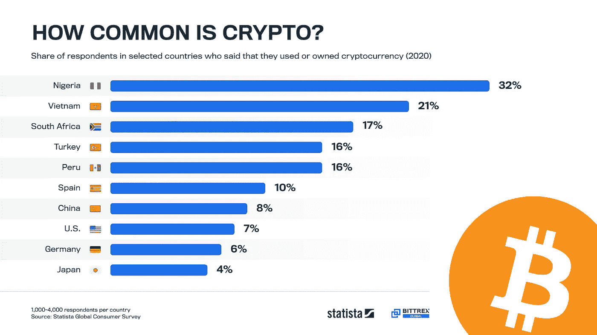

当 web2 首次出现并允许人们通过脸书和 Whatsapp 等应用程序点击按钮进行交流时，它为人类的进步带来了许多令人难以置信的机会。Web3 通过以社区为中心的设计提升了 web2 的潜力，允许权力分散。

让我们回到教育上来。

# 金融和现在…学历？

从金融服务到艺术和医药的无数行业正在被 web3 的承诺所重构——这是一种向建筑商和用户所拥有的去中心化技术的范式转变。

教育，一个长期以来或多或少保持不变的行业，也在走着类似的道路。

如果我们从教育如何随着不同版本的网络而改变的角度来思考这个问题:

*   web1 中的教育相当于授权机构(想想:大学和高中)之间的知识转移
*   web2 中的教育是分布式教育的集中平台(想想 edX 和 Khan Academy)
*   web3 中的教育是个人从各种来源收集技能，并在自己的钱包中验证知识链(想想类似“技能证明”的东西)

Web3 为教育的未来打开了大量机会的新大门。在历史上的大部分时间里，教育一直是只有一小部分人能够获得的东西。虽然 ed1 为社交、研究、学习和可衡量的证书提供了机会，但它将许多人排除在外。

有几个很好的理由来解释。持续的教育是其中之一。

# 不断的教育是必要的

技术的发展速度超过了变化的速度，这意味着现有的工人以及那些即将进入劳动力市场的人需要不断升级他们的技能，以跟上雇主的需求。当大学生完成 4 年的学位时，许多技能已经过时了。

这是否意味着你最好存钱，跳过高等教育？不一定是因为只有高中文凭的学生申请不到美国 65%的工作。

由于我们所处的世界比以往任何时候都变化得更快，因此需要更多知识丰富、适应性更强的员工。主要问题是，目前的教育体系跟不上变化的步伐，也跟不上对高质量教育的需求。

# 教育问题

教育面临 web3 可以解决的 3 个主要挑战。准入、成本和认证。

**受教育机会:**在接受高等教育的人群中，人们非常关注公平和包容性。受教育的机会也受到教育的纯粹性质的限制。大多数学校和大学提供的教育有两大限制。

1.  时间:课程通常按时间顺序提供，有具体的开始日期。如果你不能参加一个完整的学期，你不能指望完成课程。大多数大学和学校都是以学期为基础的，没有多少灵活的余地。
2.  [地理位置:](https://ed3.mirror.xyz/0U3QG8-4K6CD_ltU6SJyKN3-uBD3x6nEFs-YeShzYmk)大多数 K-12 学校都牢牢地位于特定的地理位置。在线学校已经变得越来越普遍(因为新冠肺炎疫情),但这些课程中的许多仍然是建立在面对面的基础上的。

**成本:**在美国，学生债务约为 1.6 万亿美元，这限制了未来的机会，使学生不太可能自己创业或选择他们想要的生活道路。在联合王国，教育一个孩子的终身成本超过 10 万美元。这一趋势在全球是一致的。这不仅意味着负担得起教育的人越来越少，还意味着人们在最初接受“教育”后不太可能寻求额外的教育。

**认证:**如今的大多数课程都必须达到卡内基学分单位，相当于“在座位上的小时数”，作为标准化学生在课堂上的时间长度的一种方式。然而，它并不能保证任何形式的知识增长。基于能力的标准化是随着时间的推移奖励知识的一个步骤(来自[此处](https://ed3.mirror.xyz/0U3QG8-4K6CD_ltU6SJyKN3-uBD3x6nEFs-YeShzYmk))。

既然你对这个问题有了很好的认识，你可能会想，【web3 如何解决这些问题？”

# 让我们来谈谈准入

教育从根本上来说是一个由家长、教师和学生等多个利益相关者参与的结构。在 web3 中，Dao 为各种利益相关者之间的合作和互动创造了新的方式。这意味着社区现在可以有一个共享的银行账户，允许共享购买(就像美国宪法一样)👀)被相似的目标所激励。

借助教育领域的 web3，DAOs 可以为分散式教育体验提供基础设施。

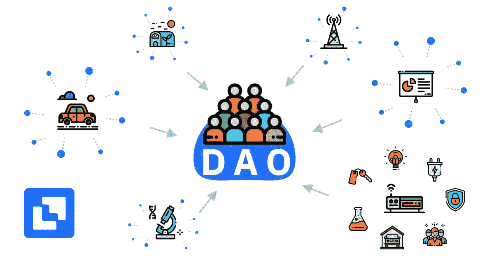

from Ledger

这篇文章引用 Dao 作为“学习中心”,学生现在可以加入一个社区来学习他们感兴趣的想法和领域。然后，他们可以开始应用他们的知识，为道工作，同时一路赚钱。"

Dao 最酷的一点是，它们可以使治理更加透明，从而允许最大的贡献者在课程和交付等方面获得相应的发言权。DAOs 可能标志着完全受学生影响的教育的转变。

# 那么，负担能力呢…？

任何地方的学生只要能上网，就能利用免费和开放的内容。他们可以利用自己的时间研究内容和学习，区块链将允许任何获得的证书在链上得到验证，并对潜在的雇主可见。学生们可以完成奖金并向雇主展示他们的技能，而不是做传统上所谓的家庭作业。

Web3 尤其令人兴奋，因为它建立在 web2 取得的所有进展之上。许多 web2 平台已经在确保公平获得教育和学习方面发挥了作用。

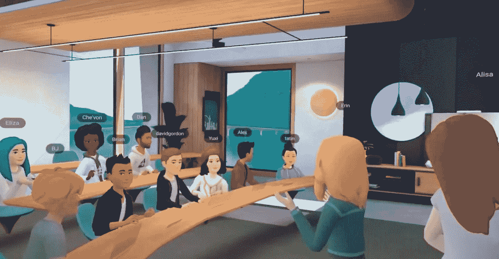

from [Ingel Soong](https://ingelsoong.com/metaverse-tuition/)

无论您身在何处，进入元宇宙都能获得更好、更公平的体验。在元宇宙，你只需要用你的数字头像就可以参与了。

# 和认证……..？

总的来说，标记化和标记的使用可能会改变教师和学生之间的关系。

学生可以获得微型证书，为他们需要学习的东西付费，在他们需要的时候及时使用。微证书的一些例子可以包括发表文章、活跃在社交媒体上、写作、发表演讲等。可以实时制作和更新技能组合。此外，整个过程可以用徽章游戏化，徽章显示你学到了什么，有时被称为 POAPs(出勤证明协议)。像 [Open Badge Passport](https://openbadgepassport.com/) 和 [POAP.xyz](http://poap.xyz/) 这样的服务是朝着这个方向迈出的第一步。

from Mozilla Open Badges

教师或其他认证人员可以通过授予特殊学分来评定技能，这些学分也将存储在每个学生在区块链上的帐户中。

[网络 3 在教育中的整合真正代表了问题的转变，不再是“孩子有多聪明？”到“孩子在哪些方面聪明？”](https://ed3.mirror.xyz/0U3QG8-4K6CD_ltU6SJyKN3-uBD3x6nEFs-YeShzYmk)

# Web3 x 传统版

基于能力的教育创造了 web3 在传统教育机构中工作的模式。

学生可以在各种地方学习技能，包括 Dao、web3 学习平台、工作场所和同伴学习。基于能力的方法意味着任何经验都可以结合到一个传统的程度(从缓慢的整合开始)。

传统教育的网络 3 可以改变一些事情，比如:

*   允许个人搬到其他地方继续接受教育
*   为独立学习、工作、创业、服兵役等提供可叠加的信贷
*   早在标准化考试之前就发现有天赋的学生

# 构建项目

在展望教育的未来时，我创建了一个 [web 应用](https://nftcredify.vercel.app/)来允许数字证书存储在区块链上，并让人们能够通过 NFTs 授予证书，并在链上验证其合法性。

本质上，该项目允许您创建证书链，并将其发送到某人的钱包。它还允许您查看这些凭据。虽然这个项目有许多不同的部分，这里是一些主要的技术和系统涉及到这个项目的生活。

# 开放徽章标准

首先说一下凭据。凭证需要是可验证的、可携带的和充满信息的。对于这个项目，我使用了不是特定产品或平台的 [IMS 开放标准徽章](https://openbadges.org/)。相反，它是一个按照特定标准构建的数字徽章，这些标准对于构建 web 应用程序非常有用。例如，web 应用程序允许用户通过使用哈希函数来手动验证凭据。还有一些字段用于输入描述、可选注释、链接和图像等内容。

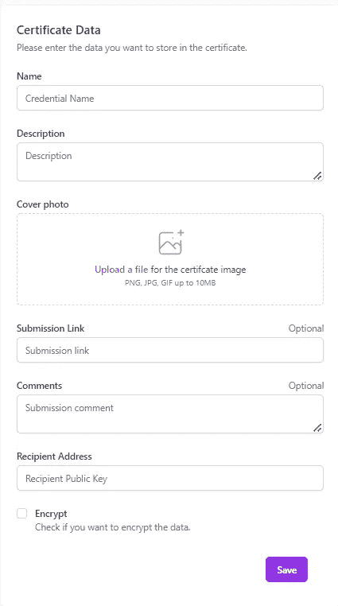

让我们浏览一下我们的凭证逻辑。Open badges 为我们提供了在链上验证我们的凭证的结构，具体方法如下:

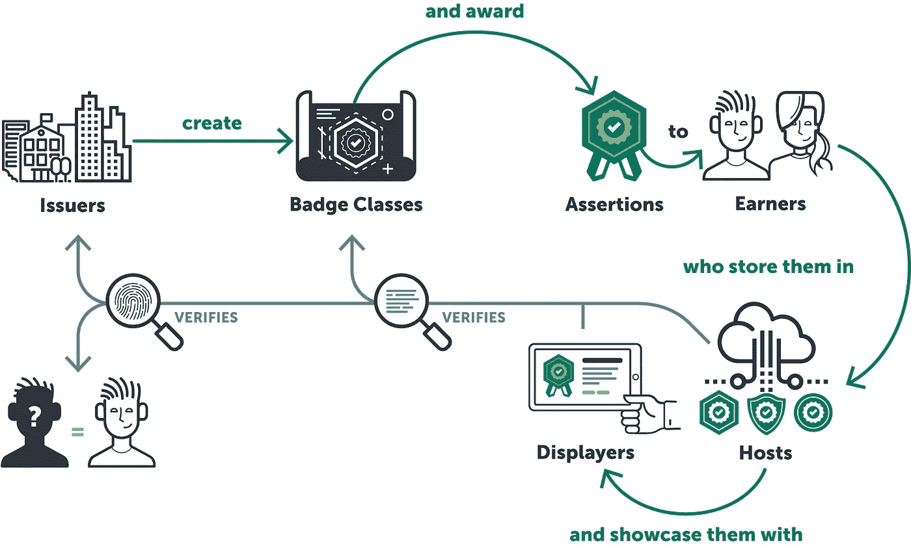

from IMS Open Badges

# IPFS

如上所述，该应用程序需要有用的元数据和图像进行存储。但是，这些元数据和图像从哪里上传呢？在传统的 web2 应用程序中，您需要一个支持数据库的后端来存储这样的信息。

今天，当你想访问一个网站时，你的浏览器(客户端)向服务器(主机)发送一个请求，不管服务器在哪里，都会打开这个网站。这被称为基于**位置的**寻址，它使用 IP 地址来显示你的位置。这个过程消耗了大量的带宽，这意味着更多的金钱和时间。更糟糕的是，HTTP 一次从一台服务器上下载一个文件——想象一下下载、访问和传输大量信息会有多慢和多困难。

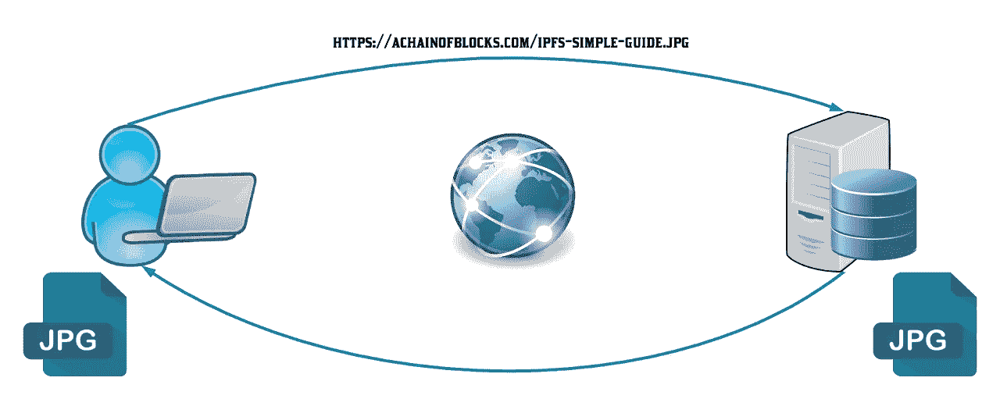

IPFS 很酷，因为它*没有单点故障。*它是一个对等的、分布式的文件系统，可以从字面上代替 HTTP，去中心化整个互联网。互联网审查实际上是不可能的，发布的信息不可能根据提供商或托管网络的判断突然消失。

IPFS 还允许增加安全性。DDos 攻击不会起作用，因为它依赖于攻击一个中心故障点，而 IPFS 显然不具备这一点。IPFS 的另一个优点是它还允许提高速度。在分布式网络中，每个请求某个东西的节点都向最近的节点请求，而不是向一个单一的中心位置请求。

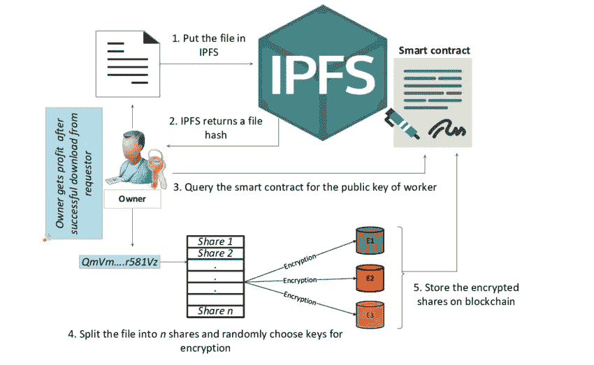

from Research Gate

这怎么可能？

IPFS 的工作原理是将网络上的所有设备连接到同一个文件结构。这个文件结构是一个 Merkle DAG，它结合了 Merkle 树(在区块链用于确保不变性)和有向无环图(在 Git 版本控制中使用，使用户能够看到 IPFS 上内容的版本)。

假设您想阅读以太坊白皮书。你可能会打开你最喜欢的浏览器，输入一个 URL，这个 URL 可以被解析成一个 IP 地址，它提供了文件位置的信息，然后允许你的客户端与主机建立连接并获取文件。这里面有很多问题。

现在，想象一下从 IPFS 网络访问它。文件及其所有块都由内容本身的唯一加密哈希来标识。整个系统基于一个键值数据存储。这就是允许内容寻址的原因:任何人都可以拥有密钥，而不管信息的来源。本质上，你可以连接到 swarm 并从网络上请求那个文件。它会首先查找你最亲近的同伴，因为他们很可能有该文件的副本。如果没有，您将与最初上传文件的节点连接，因为这是托管该文件的节点。

然后，您下载该文件，并成为自己的主机。这意味着你基本上同时是主机和客户端🤯

连同以太坊等其他分散化项目，IPFS 非常强大。以太坊这样的区块链可以做 DApp 的后端，前端由 IPFS 服务。这意味着您的应用程序可以完全去中心化。

很神奇吧？！？

对于这个项目，我使用了 Infura 的 IPFS 网关，因为它最容易安装。

# 加密

这个项目的最后一部分是设置加密，让人们可以自由选择谁可以看到他们的凭证。这意味着，如果有人来搜索钱包地址，他们可能会看到加密的凭证，他们将无法访问元数据。

加密的简单过程如下所述:

1.  一条清晰可读的消息(或者在这种情况下是元数据)被加密成一条不可理解的加密消息。
2.  加密的信息通过互联网发送，其他人可以看到加密的信息。
3.  当它到达目的地时，预定的接收者，只有预定的接收者，有某种方法将它解密成原始消息。

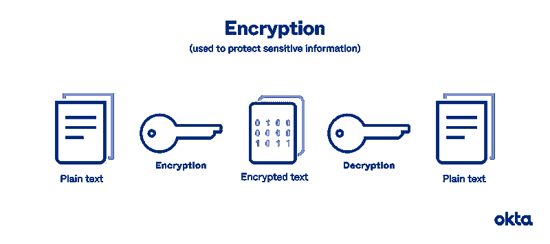

from Otka

在公钥加密中，加密和解密密钥是不同的。

公钥加密让参与交易的每个人都有两把钥匙——一把公钥和一把私钥。两个键是连在一起的，实际上是非常大的数，有一定的数学性质。如果你用一个人的公钥对一条消息进行编码，他们可以用他们匹配的私钥对其进行解码。这是加密背后的基本思想，它为用户提供了加密存储在凭据中的元数据的选项。

# 奖励:散列函数和 ENS 域

所以上面的一切都很酷，但是有一天我出去散步的时候，我在想，我怎样才能让它变得更加复杂和困难呢？

在我意识到之前，我已经掉进了一个散列函数的兔子洞。我创建的应用程序的一个很酷的功能是，每个凭证或 NFT 的元数据都经过了链上哈希处理，因此您可以看到元数据是否真实，凭证是否可验证和准确。您可以单击一个按钮，立即将原始元数据的哈希与您当前正在查看的元数据的哈希进行比较。

我想到的另一件事是像这样的应用程序的用例。如果你想从认证组织或公司获得证书，他们可能会有一个 ens 域。显示 0x 是没有意义的……..因为人们将无法识别它。几个小时和几行代码后，我的 web 应用程序可以显示 ens 域和钱包地址😎

这基本上是 web 应用程序的主要部分。这个项目目前在 Rinkybye Testnet 上，所以你可以在这里玩这个项目，并向你的朋友发送证书以示感谢😌

虽然无论如何都不全面，但这个项目显示了 web3 在彻底改变我们对教育的看法方面的潜力。就像数字证书一样，鉴于从访问到地理位置的巨大差异，在创造一种公平的方法来判断技能和其他教育成果方面已经有了很多进展。

通过 web3 和区块链的承诺，更多的学习者将能够获得并负担得起高质量的教育，以帮助他们在这个不断变化的世界中成长、学习和改变。

**我对教育未来的许多理解和想法来自于** [**这篇精彩的文章**](https://ed3.mirror.xyz/0U3QG8-4K6CD_ltU6SJyKN3-uBD3x6nEFs-YeShzYmk) **所以我鼓励你去看看！**

> 如果您对本文/我的理解有任何疑问或发现错误，请联系我，我们将不胜感激。
> 
> *不然可以在*[*Twitter*](https://twitter.com/_anyasingh)*上抓我或者在*[*LinkedIn*](https://www.linkedin.com/in/anya-singh/)*上联系我。我也每天在 Substack 上写我在 crypto/区块链* [*这里*](http://anyasingh.substack.com) *学到的东西，如果你有兴趣可以订阅；)*