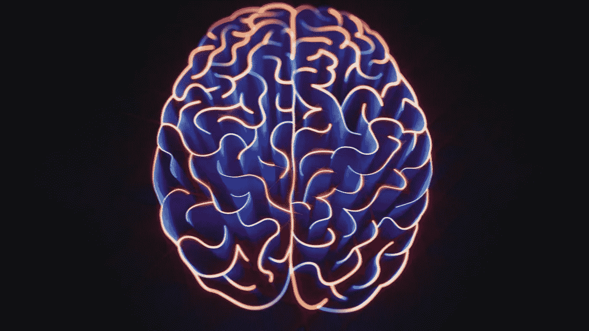
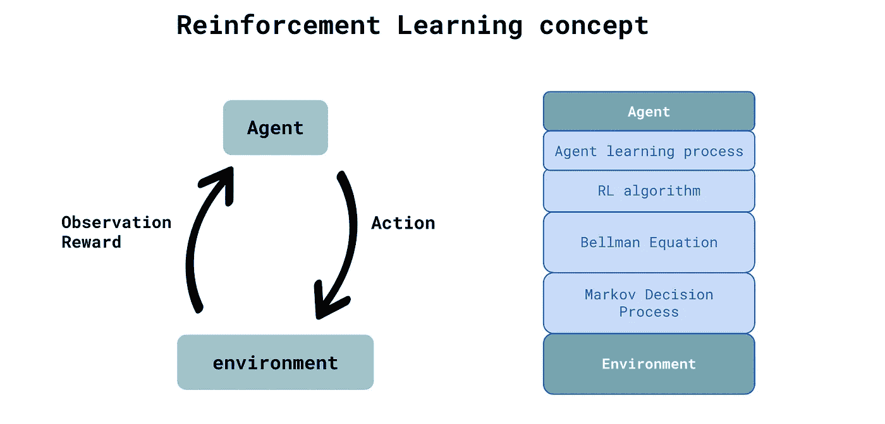
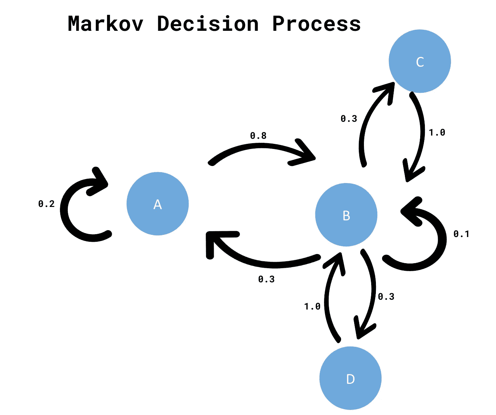
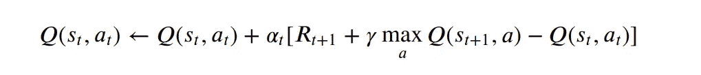

# 强化学习。C++中的贝尔曼方程。

> 原文：<https://medium.com/geekculture/reinforcement-learning-bellman-equation-in-c-b4c52b3300a9?source=collection_archive---------4----------------------->



MIT

在接下来的文章中，我将简要强调强化学习的主要概念，特别关注被认为是相关领域中基本方程的[贝尔曼方程](https://en.wikipedia.org/wiki/Bellman_equation)。我们要用 C++玩简化迷宫游戏，我的代码你在这里找到。
请注意，下面的文章并没有穷尽所讨论的问题，而是给你一个理解原理(直觉)和软件的良好开端。我还指定了一些有价值的参考资料，我认为如果你想深入这个非常迷人的领域，熟悉这些资料是非常重要的。

# 强化学习概念

[强化学习](https://en.wikipedia.org/wiki/Reinforcement_learning)是机器学习(ML)的一部分，它定义了**代理**(机器人、机器、流程等)和**环境**(代理执行特定动作的地方)。环境由**状态**表示——一组完整描述环境的变量。代理可以访问也可以不访问实际环境的状态。代理在任何给定时间感知的变量集合被称为**观察**。

在与环境交互的每个状态下，代理可以执行特定的**动作**(例如，向左移动、向右移动、停止或向前移动)——根据**策略**——这可以与代理决定在特定状态下采取何种动作的策略相关联。我们可以把政策看作代理人的大脑。

代理与环境交互(通过执行特定动作)接收，代理从环境接收**奖励**(可以是正的或负的)。

**代理人的目标，是在代理人与环境互动的同时，使其累积报酬最大化，称为回报。代理的“大脑”学习采取什么行动来实现这个目标。这是 RL 的主要原理。**

执行动作的主体影响环境，环境通过将主体从一种状态转换到另一种状态来响应主体的动作。负责这种转换的功能称为**转换功能**。动作、状态、转移函数和回报共同决定了[马尔可夫决策过程](https://en.wikipedia.org/wiki/Markov_decision_process) (MDP)，这是 RL 的一个基本框架。

请考虑下图，该图概述了如何将上述概念纳入 RL 堆栈



by author

# 马尔可夫决策过程

我们在上一段中讨论过，RL 的基本框架与**马尔可夫决策过程**(因果过程)直接相关。
考虑试图实现目标的代理人。执行动作时，代理在状态和学习之间转换(“大脑”)。我们所说的学习是指代理人学习策略(如何在特定状态下执行动作以最大化累积回报)。
**当智能体与环境交互时，智能体自身发现如何实现给定目标的最优策略(策略)。我们不必为代理动作编程。我们只提供算法，它决定代理如何与环境通信。RL 算法有相当大的范围，其选择取决于应用、环境、代理必须遵循的策略、目标等。除了大量适用的算法外，所有这些算法都基于贝尔曼方程**

代理运行的环境是由一组变量定义的(正如您现在所熟悉的)。这里我们可以命名为:特定时间的环境状态，代理可以采取的行动，奖励和转换。对于给定的变量，我们可以定义 MDP，一个代理状态、转换(状态之间)和这些转换的某些“条件”的图表。我们可以说(考虑下图),概率为 0.8 的代理将转移到状态 B。代理可以从状态 B 转移到状态 C 和状态 D，同样概率为 0.3。从状态 C 或 D，概率等于 1.0 的代理只能转移到状态 B，等等。



by author

## **折现因子，学习率，探索因子。**

当我们讨论强化学习时，考虑需要调整的流动因素是很重要的。

**代理在执行行动时收到的奖励的折扣系数**。基本上，因素**决定了相对于近期的回报，代理人对远期回报的关心程度**。如果γ=0，这意味着代理人更喜欢早一点而不是晚一点得到报酬。对这一现象的解释与代理人未来能得到的报酬是不确定的这一情况有关。数学上用随时间呈指数衰减的**贴现因子γ**表示。

**学习率**被认为是**代理接受新状态值与旧值的多少(作为一个因素)**。

**ε因子，**直接对应**勘探——开采**困境。ε因子决定代理如何做出决定。代理计算第一个随机数(等于或小于 1.0)，如果这个数大于ε因子，代理遵循**探索**方法——代理选择随机动作。代理探索环境，并有机会“发现”实现目标的可能性。
另一方面，如果计算出的随机数低于ε因子，代理遵循**利用**并基于学习到的知识选择动作。在这种情况下，代理选择“最佳行动”。

# 贝尔曼方程方法

我们明白，代理人的目标是找到达到目标的最优途径。当与环境交互时，代理学习策略(策略)以获得成功(代理可以从环境中获得最大回报)。正如您所记得的，代理在环境的每种状态下都有一组动作可供选择。策略(strategy)可以被认为是**状态**到代理**动作的映射函数。**

## 状态值函数

当代理学习策略时，对代理来说最重要的是评估**状态值**,该值指定代理在具有策略𝜋.的特定状态下“有多好”正如你所记得的，代理人试图最大化总报酬(回报)。回报函数不是状态或行为的函数，只取决于时间和贴现因子。
现在我们可以组合这两个组件(状态值和奖励)并确定下一个映射函数(除了上面提到的策略之外)，称为**状态值函数**，它定义当代理遵循策略𝜋.时状态值 **s** 的值通常，状态值函数衡量代理处于该状态有多好。

## 动作值函数(Q 函数)

除了代理能够估计状态的值之外，代理还需要知道在策略𝜋.下的状态 **s** 中采取适当的动作 **a** 我们上面定义的状态-值函数有助于区分环境中每个状态的值，但是它没有提供代理采取最佳行动的机制。
我们引入了**动作-值函数**，它指定了代理在特定状态 **s** 下用策略(策略)𝜋.执行动作 **a** 有多好动作值功能也被称为**Q-功能**。

## **贝尔曼方程**

遵循只关注直觉的文章“策略”,我们可以说贝尔曼方程是递归计算状态值函数和动作值函数的方程。有了这两个值，代理就能够遵循最优策略来实现目标。这意味着代理人将总是采取最佳决策，以通过具有最高回报的状态。

最后方程(没有描述冗长的推导过程)被公式化如下(这个方程用 C++代码实现)。为了理解 Q-函数的更新是如何执行的，请查看一下实现。



## **代理学习和运行游戏。C++实现**

我决定用 C++实现贝尔曼方程(代码在这里)。为了简单起见，代理在标准迷宫问题中找到解决方案。我们定义环境——迷宫:4x4、6x6 矩阵或其他大小(在我的存储库中有这两种变体)。迷宫中的每个位置都被视为一个代理状态。代理的目标是学习策略，以便找到从开始到目标的最佳方式，避开障碍(洞)。您可以自由调整起点、目标和孔的位置。当代理人选择通过他进洞的行动时，代理人得到负回报-1。学习过程可以在终端(Linux)上看到，但是你需要安装 [Eigen](https://eigen.tuxfamily.org/index.php?title=Main_Page) 库。

```
git clone [https://gitlab.com/libeigen/eigen.git](https://gitlab.com/libeigen/eigen.git)
sudo ln -s /usr/include/eigen3/Eigen /usr/local/include/
/usr/include/eigen3/Eigen  -- location of your clone library
```

你可以在没有特征矩阵的情况下运行，但是你必须对使用特征矩阵的代码进行注释。

您可以随意调整讨论的参数。我希望代码是自我解释的。

我真的推荐以下这本书，它很独特:

[【1】米格尔·莫拉莱斯。摸索深度强化学习](https://www.manning.com/books/grokking-deep-reinforcement-learning)。