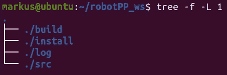
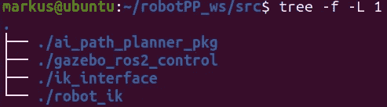
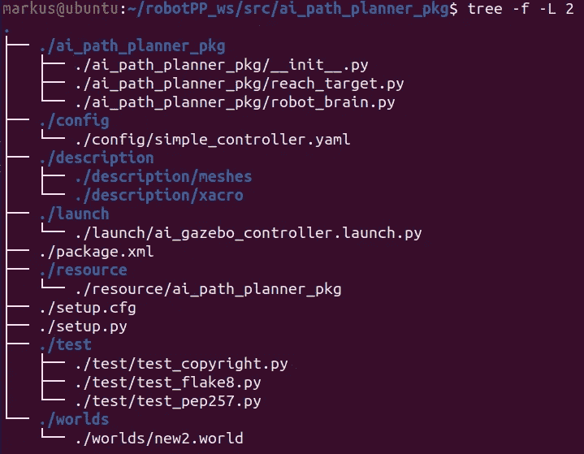
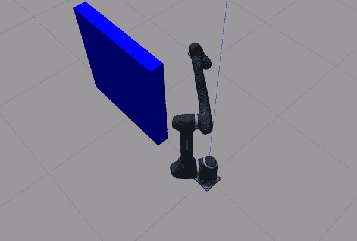

# 基于 ROS2 的 6 自由度机器人强化学习路径规划器

> 原文：<https://medium.com/geekculture/reinforcement-learning-path-planner-for-6dof-robot-in-ros2-518581dc72c7?source=collection_archive---------7----------------------->


在这篇文章中，我会给你一些例子，如何在 ROS2(福克西)中创建机器人仿真。
[斗山](https://github.com/doosan-robotics/doosan-robot2)协作机器人将是我们项目的一部分。我们将使用强化学习代理来寻找最优路径。我们使用数值[逆运动学](/geekculture/inverse-kinematics-solver-in-c-e999f1b7f353)来计算机器人的关节位置。最后，一组机器人关节将被发送到机器人控制器，以执行避障运动。
机器人将根据路径规划器(寻找 A 点和 B 点之间的最佳路径以避开障碍物)移动。有许多算法可以找到最佳路径。通常，机器人运动的最佳路径是通过例如 [A*算法](/geekculture/graph-algorithms-in-c-161d2d3c245)(参见我的文章和 C++实现)来搜索的，该算法在关节空间坐标空间中找到最佳路径。在这篇文章中，我们使用笛卡尔空间。强化学习代理使用贝尔曼方程进行路径计算(见我以前的[文章](/geekculture/reinforcement-learning-bellman-equation-in-c-b4c52b3300a9))。

# **项目详情**

为了简单起见，在这个项目中，路径是在 2D (XY)中计算的，Z 平面被认为是常数。我在上一篇文章中描述的强化学习的想法。这里重用了这个方法。将 Z 轴视为常数，代理在 3×3 迷宫中寻找最佳路径。请注意，在 src 文件夹中，您将精细实现 3D planner，其中代理与 27 个状态(3x3x3 矩阵)进行交互。迷宫的每个点都被认为是一个 XYZ 位置。因此，对于三维迷宫在我们的情况下可以表示为一个 27 个节点的立方体(正如我在这个项目中提到的，我们认为 Z 轴是常数，所以我们的代理在 9 空间环境中找到路)。
当到达目标机器人位置的路径满足时(起点和目标之间的路径)。这些位置被发送到反向运动学管理器，以便(数值地)计算机器人的关节部分(对于迷宫中的节点)。反向动力学管理器计算特定方向的机器人位置，但您很容易改变(考虑代码中的注释)。模拟可以在 Gazebo 看到。下面考虑 ROS2 节点之间的“信号”流。
该项目是对一般机器人运动规划问题的简化。实际上，机器人的关节空间由覆盖机器人工作空间的数千或数百万个节点来模拟。
在这个项目中，我们使用简化的方法来熟悉这个可以用作路径规划器的算法。对于具有许多节点(机器人的位置)的环境，我们应用深度强化学习，其中我们的 Q 表(机器人的大脑)由神经网络代替(参见 may 以前关于深度强化学习的文章)。

# **ROS 2 中的解决方案**

在接下来的部分，我将描述允许你从头开始构建 ROS2 模拟的步骤。你也可以在我的 [GitHub](https://github.com/markusbuchholz/6DOF_Robot_in_ROS2_Doosan) 上找到完整的工作包。
注。我不打算预设 ROS2 的架构以及它是如何工作的。有优秀的文档: [ROS2](https://docs.ros.org/en/foxy/index.html) ， [Moveit](https://moveit.picknik.ai/foxy/index.html) ， [Control](https://control.ros.org/master/index.html) 。
我也推荐一下 [URDF 在凉亭的教程](https://classic.gazebosim.org/tutorials?tut=ros_urdf)。

一开始，创造你的工作空间。这里我创建了 robotPP(在“colcon build”命令之后)



after command: colcon build

正如你在下图中看到的，在 src 中有 4 个文件夹(包),你将一步一步地创建它们。
**ai_path_planner_pkg** 是一个主包，在这里你可以启动你的主函数。
**gazebo_ros2_control** 是一个负责控制我们将要使用的机器人的包。我们将从官方仓库克隆这个包。
**ik_interface** 是管理节点间数据的[服务](https://docs.ros.org/en/foxy/Tutorials/Beginner-CLI-Tools/Understanding-ROS2-Services/Understanding-ROS2-Services.html)包。在此项目中,( ai_path_planner_pkg)中的主程序通过服务包(在本例中为 ik_iterface)与其 ik_manager 通信。
请检查 ik _ interface/SRV/XYZ points . SRV 中的文件。前三行是请求的参数(发送给管理器)，破折号下面是响应(计算的联合)。

```
float32 x
float32 y
float32 z
---
float32 j1
float32 j2
float32 j3
float32 j4
float32 j5
float32 j6
```

**robot_ik** 是机器人逆运动学的“管理者”。经理用数字计算机器人关节。这些计算的输入是由强化学习代理“建立”的 XYZ 位置 XYZ。XYZ 位置和计算关节通过上述定义的服务(IK_interface)传输

在 src 文件夹中执行以下“操作”:

```
// 1\. 
ros2 pkg create --build-type ament_python ai_path_planner_pkg --dependencies rclpy// 2.
ros2 pkg create --build-type ament_cmake ik_interface
cd ik_interface/
mkdir srv// 3.
ros2 pkg create --build-type ament_python robot_ik// 4.
git clone -b foxy [https://github.com/ros-simulation/gazebo_ros2_control.git](https://github.com/ros-simulation/gazebo_ros2_control.git)
```

运行上面的命令，你的机器上应该有类似的文件夹设置。请查看我的 [gitHub](https://github.com/markusbuchholz/6DOF_Robot_in_ROS2_Doosan) 以便检查项目设置。



现在我将把重点放在 ai_path_planner_pkg 包上，因为它包括机器人的定义、启动文件和控制设置。
该文件夹如下所示



文件夹/描述包括“构建”机器人虚拟模型所需的所有文件。子文件夹和包含的文件由斗山机器人生成(见[此处](https://github.com/doosan-robotics/doosan-robot2/tree/master/dsr_description2))。启动文件夹包括启动 Gazebo 模拟的 python 脚本。在 python 脚本中，我们调用定义机器人的第一个 xacro 文件(机器人运动学和物理参数，如:质量、惯性、链接类型、速度等)。
为了影响机器人运动，您必须调用控制器(见 macro . gazebo _ config _ control . xacro ),正如您所想象的，该控制器可被视为机器人(如 moveL 或 moveJ)命令和物理机器人(此处为 Gazebo 中的模拟)之间的接口。控制器接受命令并计算关节轨迹，以实现目标。

现在，您必须构建和采购:

```
colcon build
```

现在打开您的终端(或终端)并运行以下命令(在终端的单独实例中运行命令)

```
ros2 run robot_ik doosan_inverse
ros2 launch ai_path_planner_pkg ai_gazebo_controller.launch.py
ros2 run ai_path_planner_pkg reach_target
```

机器人的预期运动。



**参考文献:**

大卫·瓦伦西亚

[2] [机器人休闲](https://roboticscasual.com/)