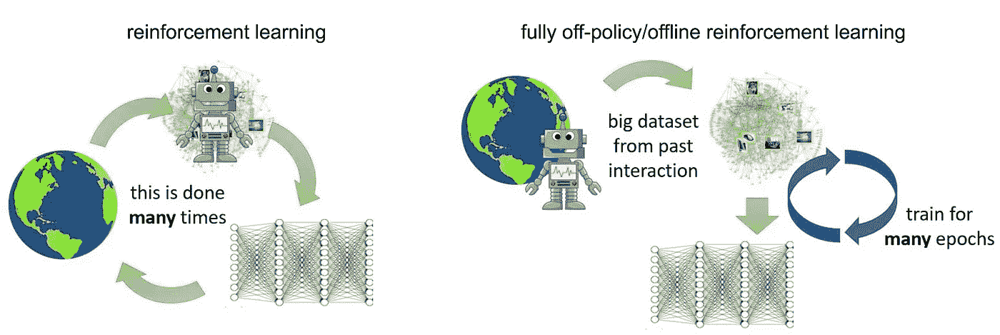

# 强化学习——奖励你的东西会让你变得更强

> 原文：<https://medium.com/geekculture/reinforcement-learning-what-rewards-you-makes-you-stronger-9aa03ad9e0e?source=collection_archive---------16----------------------->

强化学习指的是一个实体**通过反复试验**学习，而不是被明确教授，以便最大化最佳行动的可能性。像任何其他好的定义一样，让我们把这个词分解一下。“加强”的意思是加强/增加某物。所以，如果一个学生努力学习以提高成绩，这是强化吗？嗯，看情况。从技术上讲，RL 涉及一个代理人(我们的英雄)获得量化奖励，作为他们行动成功的编码，然后通过最优策略最大化获得更好的量化奖励的机会。

你可能在科技新闻博客、人工智能初创公司封面故事或科幻电影中读到过 RL。所以让我们回顾一下 RL 的**利与弊**:

优点:错误没有可重复性。与监督 ML 模型不同，RL 模型可以自我学习，并且不太可能重复一个错误两次。此外，它们在探索和利用性能之间保持平衡。与其他算法不同，RL 可以制定发现新领域的完美策略，并利用过去的正确行动。

反对:RL 模型可能不会很快收敛到一个政策，因此它们需要一个不会快速变化的环境。对于它们可能被部署的真实世界来说，情况并非如此。延迟对我们代理人的奖励会导致我们政策的不一致，这是不理想的。

**我们什么时候应该考虑应用强化学习？什么时候不呢？**

RL 在你想要模拟某个过程的情况下有很大的应用。就像一家企业试图弄清楚消费者对其产品新用户界面的反应。此外，手动优化任何任务的操作都很困难，因为状态(我们代理的状态)空间很大，并且有许多选项可供选择。RL 算法可以减轻这里的劳动。

现在，在某些情况下，很难为你的代理定义一个奖励函数，因为需要一个数值。例如，自动驾驶汽车可以在每次检测到障碍物并停下来时获得奖励。但是如果有人在车停下来之前把障碍物移走了呢。对于这部分成功，数字奖励是否应该保持不变？尽管这个问题可以通过逆 RL 来解决，但是模糊的奖励函数并不是最好的 RL 领域。最后，如果你不能在模拟中犯错误，那么 RL 模型会让你付出很大的代价，因为它们在学习过程中肯定会出错。

**监督学习和强化学习有什么区别？**

监督式 ML 使用一组训练数据来学习给定类似概念的某个概念，而 RL 使用与环境的直接交互来计算出给定基本奖励标准下采取的最佳行动。这意味着 RL 算法在开始提交动作之前对环境没有概念，但更有可能随着训练而改进。事实上，结合 RL 的神经网络在获得适当的 Q(奖励函数)值方面已经显示出巨大的成功。

**离线强化学习**

这指的是通过批量摄取数据而不是一次一个观察来学习一切的代理。记录的交互数据(状态、动作和奖励)必须一起发出，而不是连续传输。这使得离线 RL 大大便宜，性能更好。这种方法通常被称为“数据驱动”。

**利与弊:**离线 RL 相对于其他方法的一个重要能力是摄取大量不同的数据集，并产生广泛适用于新情况的解决方案。例如，在向新用户推荐 Youtube 视频方面有效的政策，或者可以在陌生情况下执行机器人任务的政策。“泛化”能力在我们可能构建的几乎任何机器学习系统中都是必不可少的，但典型的 RL 基准测试任务不会测试这一属性。这使得离线学习变得更加“常识化”。由于外推误差，标准深度强化学习算法，如 DQN 和 DDPG，无法利用与状态分布、奖励和当前政策行动不相关的数据进行学习。因此，修复一个批处理会导致收集的数据缺乏代表性/多样性的问题。

**什么时候用或者不用离线 RL？**

机器人和自动驾驶汽车需要大量数据来获取它们的技能，因此具有预训练模型和批量数据的离线 RL 非常适合。离线 RL 可以很好地适应机器人操作员，在这种情况下，动作的精确性和准确性不能妥协。在线 RL 使用部分训练的策略或专门的数据来执行任务，这可能会导致我们的代理由于对在线数据的敏感性而表现不佳。总之，离线 RL 模式会带来更值得信赖的代理。

**离线 RL** **的一个有趣的例子是新闻推荐**，这是当今的一个热门话题，我们可以通过某些用户的阅读信息、新闻特征(如出版商、文章长度等)来预测他们的返回行为。还可以调整时间、与其他新闻的关系以及新闻显示顺序等上下文特征，以推荐以积极方式提高参与度并减少错误信息的文章。记住，信息只有在被解释的时候才是好的。因此，使离线 RL 成为在新闻平台上部署的值得信赖的方法。

目前就这些。希望这足以让你在 https://ai . Google blog . com/2021/04/evolving-Reinforcement-Learning . html 上了解更多关于强化学习的信息

