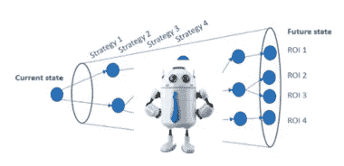

# 强化机器学习:人力资源的下一大步

> 原文：<https://medium.com/geekculture/reinforcement-machine-learning-the-next-big-step-for-hr-ccc3ea908bd7?source=collection_archive---------16----------------------->

Image by stokkete

## **简介**

2016 年 3 月 15 日，当 DeepMind 的 AlphaGo 强化机器学习模型击败围棋世界冠军 Lee Sedol 时，人工智能世界发生了变化，这表明在寻求基于无限多种可能性做出最佳决策/行动时，计算机已经正式超越了人类。基于其对机器学习未来的所有影响，这场胜利开启了一个新时代。除了游戏场景，它还证明了未来现实世界机器学习应用的价值将通过强化学习得到最大化，包括在人力资源领域。

## **AlphaGo 及其启示**

DeepMind 是一家人工智能公司，于 2014 年被谷歌收购。它开发了 AlphaGo，这是一种使用蒙特卡罗树搜索算法构建的机器学习模型，该算法基于人工神经网络先前通过人类和计算机训练获得的知识来确定其移动。

围棋是一种逻辑游戏，类似象棋，流行于中国、日本和韩国。1997 年，IBM 创造了一个名为“深蓝”的机器人，它打败了当时的国际象棋世界冠军加里·卡斯帕罗夫。这是计算机第一次在这类比赛中获胜。然而，AlphaGo 在许多方面与众不同，但最重要的是它能够在一场几乎有无限种可能走法(“决策”)的游戏中击败人类。

AlphaGo 击败 Lee Sedol 的胜利引发了许多辩论，内容是它是否展示了向人工一般智能(人工智能是研究人员追求的人工智能的圣杯)的进步。人工通用智能(AGI)是一种假设的能力，智能代理可以开发在一种环境中学习智力任务并在另一种环境中应用它们的能力，类似于人类。这将意味着像 AlphaGo 这样的机器人最终可能会醒来，并开始学习做围棋范围之外的其他任务，例如学习如何使用武器。请放心，我们还没有接近这种科幻小说中的假设情况。然而，尽管一些研究人员不同意 AlphaGo 是 AGI 进步的证明，但它提醒人们实施机制以确保人工智能保持在人类控制下的重要性(有一个“关闭”开关)，说明了强化学习的力量。

## **什么是强化学习？**

在其核心，AlphaGo 是一个深度强化的机器学习模型。强化学习(RL)与其他两种常见的机器学习模型明显不同:监督学习和非监督学习。后两者使用历史数据来预测未来的结果或评估趋势和变量之间的分组，而 RL 从积极和消极的强化中学习，也称为“奖励”和“惩罚”。

我将引用我以前的[文章](/geekculture/unsupervised-machine-learning-uncover-game-changing-insights-in-your-data-13412a59598d)中关于训练外星人不同类型音乐风格的例子:

在**的监督学习**下，我可以教外星人不同风格的音乐，让它一次听一首歌，每次指定风格“这是说唱，这是流行，这是爵士，……”，直到它开始识别不同类型之间的相似之处，自己猜测风格。

在**无监督学习**下，我只提供对一个曲目的所有歌曲的访问，而不告诉它任何事情，让它去创造自己对歌曲之间模式的理解。

在**强化学习**下，我会与外星人分享 100 首歌曲，让它尝试猜测每首歌曲的风格(之前没有任何关于风格类型的知识)，并在最后根据答对的歌曲给它打分。

Image by Lil’Log

关键在于意图。强化学习通过训练一个“代理”来学习优化其未来结果，从而将自己与其他机器学习方法区分开来。这也包括训练一个代理人在开始时接受小的打击，如果它能让它未来的回报最大化。

我们大多数人在日常生活中都接触过 RL 模型，这些模型的复杂性各不相同:

一些自动真空吸尘器致力于最大化灰尘的收集量。

电子游戏中的机器人试图击败真正的玩家(并非所有的电子游戏机器人都是 RL，有些确实比普通玩家获得了更多的信息)

寻求回报最大化的股票交易机器人

无人驾驶汽车(正在制造中)

RL 远不是一个新的研究领域，它实际上从 20 世纪 50 年代就已经存在，其应用越来越渗透和扰乱市场。

## **alpha go 和强化学习跟 HR 有什么关系？**

使用机器学习模型来最大化未来结果的概念正是人力资源的发展方向。虽然领先的组织越来越多地集成高级分析和机器学习模型来评估观察到的趋势和预测未来的结果，但 RL 可用于确定响应这些观察/预测的最佳策略/最佳行动方案。

让我们收回这个为预测员工流失而开发的[监督学习模型](/geekculture/how-to-build-a-simple-machine-learning-model-to-predict-attrition-and-uncover-critical-operational-82d1af754ba8)。我们评估了一些变量，如“工资”和“加班”，这些变量是公司员工流失的最大因素。使用该模型，我们能够从当前的员工群中预测出最有可能离开公司的人。

解决这一问题的下一步是确定应对这一威胁的最佳行动方案。我们应该给这些员工加薪 5000 美元吗？三万美元？，18.25K？…这些行动会对其他员工产生什么影响？同一团队或不同部门的其他人是否会嫉妒，认为这种做法不公平，并成为下一个飞行风险？不同策略的组合会产生更大的影响吗(加薪 6%，减少 11%的工作时间)？RL 可以回答这些问题，并用于确定最佳行动方案。

通过考虑被评估变量之间的相关性，有可能理解它们的相互关系以及从一个状态转移到另一个状态的所有潜在影响。例如，如果我们将 7 名员工的工资增加 30K，部门和其他个人的工资中位数之间的差距将发生变化，这可能会对其他变量产生影响，如“工作投入度”、“工作满意度”、“环境满意度”，这可能会导致其他员工成为流失风险。强化学习可以用来量化所有这些潜在的场景，并评估哪一个将产生最大的投资回报(ROI)。

最好的一点是，这种类型的模型可以复制，以确定其他观察到的人力资源趋势或情况的最佳行动方案，例如:

-纠正系统多样性、公平和包容性偏见

-确定最佳整体薪酬结构

-提出理想的职业道路和内部流动机会，使员工和组织都受益

请记住，这并没有剥夺人力资源的咨询作用，如果有的话，强化学习为战略干预创造了更多的空间。虽然机器学习可以指出需要进行哪些类型的修改来纠正特定情况，但它们与更广泛的计划/战略的集成及其实施需要由人力资源顾问完全驱动。它归结为优化人力和机器资源之间的可用时间和工作的使用。

## **结论**

作为一名人力资源顾问，我理解其他人更喜欢利用他们的经验、知识和直觉来确定最佳行动方案，但机器在这方面比我们做得更好。2016 年 3 月 15 日证明。

来源:

 [## 电脑是如何打败围棋手的

### 上帝移动玩家，他反过来移动棋子。但是上帝之外的上帝开始了灰尘、时间、睡眠和…

www.scientificamerican.com](https://www.scientificamerican.com/article/how-the-computer-beat-the-go-player/)  [## 深蓝电脑击败国际象棋世界冠军-档案 1996 年 2 月 12 日

### 机器战胜了人类，深蓝，一台“无所畏惧”的 IBM 电脑，撕碎了加里·卡斯帕罗夫，世界象棋…

www.theguardian.com](https://www.theguardian.com/sport/2021/feb/12/deep-blue-computer-beats-kasparov-chess-1996#:~:text=Deep%20Blue%20computer%20beats%20world%20chess%20champion%20%E2%80%93%20archive%2C%201996,-This%20article%20is&text=Machine%20triumphed%20over%20man%20as,prevailed%20in%20a%20traditional%20tournament)