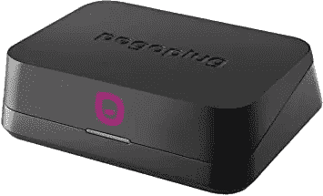

# 用 Debian 10 更新 Pogoplug v4(buster)

> 原文：<https://medium.com/geekculture/rejuvenate-pogoplug-v4-with-debian-10-buster-215bdbf3596f?source=collection_archive---------53----------------------->

记得这个吗？

Pogoplug v4。能够驱动 3 个硬盘并运行 NAS 的便携设备？

我大概在 7 年前买了它，并在我的家庭网络中使用了很长时间。在公司倒闭后，我更新了 debian，并且能够进一步延长这个便利设备的寿命。