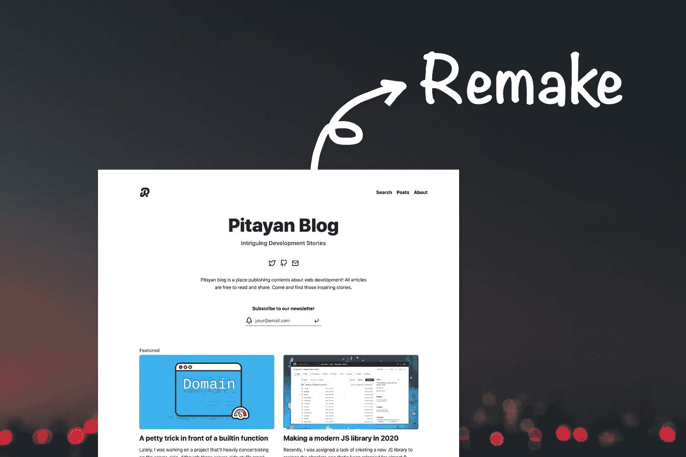

# 用可靠的系统设计重塑我的博客(第 1 部分)

> 原文：<https://medium.com/geekculture/remake-my-blog-with-a-solid-system-design-part-1-d181962b3c8a?source=collection_archive---------77----------------------->

阅读这篇文章

 [## 重拍皮塔延博客(第一部分)

### 最近我决定重新制作这个博客来改进它的工作流程和用户界面/UX。这篇文章将揭开我的故事…

pitayan.com](https://pitayan.com/posts/remake-pitayan-blog/) 

最近我决定重新制作这个博客来改进它的工作流程和用户界面/UX。这个…