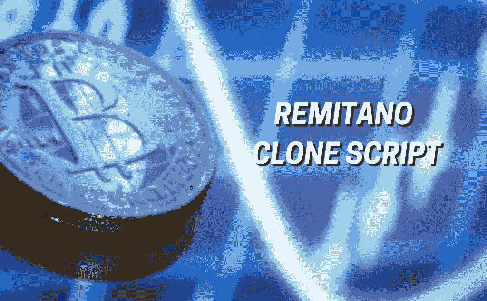

# 雷米塔诺克隆剧本——它如何对企业家有益？

> 原文：<https://medium.com/geekculture/remitano-clone-script-how-it-is-beneficial-for-entrepreneurs-7a4542265f82?source=collection_archive---------14----------------------->

Remitano Clone Script

加密货币是区块链小镇的热门话题，人们总是在各种数字平台上窃窃私语。它的底层技术使得许多初创公司和其他个人进入这一领域，因为它具有高度的安全性、隐私性和透明度，甚至可以通过运营创收的商业模式成为这一领域的亿万富翁。

说到这里，p2p 加密交易所是一个蓬勃发展的商业模式，许多投机者选择这种方式来涉足加密领域并从中获利。说到 p2p 交易，有几种交易模式，但在选择之前你需要确定。其中，Remitano 因其交易服务和收入流赢得了最好的名声。

创建一个像 Remitano 这样的 p2p 加密交易所将有助于你快速进入市场并获得丰厚的收入。好吧，你要开始一个 p2p 加密交换业务，你需要的首要东西是一个吸引注意力的交换网站。为此，您需要选择正确的开发方法。关于这一点， **Remitano 克隆脚本**是目前启动与 Remitano 相同的 p2p 交换最有效的技术。

你困惑吗？不要担心，为了你更好的理解，让我们看看…

## **雷米塔诺克隆剧本——这是什么意思？**

Remitano 克隆脚本是市场上现成的 p2p 加密交换软件**。**在 Remitano 交易所的启发下，它进入了加密市场。这个克隆脚本内置了交易功能、安全模块和其他插件，与 remitano 100%相似。

这个脚本将让您在一周内创建和部署一个像 Remitano 这样的成熟的 p2p 加密交换。使用这个脚本的显著好处是定制范围**。这是因为你可以改变整个交换。例如，您可以根据您的商业计划修改功能、主题、外观、向您的 exchange 平台添加额外功能等。您的独特定制将使您的 exchange 脱颖而出。**

这是一款定制的 exchange 软件，因此它经过了完整的设计、开发、多重测试，并且随时可以部署。你必须总是比你的竞争对手领先一步，这是在密码行业成为一名成功企业家的重要因素。为了快速进入市场，用你的商业理念击败你的竞争对手，Remitano 克隆脚本将是你的企业的最终解决方案。

这样够不够拿到剧本，开始你的 p2p 交易所商业之旅？？不是吧。你还必须意识到它的突出特点和企业家的好处。了解了这些，你就可以清楚地知道是否应该继续进行 Remitano 克隆脚本。

继续读我的父母！

关于雷米塔诺克隆剧本的令人印象深刻的因素就隐藏在这篇文章中！谁知道呢，它甚至可能会改变你的 p2p 交易业务的游戏规则。

好吧！现在，让我们深入了解…

## **使用 Remitano 克隆软件的好处**

作为一个企业家，你可以通过获得一个白色标签雷米塔诺克隆脚本来体验几个优势。让我来分享一些突出的优点，它们可能对您的 exchange 业务非常有益。

1.  高定制范围
2.  你可以通过收取交易费、提现费等获得一笔丰厚的收入。
3.  该软件带有先进的交易模块和安全功能
4.  更快的部署。
5.  兼容多种设备。
6.  带有集成托管系统的用户友好型仪表板。
7.  不需要成为技术专家
8.  您可以在全球任何地方访问或管理该脚本

## **雷米塔诺克隆脚本的预装特性**

您在脚本中启用的功能在您的业务中扮演着重要的角色。它将决定你的平台在加密领域的成功率和品牌。让我列出一些你可以从白色标签 Remitano 克隆脚本中获得的独有特性。

**管理模块**

1.  仪表盘
2.  查看用户详细信息
3.  佣金设置
4.  支付网关集成
5.  争议管理系统
6.  KYC 管理

**用户模块**

1.  用户登录/注册
2.  近似匹配
3.  加密钱包集成
4.  加密存款/取款历史记录
5.  提出争议
6.  创建购买/销售广告
7.  用户对用户的外汇买卖

**安全特性**

1.  监狱登录守卫
2.  短信/电子邮件验证
3.  CSRF 保护
4.  双因素认证
5.  托管保护
6.  HTTPS 认证
7.  SSL 加密/ SQL 集成

通过整合这些强大的功能，您可以将您的 p2p 交换平台提升到一个新的水平。此外，您还可以根据您的商业计划修改这些功能，这有助于您轻松吸引全球范围内的广大加密用户。

## **雷米塔诺克隆脚本的优势**

在使用 remitano 的克隆脚本启动 p2p 交换之前，您需要注意这个脚本的用户和管理员特权。作为一名企业家，通过了解这些好处，你会在选择 remitano 克隆脚本时拥有强大的信心。

**管理端**

1.  Remitano 克隆脚本帮助管理员(启动)以经济高效的方式立即启动 p2p 加密交换。所以，它节省了时间和金钱。
2.  交易所的管理员可以通过有效的管理门户来确认或管理用户的 KYC 报告。只有经过 KYC 管理员的批准，用户才能在平台上执行交易。
3.  管理员可以使用高级功能维护已完成的交换。此外，他们对广告费、提现费、存款费等有决策权。
4.  作为交易所的管理员，你可以阻止进行虚假操作、垃圾邮件活动、网络欺凌和其他可疑活动的买家/卖家。
5.  区分真正的买家和卖家的优先级可以由管理员来实现。
6.  没有管理员的允许，交流中的所有活动都不能进行。
7.  作为管理员，您可以完全访问用户的个人资料、交易历史、钱包余额等。

**用户端**

1.  您的用户可以轻松发布购买/销售广告。
2.  易于注册和登录。
3.  他们可以通过实时数据追踪加密市场。
4.  用户可以利用推荐系统和加盟过程来获得额外的利润。
5.  在 p2p 交易引擎的帮助下，商家和购买者都可以以快速和安全的方式交易不同的加密资产。

我已经提供了所有关于白标 remitano 克隆软件的有益因素和功能的基本信息，这些信息将对您的业务有用。到目前为止，许多初创公司和企业家已经从这个剧本中受益，他们现在是亿万富翁。如果你想成为他们中的一员，那么这个脚本将是你事业的完美解决方案。

## **收尾**

如果我能谈论这个雷米塔诺克隆剧本，我可以为它说一整天。但是我不想让你厌烦。那么，让我来总结一下这篇文章。为了获得一个强大的雷米塔诺克隆脚本，包括所有上述讨论的功能和优势，你需要联系一个真正的加密行业的 [**雷米塔诺克隆脚本提供商**](https://www.coinsclone.com/remitano-clone-script/?utm_source=medium&utm_medium=RemitanoBenefits&utm_campaign=ben) 。这是因为与他们握手将帮助你在 7 天内以预算友好的价格推出像 Remitano 这样的 p2p 加密交易所。此外，您还可以从他们的团队获得全天候的技术支持。