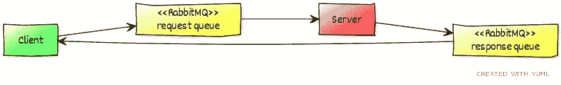
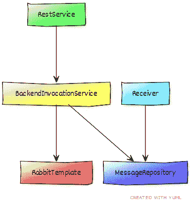

# 基于消息传递的远程 RPC

> 原文：<https://medium.com/geekculture/remote-rpc-based-on-messaging-f3d1646ae373?source=collection_archive---------43----------------------->

通过消息传递系统执行远程呼叫的两种解决方案。


Photo by [John Barkiple](https://unsplash.com/@barkiple?utm_source=unsplash&utm_medium=referral&utm_content=creditCopyText) on [Unsplash](https://unsplash.com/s/photos/wires?utm_source=unsplash&utm_medium=referral&utm_content=creditCopyText)

通过 API 连接两个系统是一个简单的解决方案，但并不总是适用。有时服务通过[企业服务总线](https://en.wikipedia.org/wiki/Enterprise_service_bus)或另一个消息系统(例如 ActiveMQ、RabbitMQ、JMS……)连接。在这种配置中，很难实现同步请求-响应逻辑。这里有两种解决方案，一种是通用的，可以很容易地适应不同的技术，另一种是专门针对 RabbitMQ 的。

# 第一种解决方案，“手动”实施

在不使用框架的情况下“手动”完成这项工作并不是一项困难的任务。理解问题并把它分解成简单的部分是很重要的。

需要实现三种不同的功能:

*   能够从远程服务接收回复:这是一个不断监听回复的服务，它负责存储回复。
*   能够向远程服务发送请求:这是一个一次性完成并返回一个[未来](https://en.wikipedia.org/wiki/Futures_and_promises)的功能。
*   能够将请求与回复相关联:这是使用存储中的数据来完成未来的功能。


Diagram of the three flows

为了演示这个流程，我将描述客户机和服务器。对于这个例子，我将使用 Java、Spring Boot、RabbitMQ 和 Docker。完整的代码请查看最后的链接。

流程:

*   客户端向 RabbitMQ 上的请求队列发送一个请求。
*   服务器处理请求并在响应队列中回复。
*   客户端收到回复并继续。

客户端将是一个简单的 webservice，带有一个 REST 接口来接受参数。这将有助于测试解决方案。下图对此进行了建模:



Overall flow

我将把重点放在客户机上，因为它是大多数逻辑必须实现的地方。结构如下图所示:



*   RestService:只是一个传递输入的用户界面。
*   BackendInvocationService:具有通过 RabbitMQ 调用后端的逻辑的核心组件。
*   MessageRepository:保存所有回复的存储。
*   Receiver:等待来自 RabbitMQ 的回复并将它们存储在 MessageRepository 中的服务。
*   RabbitTemplate:发送消息的 spring bean。

## RabbitMQ 设置

对于这个例子，在 Docker 上使用默认的 RabbitMQ 就足够了。

```
docker run -it --rm --name rabbitmq -p 5672:5672 -p 15672:15672 rabbitmq:3.9-management
```

GUI 可在 [http://localhost:15672/](http://localhost:15672/) (凭证来宾/来宾)获得

我将简要解释如何设置客户端来连接 RabbitMQ。详情请参考官方文档，并查看后端链接中的完整源代码。

```
@Bean
DirectExchange exchange() {
  return new DirectExchange(responseExchangeName);
}@Bean
Queue queue() {
  return new Queue(responseQueueName, false);
}

@Bean
Binding binding(Queue queue, DirectExchange exchange) {
  return
    BindingBuilder
      .bind(queue)
      .to(exchange)
      .with(responseManualRoutingKey);
}@Bean
MessageListenerAdapter listenerAdapter(Receiver receiver) {
  return new MessageListenerAdapter(receiver, "receiveMessage");
}@Bean
SimpleMessageListenerContainer container(
  ConnectionFactory connectionFactory,
  MessageListenerAdapter listenerAdapter) {
  SimpleMessageListenerContainer container = 
    new SimpleMessageListenerContainer();
  container.setConnectionFactory(connectionFactory);
  container.setQueueNames(responseQueueName);
  container.setMessageListener(listenerAdapter);
  return container;
}
```

RabbitMQ 与作为消息接收者的交换机一起工作，它公开队列，并使用以路由键(类似于选择器)为特征的绑定将两者绑定在一起。上面的代码正是这样做的。

## 客户端:RestService

这是一个简单的@RestController，带有 GET 的入口点。该服务将简单地计算输入的立方(这只是一个例子！)在/cube 上。

```
@RestController
public class RestService { private BackendInvocationService backendInvocation;

  public RestService(
    BackendInvocationService backendInvocationService) {
    this.backendInvocation = backendInvocationService;
  }

  @GetMapping("/cube")
  public Response cube(
    @RequestParam(value = "value", defaultValue = "1") int value) {
    return backendInvocation.manuallyInvokeCube(
      new Request(UUID.randomUUID().toString(), value));
  }
}
```

除了值之外，请求还包含标识请求的 UUID。这个 UUID 非常重要，因为它将被用作 correlationId 来匹配请求和相应的结果。任何类型的 id 都可以，只要它是唯一的。

## 客户端:BackendInvocationService

这是核心解决方案的一半。manuallyInvokeCube 方法使用 RabbitMQ 将请求发送到服务器，然后使用请求的 correlationId 从 MessageRepository 获取 Future。MessageRepository 还不知道响应，未来是一种占位符，将在以后异步填充。

```
@Component
public class BackendInvocationService {

  private RabbitTemplate rabbitTemplate;
  private MessageRepository messageRepository;

  public BackendInvocationService(
    RabbitTemplate rabbitTemplate, 
    MessageRepository messageRepository) {
    this.rabbitTemplate = rabbitTemplate;
    this.messageRepository = messageRepository;
  }

  public Response manuallyInvokeCube(Request request) {
    rabbitTemplate.convertAndSend(
      requestExchangeName, requestManualRoutingKey, request);
    Future<Response> futureResult =
      messageRepository.getFuture(request.getCorrelationId());
    try {
      return futureResult.get(120, TimeUnit.SECONDS);
    }catch (InterruptedException | ExecutionException e) {
      return Response.PROCESSING_ERROR;
    } catch (TimeoutException e) {
      Thread.currentThread().interrupt();
      return Response.PROCESSING_ERROR;
    }
  }
}
```

在这个例子中，用一个阻塞 get()返回值立即检查未来。在实际服务中，建议尽可能推迟 get()以利用异步执行。

## 客户:接收方

这是一个简单的接收器，它从队列中获取消息并将它们存储在 MessageRepository 中。当这种情况发生时，消息存储库变得能够完成上一步返回的未来。

```
@Component
public class Receiver { private MessageRepository messageRepository;

  public Receiver(MessageRepository messageRepository) {
    this.messageRepository = messageRepository;
  }

  public void receiveMessage(Response response) {
    messageRepository.store(response);
  }
}
```

## 客户端:消息存储库

这是将事物联系在一起的组件。它包装了一个保存由 correlation id(uuid)索引的期货的映射。当数据存储在地图中并且 containsKey(uuid)变为真时，期货变得完整。请务必记住，这些操作是并发发生的，因此同步是一个需要考虑的因素。

```
@Component
public class MessageRepository { private Map<String, Response> repo = new ConcurrentHashMap<>();

  public Future<Response> getFuture(String uuid) {
    return CompletableFuture.supplyAsync(() -> {
      while (!repo.containsKey(uuid)) {
        try {
          Thread.sleep(100);
        } catch (InterruptedException e) {
          Thread.currentThread().interrupt();
        }
      }
      return repo.remove(uuid);
    });
  }

  public void store(Response response) {
    repo.put(response.getCorrelationId(), response);
  }
}
```

请注意，这种实现是一种简化。特别是，添加清除与超时事务对应的旧响应的机制是非常重要的。

## 服务器:接收器

简单看一下后端。它创建一个由请求的 correlationId 标记的响应，并计算多维数据集。

```
@Component
public class Receiver {

  private RabbitTemplate rabbitTemplate;

  private SecureRandom random = new SecureRandom();

  public Receiver(RabbitTemplate rabbitTemplate) {
    this.rabbitTemplate = rabbitTemplate;
  }

  public void receiveMessageManual(Request request) {
    Response response = new Response(
      request.getCorrelationId(), cube(request));
    rabbitTemplate.convertAndSend(
      responseExchangeName, responseManualRoutingKey, response);
 }

 private int cube(Request request) {
   return 
     request.getValue() * request.getValue() * request.getValue();
   }
}
```

这里没有太多的逻辑。只要响应用请求的 correlationId 标记，服务器就没有特定的概念要实现。

## 试验

要验证一切正常，只需创建几个线程，用不同的输入并行调用客户机的 REST 服务。

```
WebClient client = 
   WebClient.builder()
     .baseUrl("http://localhost:8080")
     .defaultHeader(
        HttpHeaders.CONTENT_TYPE,
        MediaType.APPLICATION_JSON_VALUE)
     .defaultUriVariables(
        Collections.singletonMap(
          "url", "http://localhost:8080")).build();
List<Thread> threads = new ArrayList<>();
for (int i = 0; i < 10; i++) {
  int value = i;
  threads.add(new Thread(() -> {
    String result = client.get().uri(
      builder -> builder.path("/cube")
        .queryParam("value", value)
        .build())
        .retrieve()
        .bodyToMono(String.class)
        .block();
    LOG.info("result for {} was {}", value, result);
  }));
}
threads.forEach(t -> t.start());
threads.forEach(t -> {
  try {
    t.join();
  } catch (InterruptedException e) {
    Thread.currentThread().interrupt();
  }
});
```

此示例将请求 0 到 9 的立方体，输出将如下所示，并以随机顺序回复。

```
[T7] result for 7 was {"correlationId":"7ca1bb96-7adc-4efc-9d39-17605a283009","value":343,"error":null}
[T2] result for 2 was {"correlationId":"1572b2bf-73d0-4fd2-9ab0-439fd181e7bd","value":8,"error":null}
[T4] result for 4 was {"correlationId":"0f9e55c7-68eb-459b-b5f9-eb55a18e3e83","value":64,"error":null}
[T6] result for 6 was {"correlationId":"056312ee-32ae-44d7-99af-2d2350329755","value":216,"error":null}
[T9] result for 9 was {"correlationId":"ff026711-68d3-45cb-be0b-6aea256a736f","value":729,"error":null}
[T1] result for 1 was {"correlationId":"6e0f050d-c6b6-498d-bf65-b9073f503ac1","value":1,"error":null}
[T3] result for 3 was {"correlationId":"a4823e86-fa55-4838-89fb-3356f12d7b90","value":27,"error":null}
[T0] result for 0 was {"correlationId":"4b57857f-e447-4a6f-82f3-50bc964ece0e","value":0,"error":null}
[T5] result for 5 was {"correlationId":"54a60575-4744-4e90-b2c0-5d8dd130ea31","value":125,"error":null}
[T8] result for 8 was {"correlationId":"50c20f17-182e-428d-b559-8b93abef9617","value":512,"error":null}
```

# 第二个解决方案:使用 RabbitMQ RPC

使用 RabbitMQ 可以极大地简化上述实现，因为 RabbitMQ 包含了一种自动执行请求-响应关联的机制。这就是区别:

## 客户端:RestController

```
@GetMapping("/cube-rpc")
public Response cubeRpc(
  @RequestParam(value = "value", defaultValue = "1") int value) {
  return backendInvocation.rpcInvokeSquare(
   new Request(null, value));
}
```

这是对原始入口点的替换，其工作方式相同。我在代码中使用了不同的映射来保存这两者。请注意，不再需要 correlationId，因此它保留为空。

## 客户端:BackendInvocationService

```
public Response rpcInvokeSquare(Request request) {
  return (Response) 
    rabbitTemplate.convertSendAndReceive(
      requestExchangeName, requestRpcRoutingKey, request);
}
```

最初的调用 convertAndSend 被 convertSendAndReceive 代替，这个 api 隐藏了所有的复杂性。客户端不再需要消息存储库或接收器。

## 后端:接收器

```
public Response receiveMessageRpc(Request request) {
  return new Response(null, cube(request));
}
```

后端实现也得到简化。不需要向响应队列发送消息，只需在方法中返回结果即可。

# 结论

使用消息传递手动实现 RPC 并不困难，但是使用 RabbitMQ 的原生 RPC 函数可以节省大量时间并降低代码的复杂性。


The very simple design with RabbitMQ RPC

# 链接

*   我的代号:[https://github.com/alros/remote-rpc-with-rabbitmq](https://github.com/alros/remote-rpc-with-rabbitmq)
*   https://www.rabbitmq.com/
*   https://start.spring.io/
*   用[https://yuml.me/](https://yuml.me/)制作的图表