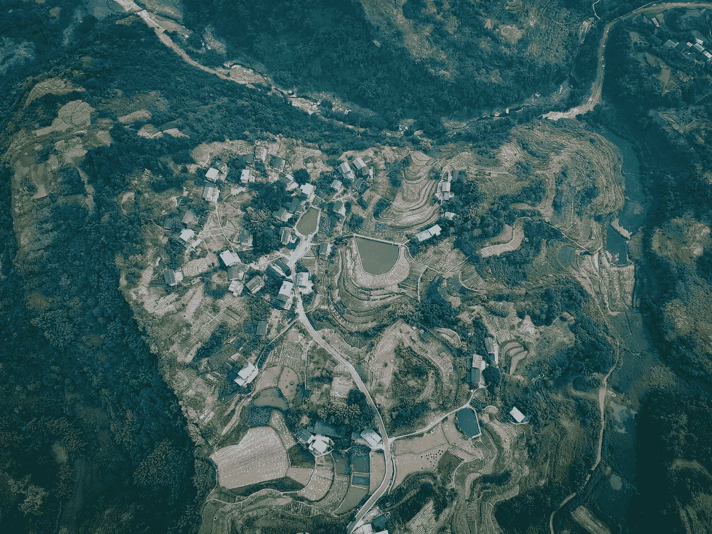

# 遥感:使用 Python 对卫星影像进行土地覆盖分类的深度学习

> 原文：<https://medium.com/geekculture/remote-sensing-deep-learning-for-land-cover-classification-of-satellite-imagery-using-python-6a7b4c4f570f?source=collection_archive---------0----------------------->

## 深度学习|遥感

## 使用 Python 对卫星影像进行土地覆盖分类的 3D-CNN 模型的详细说明和实现。

Photo by [Stewart Edward](https://unsplash.com/@stewartedward?utm_source=unsplash&utm_medium=referral&utm_content=creditCopyText) on [Unsplash](/?utm_source=unsplash&utm_medium=referral&utm_content=creditCopyText)