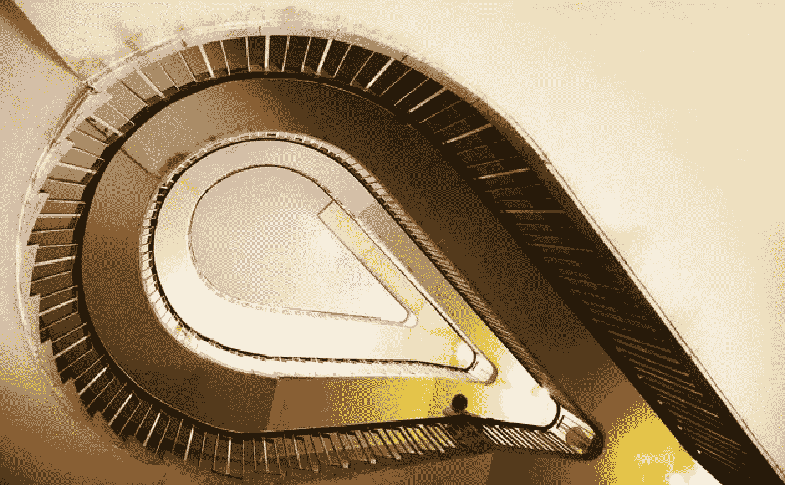
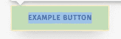
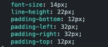
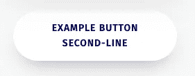
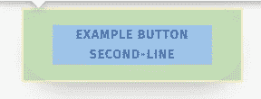
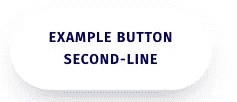
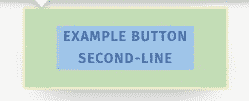

# 删除按钮中由换行符引起的多余空白

> 原文：<https://medium.com/geekculture/remove-extra-whitespace-caused-by-a-line-break-within-a-button-e7418f9de96e?source=collection_archive---------12----------------------->

—奇怪的断字 CSS👀

铁杵磨针 — — Success is built on hard work

创建一个按钮很简单，只需给它一个链接并添加一些文本来显示在按钮上，但是您遇到过这样的问题吗？如果按钮文本太长，需要显示在两行上，按钮的填充会由于文本的中断而自动改变，这会使按钮看起来不一致，这也会影响响应式元素。

这听起来很复杂，下面我用简单的截图来解释一下:

🧚首先，假设我们已经创建了一个简单的示例按钮，它包含一行如下所示的文本:

a simple button with one-line text

👉按钮 CSS 看起来像这样:

> 。按钮容器{
> 
> 背景色:…；
> 
> 边框半径:…；
> 
> 文本转换:…；
> 
> 文本对齐:…；
> 
> 填充:…；
> 
> …
> 
> }

👉如果我们检查按钮，我们可以看到它包含衬垫 **12px** 和 **32px** :

button with padding: 12px 32px

🧚现在，我们添加另一行按钮文本如下:

button with two-lines text

👉检查它，我们看到按钮填充保持不变，然而，空白被自动添加到文本的两侧，*是屏幕截图*中的蓝色区域，这使得按钮看起来更宽，文本更小:

whitespace caused by a line break

解决这个问题最简单的方法是添加👇

**断字:全断**

按钮容器中的 CSS 规则，结果如下:

removed whitespace around text

—*`***word-break***`*CSS 属性设置是否在文本溢出其内容框的地方出现换行符。**

*—*`***break-all***`**CSS 属性将在英语和其他相关语言系统中发生溢出的确切位置断开两个字符之间的单词。****

**就是这样！非常简单，希望这有所帮助👐，如果你对我的其他文章感兴趣，这里有一些链接:🧚‍♂️**

** [## 创建以反应方式嵌入的响应 iframe

### —令人惊讶的是，YouTube 没有相应的嵌入代码🦄，我们来玩 css 吧…

enlear .学院](https://enlear.academy/create-responsive-iframe-embed-in-a-react-way-f52075bf3b04)  [## 以反应方式隐藏和替换滚动时的粘性元素

### —棘手但有趣🍡

medium.com](/geekculture/hide-and-replace-sticky-element-on-scrolling-in-a-react-way-8bc3f04e2a81)  [## 使用会话存储来保持 React 组件中的状态

### 当页面会话结束时，sessionStorage 中的数据将被清除。

javascript.plainenglish.io](https://javascript.plainenglish.io/use-session-storage-to-persist-state-within-a-react-component-206867ef2269)  [## 让我们玩超链接吧

### 创建页面部分的链接很简单，但是如果你有一个固定的标题呢？

enlear .学院](https://enlear.academy/lets-play-with-hyperlinks-338d1be1f6d7)  [## 以反应方式创建分页

### 一个漂亮的分页怎么样？🧚‍♂️

javascript.plainenglish.io](https://javascript.plainenglish.io/create-a-pagination-in-a-react-way-df5c6fe1e0c7)  [## Css 技巧:给背景图片添加颜色和线性渐变

### —一个可以节省您时间的 css 技巧🦋

medium.com](/geekculture/css-trick-add-colour-and-linear-gradient-to-a-background-image-2dd0fe6125a8)  [## 如何防止 React 中嵌套

### 你熟悉这个错误吗？💻

javascript.plainenglish.io](https://javascript.plainenglish.io/prevent-validatedomnesting-button-descendant-error-21d9a34e5984)  [## 用 CSS 防止换行

### —reactcomponent🧚中的 css 技巧

medium.com](/geekculture/prevent-line-breaks-with-css-68a9f066db60)  [## 用对话框覆盖反应电子邮件验证

### —电子邮件验证有时令人头疼，🧊

medium.com](/geekculture/react-email-validation-with-dialog-overlay-472ee564d585)  [## 以反应的方式找到最近的位置

### —️地理定位 API

javascript.plainenglish.io](https://javascript.plainenglish.io/find-the-nearest-location-in-a-react-way-9ed51a999807)  [## 用 gatsby-source-filesystem 和 GraphQL 获取 JSON 数据

### 学习盖茨比第二步

javascript.plainenglish.io](https://javascript.plainenglish.io/sourcing-json-data-with-gatsby-source-filesystem-and-graphql-6fc7cef2a49e)  [## 边做边学——使用 Gatsby 创建您的第一个网站

### 一步一步来，是的。

javascript.plainenglish.io](https://javascript.plainenglish.io/learn-by-doing-use-gatsby-to-create-your-first-site-af7bfb7a8a6f)  [## 您可以使用的 5 个 React 钩子库

### 大三学生的建议——试一试。

javascript.plainenglish.io](https://javascript.plainenglish.io/5-react-hook-libraries-you-could-use-d7f13066ebba)  [## 从音乐到网络开发-我的道路

### 从一个交响乐团的音乐家到一个网页开发者。

javascript.plainenglish.io](https://javascript.plainenglish.io/from-music-to-web-development-my-junior-path-7421e0ddd65)**