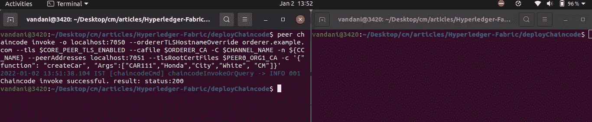
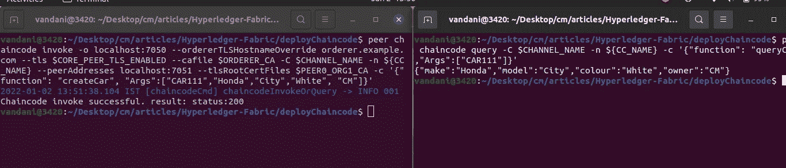
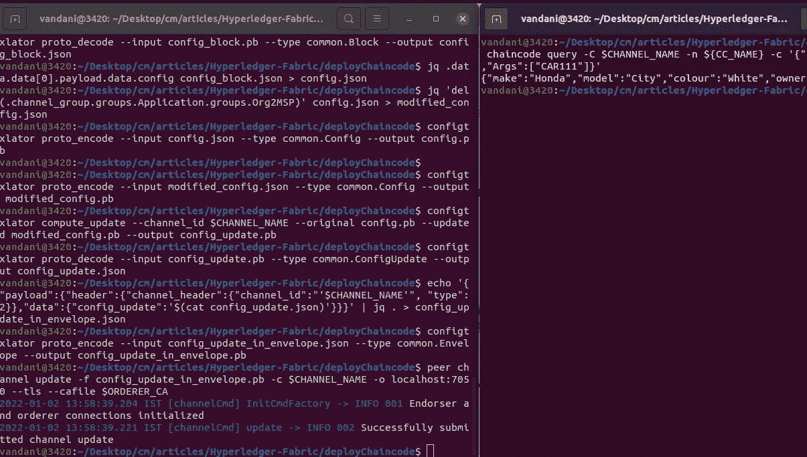
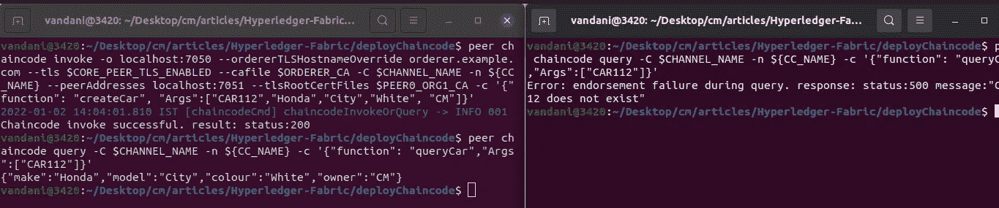

# 从运行 Hyperledger Fabric 区块链中删除组织

> 原文：<https://medium.com/geekculture/remove-org-from-running-hypeledger-fabric-blockchain-744bdd05511b?source=collection_archive---------7----------------------->


HLF

# 介绍

在本文中，我将演示如何从运行 Hyperledger fabric 网络中删除现有组织。

# 观众

Hyperledger 结构操作员，管理员。这是一篇从区块链网络中删除组织的实用实践文章。对于初学者，我想建议请通过一些基本概念的超帐织物。请访问[我以前的文章](/geekculture/hyperledger-fabric-blockchain-setup-from-scratch-21890e26aac7)，建立一个 HLF 网络。

> *注意:这篇文章不推荐给 HLF 初学者。*

# 先决条件

1.  对 **Hyperledger Fabric 区块链**的基本了解。
2.  基本了解 HLF CA，CouchDB。
3.  基本的外壳命令、外壳脚本等。

# 系统需求

1.  Docker —版本 17.06.2
2.  Docker Compose —版本 1.28.5 或更高版本
3.  Golang —版本 1.14
4.  Nodejs —版本 8
5.  Python 2.7

# 网络安装程序

*   具有 org1 和 org2 的 HLF 网络，每个都有 2 个对等体。
*   订购者群集(3 个订购服务节点)RAFT 作为一致算法(订购者、订购者 2、订购者 3)
*   组织 1、组织 2 和订购者的 CA
*   **CouchDB** 作为世界状态数据库。
*   面料最新版本 **2.3**

# 结构区块链设置

修改 hyperledger 结构网络非常复杂。如果结构网络已经在运行，那么您可以跳过这一步。

*   让我们克隆回购。

```
**git clone** [**https://github.com/cmjagtap/Hyperledger-Fabric**](https://github.com/cmjagtap/Hyperledger-Fabric)
```

*   执行以下命令。

```
**export PATH=${PWD}/bin:$PATH
sudo service docker start
 cd org1
./1_enrollOrg1AdminAndUsers.sh
./2_generateMSPOrg1.shcd ../org2** ./**1_enrollOrg2AdminAndUsers.sh** ./**2_generateMSPOrg2.sh 

 cd ../orderer** ./**1_enrollAdminAndMSP.sh
./2_artifact.sh

 cd ../org1**
.**/3_createChannel.sh

 cd ../org2**
.**/3_joinChannel.sh**
```

Hyperledger fabric 区块链 2.3 已准备就绪。

# 开始链码部署

在目录结构中，我们有***deployorg 1 _ go . sh***和 *deployOrg2_GO.sh* 执行它们。打开两个端子，一个用于 org1，另一个用于 org2。

```
**#from org1 terminal
./deployOrg1_GO.sh****#from org2 terminal
./deployOrg2_GO.sh**
```

*   成功部署后导出 org1 变量

```
export CHANNEL_NAME="mychannel"export CC_RUNTIME_LANGUAGE="golang"export CC_VERSION="1"export CC_SRC_PATH=../chaincodes/golangexport CC_NAME="fabcargo"export CC_SEQUENCE="1"export CORE_PEER_TLS_ENABLED=trueexport ORDERER_CA=${PWD}/../orderer/crypto-config-ca/ordererOrganizations/example.com/orderers/orderer.example.com/msp/tlscacerts/tlsca.example.com-cert.pemexport PEER0_ORG1_CA=${PWD}/../org1/crypto-config-ca/peerOrganizations/org1.example.com/peers/peer0.org1.example.com/tls/ca.crtexport FABRIC_CFG_PATH=${PWD}/../configexport CORE_PEER_LOCALMSPID="Org1MSP"export CORE_PEER_TLS_ROOTCERT_FILE=$PEER0_ORG1_CAexport CORE_PEER_MSPCONFIGPATH=${PWD}/../org1/crypto-config-ca/peerOrganizations/org1.example.com/users/Admin@org1.example.com/mspexport CORE_PEER_ADDRESS=localhost:7051
```

*   然后从 org1 添加新的汽车资产。

```
peer chaincode invoke -o localhost:7050 --ordererTLSHostnameOverride orderer.example.com --tls $CORE_PEER_TLS_ENABLED --cafile $ORDERER_CA -C $CHANNEL_NAME -n ${CC_NAME} --peerAddresses localhost:7051 --tlsRootCertFiles $PEER0_ORG1_CA -c '{"function": "createCar", "Args":["CAR111","Honda","City","White", "CM"]}'
```



*   将以下环境变量导出到第二个终端(org2)。

```
export CHANNEL_NAME="mychannel"export CC_RUNTIME_LANGUAGE="golang"export CC_VERSION="1"export CC_SRC_PATH=../chaincodes/golangexport CC_NAME="fabcargo"export CC_SEQUENCE="1"export CORE_PEER_TLS_ENABLED=trueexport ORDERER_CA=${PWD}/../orderer/crypto-config-ca/ordererOrganizations/example.com/orderers/orderer.example.com/msp/tlscacerts/tlsca.example.com-cert.pemexport PEER0_ORG2_CA=${PWD}/../org2/crypto-config-ca/peerOrganizations/org2.example.com/peers/peer0.org2.example.com/tls/ca.crtexport FABRIC_CFG_PATH=${PWD}/../configexport CORE_PEER_LOCALMSPID="Org2MSP"export CORE_PEER_TLS_ROOTCERT_FILE=$PEER0_ORG2_CAexport CORE_PEER_MSPCONFIGPATH=${PWD}/../org2/crypto-config-ca/peerOrganizations/org2.example.com/users/Admin@org2.example.com/mspexport CORE_PEER_ADDRESS=localhost:9051
```

让我们从 org2 查询

```
peer chaincode query -C $CHANNEL_NAME -n ${CC_NAME} -c '{"function": "queryCar","Args":["CAR111"]}'
```



这里，我们从 org1 添加资产，并从 org2 查询。

# 从网络中删除 Org2

让我们从网络中删除 org2，然后从 org2 执行相同的查询。

**步骤 1)** 从区块链获取通道配置块。

```
peer channel fetch config config_block.pb -o localhost:7050 -c $CHANNEL_NAME --tls --cafile $ORDERER_CA
```

**步骤 2)** 将 config 块协议缓冲文件转换为 JSON 格式，并将 config 块从***config _ block . JSON***剪切到 ***config.json***

```
configtxlator proto_decode **--**input config_block**.**pb **--**type common**.**Block **--**output config_block**.**jsonjq **.**data**.**data[0]**.**payload**.**data**.**config config_block**.**json **>** config**.**json
```

**步骤 3)** 将 config.json 复制到 modified_config.json，并从 **Application.groups** 中移除 **Org2MSP** 或者您可以使用下面的 ***jq*** 助手移除 Org2MSP。

```
jq 'del(.channel_group.groups.Application.groups.Org2MSP)' config.json > modified_config.json
```

**步骤 4)** 将 config.json 和 modified_config.json 文件转换到协议缓冲区，计算它们之间的 delta。

```
configtxlator proto_encode --input config.json --type common.Config --output config.pbconfigtxlator proto_encode --input modified_config.json --type common.Config --output modified_config.pb
```

**步骤 5)** 计算原始和修改后的 pb 文件之间的增量。

```
configtxlator compute_update --channel_id $CHANNEL_NAME --original config.pb --updated modified_config.pb --output config_update.pb
```

**步骤** **6** 将 *config_update.pb* 转换为 JSON 格式

```
configtxlator proto_decode --input config_update.pb --type common.ConfigUpdate --output config_update.json
```

**步骤 7)** 更新文件头以封装文件。

```
echo '{"payload":{"header":{"channel_header":{"channel_id":"'$CHANNEL_NAME'", "type":2}},"data":{"config_update":'$(cat config_update.json)'}}}' | jq . > config_update_in_envelope.json
```

**步骤 8)** 将 JSON 配置编码到协议缓冲区。

```
configtxlator proto_encode --input config_update_in_envelope.json --type common.Envelope --output config_update_in_envelope.pb
```

**步骤 10)** 根据渠道管理政策签署来自其他组织的信封。

```
peer channel signconfigtx -f config_update_in_envelope.pb
```

**步骤 11)** 向区块链提交渠道更新

```
peer channel update -f config_update_in_envelope.pb -c $CHANNEL_NAME -o localhost:7050 --tls --cafile $ORDERER_CA
```



从 org1 添加新的汽车资产，并从 org2 查询相同的汽车资产。

```
#from org1
peer chaincode invoke -o localhost:7050 --ordererTLSHostnameOverride orderer.example.com --tls $CORE_PEER_TLS_ENABLED --cafile $ORDERER_CA -C $CHANNEL_NAME -n ${CC_NAME} --peerAddresses localhost:7051 --tlsRootCertFiles $PEER0_ORG1_CA -c '{"function": "createCar", "Args":["CAR112","Honda","City","White", "CM"]}'#from org2
peer chaincode query -C $CHANNEL_NAME -n ${CC_NAME} -c '{"function": "queryCar","Args":["CAR112"]}'
```



*   在这里，我们可以看到，从 org2 中，我们无法查询到 **CAR112，**我们已经成功地从网络中删除了 org2。
*   移除 org2 容器和加密材料。

# 打扫

执行以下脚本来清理所有 docker 容器和加密材料。

```
.**/clean.sh**
```

# 摘要

我们已经看到，如何将组织从运行 hyperledger fabric 区块链网络(渠道)中删除。