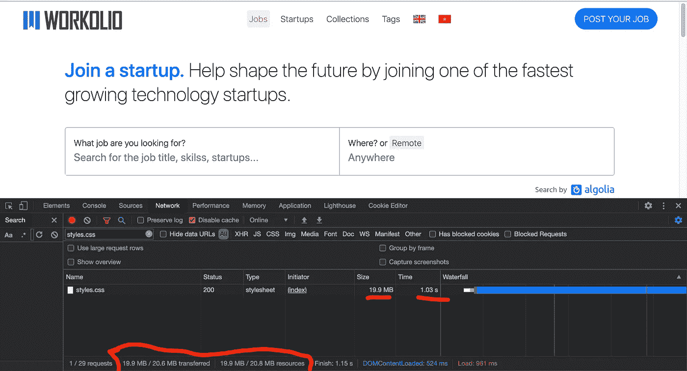
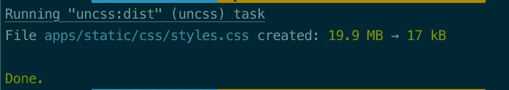
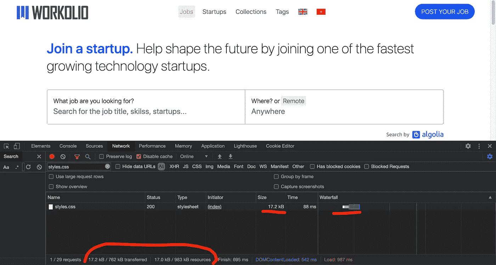
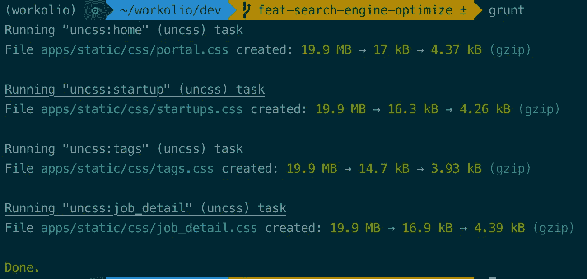
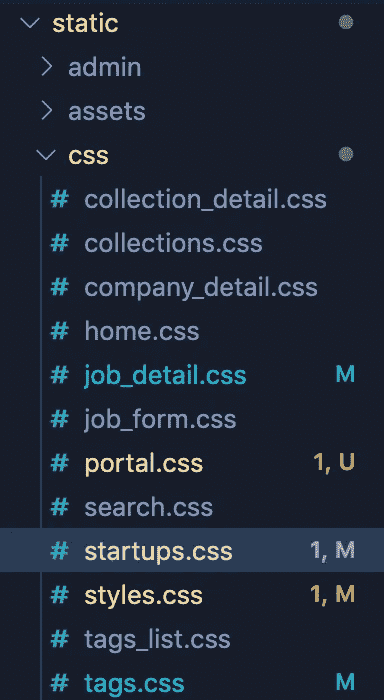

# 使用带有 UnCSS 插件的 Grunt 删除 Django 项目中未使用的 CSS

> 原文：<https://medium.com/geekculture/remove-unused-css-from-django-project-using-grunt-with-uncss-plugin-ede5e7e54d7d?source=collection_archive---------3----------------------->

速度对于一个网站来说是非常重要的。它如此重要，以至于谷歌把它变成了一个真正的排名因素。这就是为什么**的业绩**起着主要作用，还有一个术语叫做“ [**业绩**](https://addyosmani.com/blog/performance-budgets/#:~:text=A%20performance%20budget%20is%20a,any%20number%20of%20other%20metrics.) [**预算**](https://addyosmani.com/blog/performance-budgets/#:~:text=A%20performance%20budget%20is%20a,any%20number%20of%20other%20metrics.) ”

**长话短说:**我的一个客户雇了一个前端开发者，他用 TailwindCSS 做前端代码，拿了 20MB 的资源。这是一个疯狂的库，但我钦佩 TailwindCSS 是强大的 CSS 库之一。

有 webpack、rollup、parcel 和许多库来优化 JS、CSS 或现代 JS 中的任何资源。我也用光了。

但是这一次，我只需要一个简单的任务来从 Django 项目中移除未使用的 CSS。

我曾经尝试过 PostCSS，就像我在 CRA 应用程序中使用的那样，但不幸的是，这个插件并不完美。我遇到了设计问题，因为使用的 CSS 也被删除了。而且有时候，还是会发现没用的 CSS。当我在 CRA 上使用带有 PostCSS 插件的 TailwindCSS 时，效果非常好。

所以我决定尝试另一个名为 UnusedCSS 的插件，它是 PostCSS 的替代插件。为了运行这个插件，我使用 grunt，因为这只是一个简单的工作任务。

> 为什么 [**咕哝**](https://gruntjs.com/) ？
> **Grunt** 可以非常轻松地执行重复性任务，比如编译、单元测试、缩小文件、运行测试等。Grunt 包含了扩展插件和脚本功能的内置任务。**咕噜**的生态系统是巨大的；你可以轻而易举地实现任何事情的自动化。[https://www.tutorialspoint.com/grunt/grunt_overview.htm](https://www.tutorialspoint.com/grunt/grunt_overview.htm#:~:text=Why%20Use%20Grunt%3F,anything%20with%20very%20less%20effort)

# 1.先决条件网站

*   要安装的东西: [**Nodejs**](https://nodejs.dev/learn/introduction-to-nodejs) ， [**Grunt**](https://gruntjs.com/)
*   库使用: [**grunt-uncss**](https://github.com/uncss/grunt-uncss) ，[**grunt-contrib-cssmin**](https://github.com/gruntjs/grunt-contrib-cssmin)
*   操作系统:请注意，我的默认操作系统是 macOS，所以如果你有不同的操作系统，你可以跳过安装过程，谷歌如何在你的系统中安装依赖项。然后，您可以按照安装后的步骤。

# 2.装置

*   我们首先需要安装 NodeJS

```
$ brew install node 
$ node -v
v12.0.0
$ npm version
{
 npm: ‘6.9.0’,
....
```

*   **复制&运行 Package.json**

然后运行 **npm install** 来安装我们目录中的所有包。

```
npm install
```

*   **安装 grunt-cli 全局**
    我们需要将 grunt-cli 安装为全局，因为我们从终端运行 grunt 命令。

```
npm install -g grunt-cli
```

*   **更新。gitignore**

我们需要更新**。删除**并添加**节点模块**及其相关的所有模块。所以它不会超过我们的存储库。😆

```
node_modules
Gruntfile.js
package.json
package-lock.json
```

**注** NodeJS 仅用于开发阶段；我们不会在生产阶段使用它。

# 2.配置

创建一个名为“ **Gruntfile.js，**的文件，然后你可以复制这段代码并在 **src** 和 **dest 上做一些修改。**

*   **src:** 使用作为源输入，我们不能使用 HTML 文件的路径作为我们的源，因为它不是静态网页。所以我们需要运行本地服务器"**python manage . py runserver "**并放入我们想要优化的页面的 URL。
*   **dest:** 用于存储 UnCSS 的结果。
*   **选项** : **忽略样式表**用于忽略和不包括指定的样式表。谷歌字体或外部链接 CSS 的例子。
*   **选项** : **样式表**用于指定要处理的附加样式表。我们可以把主 CSS 文件路径放在这里，比如 boostrap.css，style.css 等等。如果你明白为什么我只导入 1 个 CSS 文件，一些插件已经包含在里面了。这就是 CSS 花费 19.9MB 原因
*   **nonnull:**必须为 true，否则 Grunt 会删除它在本地找不到的远程路径。

# 3.使用 grunt 和 UnCSS 插件删除未使用的 CSS

首先，我们需要确定网页的大小。因此，让我们在浏览器中打开 **localhost:8000**



正如我们所见，我们的 styles.css 大小是 **19.9MB** 。太疯狂了，对吧？！所以让我们把它变小吧！呃，不要误会我。😆

打开终端，输入:

```
grunt
```



我们可以看到**的 19.9M** B 变成了只有**的 17 kB。**太棒了。不是吗？让我们通过访问浏览器来检查这是不是真的，



耶！我们已经成功地把它变小了。现在，我们可以节省用户带宽和加载时间。

**有没有办法让它变得更小？是啊！**

我们实际上可以使用 **gzip 压缩**，因为 UnusedCSS 使用[**maxmin**](https://github.com/sindresorhus/maxmin)**来压缩**和**gzip**。****

**只需在代码中添加**report:【gzip】**，就会得到 **gzip-compressed，**的结果，比上一个小。**

****

**从 **19.9MB** 到 **17kB** 最后到 **4.37 kB。****

# **4.移除其他页面中未使用的 CSS**

**我们可能会想，如果我们有一些页面，每个页面有不同的 CSS，我们想更新所有的页面？**

**真的很简单。我们需要做这样的事情。**

****

**我的方法实际上是只导入网页需要的 CSS。所以每个网页都有自己的 CSS，只有在页面被访问的时候才会导入。所以我们可以通过这种方法来加快我们网站的速度。**

**你可以在下面看到这个方法的例子。**

****

> **注意:我还使用 [**预加载关键资产**](https://web.dev/preload-critical-assets/) **，** It 告诉浏览器尽快下载并缓存一个资源(比如脚本或样式表)。当您在加载页面后几秒钟就需要该资源，并且希望加快速度时，这很有帮助。[https://3perf.com/blog/link-rels/](https://3perf.com/blog/link-rels/)**

**那么下一步是什么？接下来我将分享如何优化**图片资产**以节省**加载时间**和**加速我们的网站！****

**希望这有帮助！请给我一些反馈！**