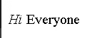
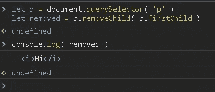
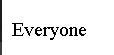
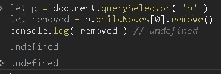
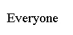

# JavaScript 中 removeChild()和 remove()的区别

> 原文：<https://medium.com/geekculture/removechild-and-remove-methods-in-javascript-4164325f97c9?source=collection_archive---------1----------------------->


在某些情况下，如果您希望检索子节点或者在某些情况下完全删除它，这些差异可以帮助您。

# RemoveChild 方法

移除子方法移除节点，你可以保存它以便再次使用，想象我们在 p 标签中有一个文本，像这样

```
<p> <i> Hi </i> Everyone </p>
```



Example p tag

你想把 Hi 拿走，留着以后用，你需要用这样的东西

```
let p = document.querySelector( 'p' )let removed = p.removeChild( p.firstChild )console.log( removed ) //<i>Hi</i>
```



Example removeChild method in JavaScript



Example p tag after removeChild method

# 移除方法

但是使用 remove 方法，你真的删除了子元素

```
let p = document.querySelector( 'p' )let removed = p.childNodes[0].remove()console.log( removed ) // undefined
```



Example remove method in JavaScript



Example of p tag after remove method

# 结论

removeChild 和 remove 是处理 DOM 元素的迷人方法，你可以完全删除它，也可以保留它，记住最后的结果是一样的，方法从 DOM 中删除元素。