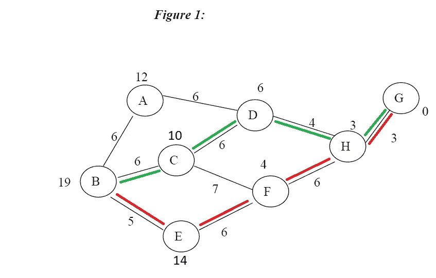

# 揭开算法的神秘面纱

> 原文：<https://medium.com/geekculture/removing-the-magic-veil-of-algorithms-e10216ea3099?source=collection_archive---------50----------------------->

## 理解算法的快速指南

“算法”这个词在媒体中经常被使用。毕竟，谷歌使用的是一种算法……还有 Twitter、Tinder、Instagram、Medium 等等。在电影和电视中，算法只由想要终结世界或拯救世界的超级天才创造。这可能会让人感到有些畏惧。

但是如果我告诉你一个算法不一定要像你想象的那么复杂呢？事实上，你可能在日常生活中使用某种形式的算法？

# 凯西…

简单地说，算法就是用来实现预期结果的一系列指令。这样想:你有没有在使用食谱的时候烹饪或烘焙过？或者用宜家的说明书组装一件家具？配方和说明实际上是算法。

# …凯达布拉！

就这样，面纱消失了。是的，就是这么简单。

# 算法的类型

说到计算机算法，我们可以将它们分为 6 种不同的类型:

1.  递归算法
2.  分治算法
3.  动态编程算法
4.  贪婪算法
5.  暴力算法
6.  回溯算法

让我们仔细看看其中的每一个:

## 递归算法

简而言之，递归算法是直接或间接调用自身的算法。例如，阶乘函数:

```
function factorial(n) {
   if(n == 1)
   {
      return 1;
   }
   else
   {
      return n * factorial(n ‑ 1);
   }
}
```

我们已经在循环中看到了另一个这样的例子！

```
let i = 0; i < a.length; i++
```

眼熟吗？这在每次迭代后调用自身，直到满足条件。

## 分治算法

这种马基雅维利式的方法已经在你的代码中广泛使用，你可能甚至不知道。JavaScript 的分治函数就是一个很好的例子。排序()

```
const array = [5,3,1,2,4]array.sort();
console.log(array);
// [1,2,3,4,5]
```

其工作方式是划分数组——从 5 和 3 开始——询问，5 是大于、小于还是等于 3？根据答案移动 5。它将数组分成更小的部分，然后将求解出的更小的部分放回一起。

## 动态编程算法

动态编程是一种将问题分解成更小的问题，并保存结果以备将来使用的技术。斐波那契数列就是一个很好的例子。

```
function fibonacci(num) {  
   if (num <= 1) return 1;   

   return fibonacci(num - 1) + fibonacci(num - 2);
}// => 2,3,5,8,13,21...
```

这看起来是不是有点眼熟？确实如此。那是因为这个函数也是递归的！动态编程主要是对普通递归的优化。每当我们看到递归解决方案重复调用相同的输入时，我们可以使用动态编程来优化它。

## 贪婪算法

贪婪算法接受一个问题，并在每一步做出局部最优选择(给定点的最佳解决方案),希望找到全局最佳解决方案。这是另一种解决问题的递归方法。以下面的例子为例，我们希望以尽可能小的阻力从节点 B 到达 G:



从上图可以看出，贪婪算法(red = 19)并不是可用的最佳路径。在这里，启发式解决方案(绿色= 18)实际上是最优的。有时候，贪婪算法甚至会让你离你要寻找的解决方案更远。

## 暴力算法

蛮力算法就像它们听起来的那样——解决问题的简单方法，依靠纯粹的计算能力和尝试每一种可能性，而不是先进的技术来提高效率。

例如，假设您忘记了银行帐户的 PIN。强力算法将从头开始，遍历所有可能的组合，直到找到正确的组合(0000，0001，0002，0003…等等)。代码示例如下所示:

```
function bruteForceSubstringSearch(text, pattern) {
    const lengthOfText = text.length;
    const lengthOfPattern = pattern.length;
    for (let i = 0; i < lengthOfText; i++) {
        let j;
        for (j = 0; j < lengthOfPattern; j++) {
            if (text.charAt(i + j) !== pattern.charAt(j)) {
                   break;
            }
        }
        if (j === lengthOfPattern) return i;
    }
    return lengthOfText;
}

bruteForceSubstringSearch('this is a test', 'test');
```

正如你在递归函数中使用递归函数所看到的那样，这些算法继续发挥作用，并相互依赖。

## 回溯算法

回溯是一种以增量方式寻找问题解决方案的技术。它通过一次解决一部分问题来递归地解决问题。如果其中一个解决方案失败了，我们就删除它，然后回溯寻找另一个解决方案。

例如，考虑解决一个数独难题需要什么:我们尝试一个接一个地填充数字，但每当我们发现当前数字不能导致解决方案时，我们就移除它(回溯)并尝试下一个数字。

```
// N is the size of the 2D matrix (N*N)
let N = 9;function solveSuduko(grid, row, col){
    if (row == N - 1 && col == N)
       return true;
    if (col == N){
       row++;
       col = 0;
    }
    if (grid[row][col] != 0)
       return solveSuduko(grid, row, col + 1); for(let num = 1; num < 10; num++){
       if (isSafe(grid, row, col, num)){
         grid[row][col] = num;
         if (solveSuduko(grid, row, col + 1))
            return true;
        }
        grid[row][col] = 0;
     }
  return false;
}
```

我希望这个简短的概述给你一个好的起点，让你在这些粗糙的算法水域中导航。永远记住，就像口头语言修辞一样，对于我们将面临的所有问题，没有一个放之四海而皆准的解决方案。为手头的工作使用最好的工具很重要。现在去施法吧，你们这些巫师！

编码快乐！