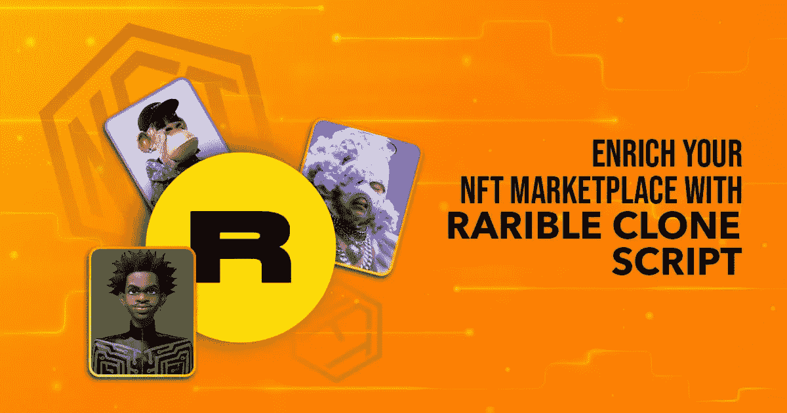

# 可盈利的平台和如何建立一个平台？

> 原文：<https://medium.com/geekculture/remunerative-rarible-platform-and-how-to-build-one-46bfcb331736?source=collection_archive---------13----------------------->

在本世纪初，拥有一个虚拟市场让人们可以买卖稀有的数字收藏品是不可想象的！

但是，它已经成为一项主流业务，人们正在投资数百万建立一个全面的在线平台来购买名为**不可替代代币** (NFTs)的数字艺术。

由于其独特性和稀有性，NFT 已经赢得了声誉并达到了惊人的高度。具体来说，NFT 可以是任何数字资产，如绘画、gif、音乐文件、艺术、游戏内或体育收藏品等。，是唯一的，不能重复。

NFT 是代表数字资产所有权和真实性的数字标识符。与数字货币不同，NFT 不能与其他 NFT 交易或交换，这使其独特而受欢迎。

一些读者可能知道在哪里可以买到 NFT，但很少有人对此一无所知。

所以，如果你不知道，继续阅读，了解哪里可以买到 NFTs。

# NFT 市场——买卖非关税壁垒的平台

NFT 可以在一个名为 **NFT 市场**的虚拟市场进行买卖。Opensea、Rarible、Solanart、币安等。，是一些著名的 NFT 市场。

NFT 市场包含所有的功能，如铸造，拍卖等。，要求将数字艺术转化为非数字艺术，并以更好的价格出售。

每个 NFT 市场都包含独特的功能& NFT 系列，使该平台更容易被不同的受众接受。例如，Rarible marketplace spotlight 功能包括信用卡支付、无汽油铸币、多钱包配置文件等。

对于初学者和专家来说，浏览 Rarible Clone 脚本很容易，因为它具有吸引人和用户友好的前端设计。有很多关于 Opensea 克隆脚本的文章，但是关于稀有的 NFT 平台的文章却很少。

所以，我决定在这个博客里整理稀有的 NFT 市场和稀有的克隆剧本。

让我们铸造吧！

# 关于稀有的 NFT 市场的重要事实

*   Rarible NFT 市场是少数几个初学者友好的平台之一，允许用户毫不费力地创造和交易他们的 NFT。
*   像，Opensea，也是基于以太坊区块链。它包含一个名为 **Rari** 的内置虚拟令牌。
*   许多全球品牌，如 **Adobe** 和 **Taco Bell** 与 Rarible 平台合作，以保护艺术家和创作者创作的数字艺术。
*   Rarible 在 2022 年初获得了约 1500 万美元的资金。
*   Rarible 的目标是成为一个 **DAO** (社区的力量)，尽管它最初是一个集中的平台。

接下来的部分揭示了初学者如何在 Rarible 平台上购买他们的第一个 NFT。请注意，所有 NFT 市场的注册程序几乎都是一样的，无论其性质是集中式还是分散式。

# Rarible 平台入门

以下是开始使用 Rarible marketplace 的逐步说明。

# 买家

*   给出必要的细节并与平台签约。
*   选择区块链铸造你的 NFT。
*   点击**创建**或选择收藏(用于多次铸造)。
*   输入吸引人的 NFT 或收藏名称，并给出详细描述。
*   如果需要，上传图片或其他媒体。
*   选择销售类型，如公开拍卖或固定价格。
*   选择版税类型。
*   最后，点击创建一个项目，并使用您的电子钱包进行交易。

# 塞勒斯

*   注册 Rarible 平台
*   将你的钱包与市场整合。
*   浏览并找到您想要购买的 NFT
*   如果 NFT 列表是固定类型，请点击**购买**并使用加密货币或信用卡/借记卡继续。
*   如果 NFT 已在竞价列表中，请点击“出价”并按照指示进行操作。

竞价拍卖过程就像一场比赛，出价高的人就是赢家。因此，明智地决定和放置您的出价。

祝你的 NFT 竞标成功！

你了解 Rarible 平台的基本情况吗？

如果是的话，让我们转到开始一个像 Rarible 这样的 NFT 平台的想法，以及它如何成为一个百万美元的生意。

# 稀有——像 NFT 市场——一个蓬勃发展的商业概念

根据 growjo 的数据，Rarible 的平均年收入是惊人的 2070 万美元。

难以置信，对吧？

你可能会问这样的问题，

NFT 的企业是如何产生这么多收入的？

***Rarible 的创收来源有哪些？诸如此类。***

为了澄清你所有的疑问，请继续阅读。

Rarible NFT 平台从许多内置收入流中产生收入，例如，它对每笔销售收取 2.5%的平台费，2021 年的交易额超过 1.09 亿美元。稀有的 NFT 平台的一些主要收入来源是

*   服务费— 5%(买方 2.5%，卖方 2.5%)。
*   交易费— 1%(针对买卖双方)。
*   NFT 推广费。
*   卖 Rari 代币的收入等等。

虽然建立一个稀有的平台需要巨大的投资和资源，但它肯定会给投资者带来巨大的回报。

随着这个平台的蓬勃发展，许多初创公司从这个回报丰厚的平台中找到了灵感，并开始以低得多的资本推出像 Rarible 这样的综合性 [NFT 市场。](https://maticz.com/rarible-clone-script)

如果你有兴趣投身于这个有回报的行业，你也可以在著名的稀有克隆脚本的帮助下，在短时间内推出一个 NFT 市场。

# 稀有克隆脚本-快速建立最好的 NFT 市场

Rarible 克隆脚本是一个完美的编码和现成的 NFT 市场脚本，有助于更快地开发和部署像 rari ble NFT 市场。

Best Rarible Clone Script in 2022

rarible clone 脚本包含原始 Rarible marketplace 的所有基本特性和功能。这是一个创新的 NFT 市场开发解决方案，旨在短期内建立一个功能丰富的 NFT 平台。此外，这款白色标签的 NFT 市场开发解决方案也非常便于携带。

一个稀有的克隆脚本必须包括吸引用户的功能，如惊人的前端显示，先进的 NFT 滤波器，多种铸造标准(ERC 721，ERC 1155 等)。)、NFT 促销包、独特的 NFT 拍卖流程、多支付网关等等。

一些领先的公司提供可定制的 Rarible 克隆脚本，允许用户根据 NFT 市场的要求修改特性。

尽管 NFT 和 Rarible 平台很受欢迎，但 Rarible 平台的成功因素主要取决于它们的独特性和通用性。

# 稀有的克隆剧本会给 2023 年的商业带来好处吗？

NFT 被认为是像金、银等一样有价值的资产。据统计，到 2027 年，全球 NFT 市场的收入将增长 27.26%。

特别是，稀有市场的固有货币 RARI 的价值预计到 2026 年将增长 300%。

因此，更明智的做法是将您的血汗钱投资于 NFT 市场的发展，它肯定会让您获得丰厚的回报。

投资者可以接触一家全球性的 NFT 市场开发公司，用其货币 Rarible 建立并推出一个无与伦比的 NFT 平台。

你可以在网上找到许多稀有的克隆脚本，但只有少数公司提供真正的稀有克隆脚本。因此，建议在做出任何可靠的决定之前选择一个免费的演示。

总之，如果你想在繁荣的 NFT 开始你的创业之旅，不要浪费时间，与领先的 NFT 市场开发公司合作。

祝你的创业之旅好运！