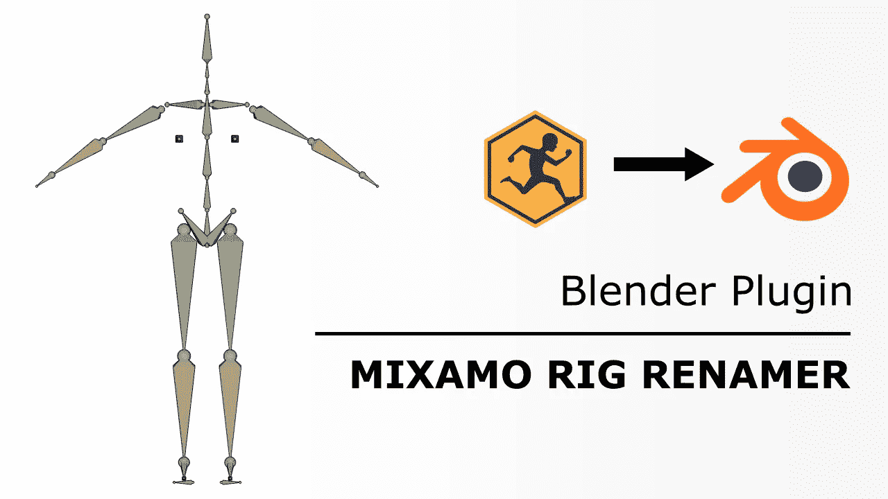

# 用 Blender 的 Python API 重命名 Mixamo 装备

> 原文：<https://medium.com/geekculture/renaming-mixamo-rigs-with-blenders-python-api-a0881fd566d5?source=collection_archive---------8----------------------->

## "等等——为什么这个 3D 甲胄在 Blender 中不能正常镜像？"

如果你像我一样，不知道如何制作一个角色的动画，那么你可能已经听说过 Adobe 的 Mixamo 平台和**的免费在线动画集**: