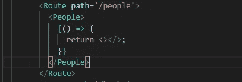
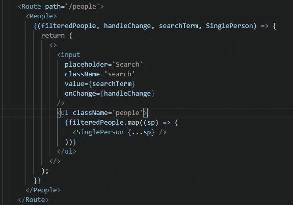
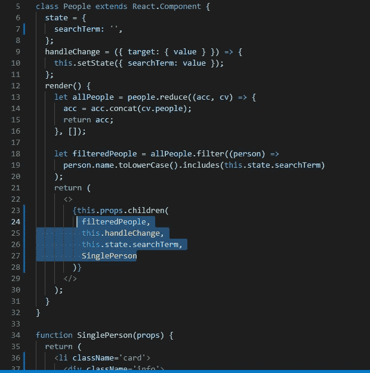

# 在反应堆中渲染道具。

> 原文：<https://medium.com/geekculture/render-props-in-reactjs-d672e3106bc1?source=collection_archive---------11----------------------->

# 什么是渲染道具？

> “渲染道具”一词指的是一种使用一个值为函数的道具在 React 组件之间共享代码的技术。

*   具有呈现属性的组件采用返回 React 元素并调用它的函数，而不是实现自己的呈现逻辑。
*   让我们看看渲染道具在 React 中是如何工作的。

# 步骤 1:-添加函数作为组件的子组件。

*   首先，添加空箭头函数作为组件调用的子组件。

adding empty arrow function.

*   现在添加 JSX，它将把 UI 呈现到空箭头函数的返回中。
*   我们编写 JSX 所需的数据和函数必须添加到参数中。

adding JSX and function parameters.

# 步骤 2:-向组件添加所有逻辑并传递逻辑。

*   现在转到具有所需逻辑的组件。
*   现在转到组件的 **render()** 方法。
*   现在我们可以使用“ **this.props.children()** ”调用我们在组件调用中编写的函数。
*   在上面的函数中，我们必须正确地传递所需的参数。
*   例如:- this.props.children(data，this.handleChange，OtherComponent)

Calling function inside Component.

> 这是在 React 中使用渲染道具的基本方法。

有关更多信息，请参考文档。:-"*"*