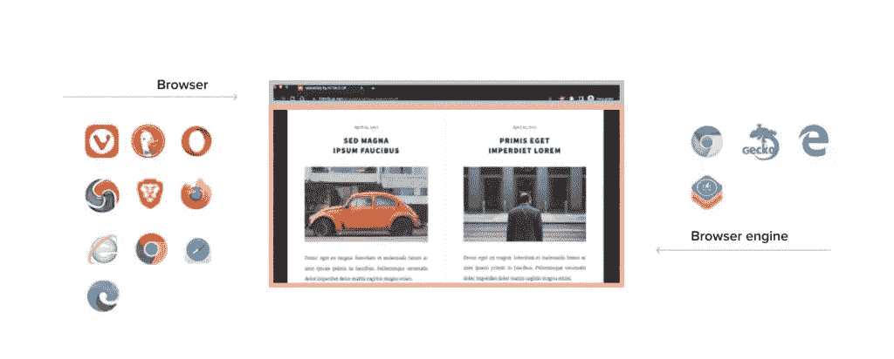
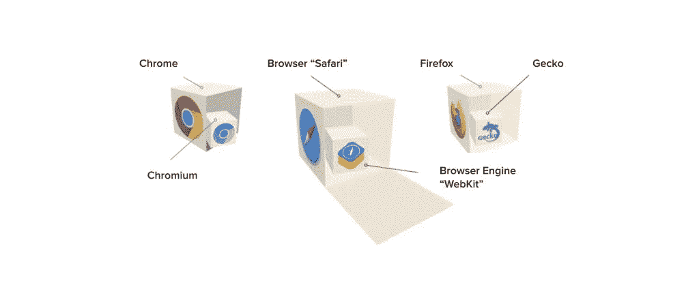
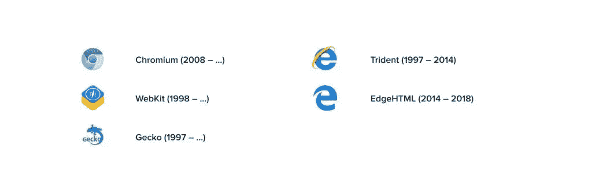
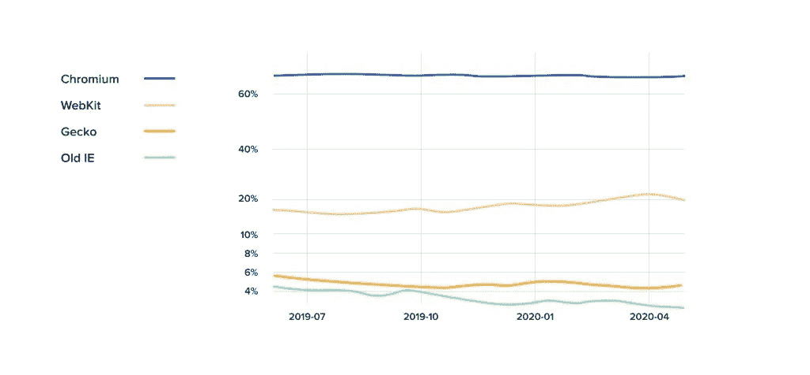
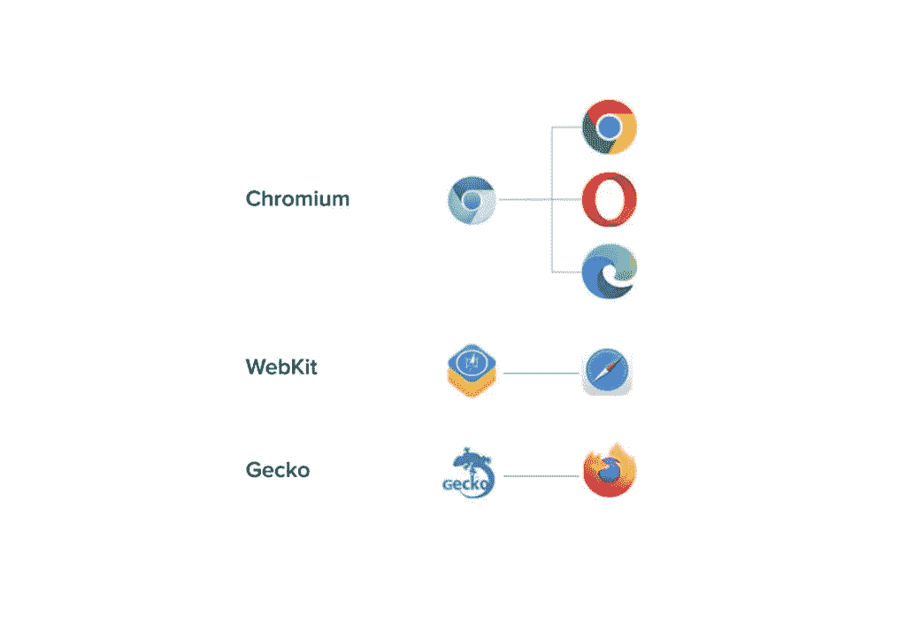
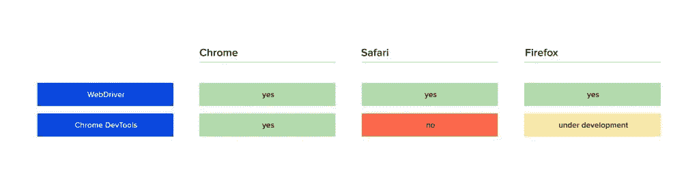
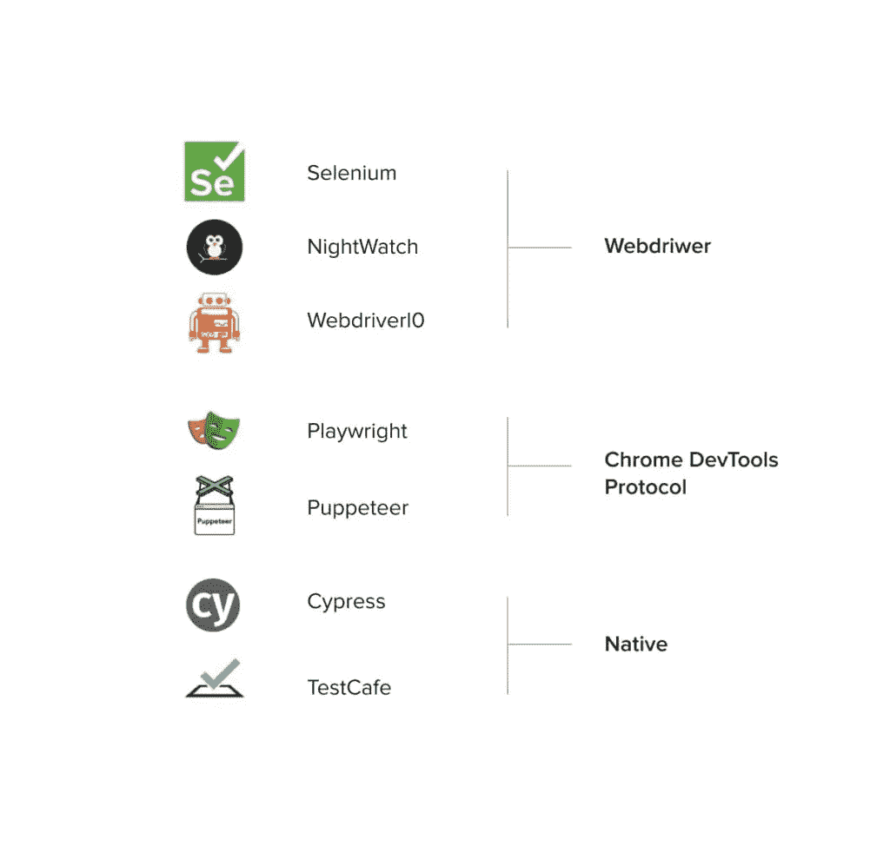

# 渲染引擎及其在自动化 Web 应用测试中的作用

> 原文：<https://medium.com/geekculture/rendering-engines-and-their-role-in-automated-web-app-testing-9d68f614fa2f?source=collection_archive---------16----------------------->

网络浏览器是允许用户访问、检索和查看万维网上的信息的应用软件。在当今的数字环境中，浏览器是企业获得客户的重要组成部分。此外，许多前台和后台应用程序已经从桌面迁移到基于 web 的界面。

然而，web 技术伴随着它们的挑战，所以能够测试它们是非常重要的。在本文中，我们将描述浏览器的渲染引擎以及它们在测试自动化中的作用。

# 什么是渲染引擎？

渲染引擎，也称为浏览器引擎或布局引擎，是每个主要 web 浏览器的基本软件组件。它巧妙地将结构和风格结合起来，在你的屏幕上绘制网页，并决定哪些部分是交互式的。换句话说，浏览器引擎将 HTML 文档转化为交互式的可视化表示。

在自动化 web 应用程序测试中，渲染引擎用于模拟浏览器如何显示 web 内容。它允许测试人员查看他们的 web 应用程序在不同的浏览器和设备上的外观和功能。

# 渲染引擎是如何工作的？

让我们看看浏览器窗口；从视觉上看，它由两个不同的元素组成。

第一个元素是用户界面(UI)，一个包含所有浏览器控件(URL 栏、左右箭头、书签)的标题。对于用户来说，这是最重要的事情之一，因为它将浏览器彼此区分开来。

虽然可能有五种领先的浏览器(Chrome、Safari、Microsoft Edge、Samsung Internet 和 Firefox)，但目前可用的浏览器总数超过 20 种。

第二个元素是渲染引擎，负责显示网页，也就是屏幕上的像素。它处理 CSS，JavaScript，HTML。只有五种浏览器引擎可用。

通过查看 Safari 浏览器，我们可以看到 WebKit 引擎在里面。Chrome 浏览器也有类似的情况——Chromium 在里面。如果我们研究 Firefox，我们会发现 Gecko 引擎为它提供了动力。

# 渲染引擎全球市场趋势

用于 web 浏览器的所有渲染引擎可以大致分为两个独立的组:

*   当今积极支持和开发的引擎(WebKit、Chromium、Gecko)；
*   不再维护或开发但在互联网上仍然常见的引擎(Trident，EdgeHTML)。

Trident 的第二次生命始于 2014 年，当时它被分叉成了 **EdgeHTML** 。然而，这一举措在 2018 年结束，当时微软决定改用 **Chromium** 浏览器平台。新 Edge 用的是铬，不是三叉戟。

目前有三个主要的网络浏览器引擎控制着大部分市场:Chromium、WebKit 和 Gecko。让我们来看看浏览器引擎的份额是如何随着时间的推移而变化的:

Chromium 是最受欢迎的一个，WebKit 紧随其后，略有增长。底部的绿条代表 IE，它在短短一年内失去了相当一部分全球观众。这一趋势预计将继续，这意味着 Chromium 和 WebKit 将在未来十年内主导渲染引擎的市场份额。

# 从测试自动化的角度看浏览器引擎

我们的 QA 团队在为软件开发项目提供[测试自动化服务](https://eleks.com/services/quality-assurance-and-testing-services/software-test-automation-services/?utm_source=medium&utm_medium=refferal&utm_campaign=Republ-browser_engines_labs)方面拥有丰富的经验，我们可以向您保证，没有人对让应用程序在旧引擎上工作感兴趣。让我们看看在我们的开发周期中我们更喜欢使用什么浏览器和引擎。

对于自动化的 web 应用测试，我们建议使用这三个浏览器引擎: **Chromium** 、 **WebKit** 和 **Gecko** 。

自 2020 年以来，有两种主要的测试协议:

*   **WebDriver 协议** —提供对浏览器 API 的访问，并允许在浏览器中管理用户操作，如打开页面、访问 DOM、点击、键入等。
*   **Chrome DevTools 协议** —提供对浏览器引擎 API 的访问，并帮助处理地理位置、权限、服务人员和网络等事宜。

WebDriver 是一个用于自动化基本用户操作的协议，但是如果您需要执行更多的渐进操作，您可能需要使用 Chrome DevTools 协议。不幸的是，这是一项新功能，目前并非所有浏览器都支持它:

Chrome 支持 Chrome DevTools 协议。Firefox 率先实现了 DevTools 协议，但这一计划仍在开发中。可惜 Safari 里没有 Chrome DevTools 协议。

综合考虑，这是目前市场上各种流行工具所使用的浏览器自动化协议的当前状态:

总而言之，测试引擎和测试浏览器不一样。我们知道渲染引擎允许我们测试更具体的用例。由于每种测试工具都有其优点和规则，测试工程师需要清楚地了解他们想要自动化哪些特性，以便为任务选择最合适的工具。

# 关键要点

为了构建一个可靠的测试项目，您需要了解需要什么类型的测试。例如，如果您需要一组快速测试来检查 UI 元素，那么只使用 WebDriver 协议就足够了。然而，如果需要测试更详尽的浏览器功能，就有必要用 DevTools 协议覆盖浏览器引擎。

所有浏览器最终都可能支持 DevTool 协议，给 WebDriver 世界带来稳定性；然而，事情仍在发展。

今天最流行的自动化 DevTools 协议的工具是木偶师和剧作家。这些工具不依赖于 Webdriver，通过 Chrome DevTools 协议直接与浏览器通信。这为他们提供了更好的控制，从而带来更稳定的测试。

您对如何简化您的 web 测试或 QA 流程有疑问吗？[联系我们的质量保证专家](https://eleks.com/contact-us/?utm_source=medium&utm_medium=refferal&utm_campaign=Republ-browser_engines_labs)。

*ELEKS 的测试自动化工程师 Oleksandr Chako。*

*原载于 2022 年 7 月 13 日 https://labs.eleks.com***。**