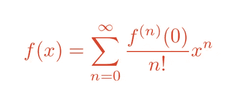

# 用 Python 渲染 Latex 公式

> 原文：<https://medium.com/geekculture/rendering-latex-formulas-in-python-122294c41b69?source=collection_archive---------6----------------------->

使用 generativepy 很容易。

在本文中，我们将看看使用 [generativepy](https://pythoninformer.com/generative-art/generativepy/) 将 Latex 公式渲染为 PNG 图像的最简单方法。

我们将使用`formula`模块的`rasterise_formula`函数。首先，我们将看看公式是如何定义的。

# 乳液