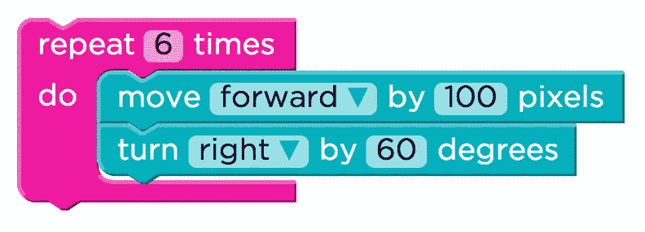

# 编程中的重复逻辑

> 原文：<https://medium.com/geekculture/repeating-logic-in-programming-4035ebf392d5?source=collection_archive---------43----------------------->



假设出现了将文本显示一百次的需要。一种非常痛苦的方法是写一百行代码来显示一百次。多亏了循环，不需要重复编写代码来完成这种重复的任务。

# while 循环

“while 循环”在语句中循环，直到条件变为假。

语法:

```
while(condition) {
    statement(s);
}
```

示例:

输出

```
I am looping 1 times
I am looping 2 times
I am looping 3 times
I am looping 4 times
I am looping 5 times
```

循环的条件写在“while”关键字后的括号内

```
while(i <= 5)
```

while 循环首先检查条件。如果条件为真，则执行语句，直到条件变为假。随着“I”的值在每个循环中递增，它最终变得大于 5，当这种情况发生时，条件变为假，循环将停止执行。

```
printf("I am looping %d times\n", i);
```

' \n '用于换行。反斜杠告诉计算机不要显示‘n ’,而是用它来表示换行符。如果没有换行，输出将在一行中连续显示。

# for 循环

在 while 循环代码中,“I”的值首先被初始化，并在循环块(花括号之间的代码)中递增。

在这种情况下，使用 For 循环更方便。它提供了一种更方便地初始化、给出条件和增加变量的方法。

语法:

```
for ( init; condition; increment ) {
   statement(s);
}
```

示例:

输出

```
I am looping 1 times
I am looping 2 times
I am looping 3 times
I am looping 4 times
I am looping 5 times
```

初始化、条件和增量都在“for”关键字后的括号中给出。

```
for (i = 1; i <= 5; i++)
```

这告诉计算机，用值 1 初始化“I ”,如果“i ≤ 5”则重复这些语句，并在每次循环中使“I”的值增加 1。

for 循环也首先检查条件，然后执行语句。

# do…while 循环

除了一点不同之外，它与 while 循环相同。前面的循环首先检查条件，然后执行语句。“do…while”循环执行语句，然后检查条件。

语法:

```
do {
   statement(s);
} while( condition );
```

示例:

输出:

```
I am looping 1 times
I am looping 2 times
I am looping 3 times
I am looping 4 times
I am looping 5 times
```

程序为 while 循环和 do…while 循环显示相同的输出。那么，实际上有什么区别呢？最初的检查条件和最后的检查条件是什么？

# while 循环和 do…while 循环的区别

不同之处在于，如果条件为假，while 循环将永远不会执行语句，但 do…while 循环将至少执行一次语句，即使条件为假，因为它首先执行，然后检查条件。

上面的程序不输出任何东西，因为当条件为假时，不执行“printf”语句。

输出

```
I am looping 1 times
```

看，即使条件为假，语句也只执行一次，因为条件在执行后被检查。这就是 while 循环和 do…while 循环的主要区别。

# 乘法表生成器程序

使用循环做的一件简单而有趣的事情是乘法表生成器。试试看。

输出

```
Enter a number to print it's multiplication table: 4
Enter the limit: 11
4 x 1 = 4
4 x 2 = 8
4 x 3 = 12
4 x 4 = 16
4 x 5 = 20
4 x 6 = 24
4 x 7 = 28
4 x 8 = 32
4 x 9 = 36
4 x 10 = 40
4 x 11 = 44
```

# 乘法生成器专业版

这是一个改进的乘法发生器。在这里，用户可以说出范围。例如，用户可以说他想打印从 1 到 5 的表，每个表的乘法运算一直到 11。

输出

```
Enter starting number and ending number(space seperated)4 7
Enter the limit: 10
4 x 1 = 4
4 x 2 = 8
4 x 3 = 12
4 x 4 = 16
4 x 5 = 20
4 x 6 = 24
4 x 7 = 28
4 x 8 = 32
4 x 9 = 36
4 x 10 = 405 x 1 = 5
5 x 2 = 10
5 x 3 = 15
5 x 4 = 20
5 x 5 = 25
5 x 6 = 30
5 x 7 = 35
5 x 8 = 40
5 x 9 = 45
5 x 10 = 506 x 1 = 6
6 x 2 = 12
6 x 3 = 18
6 x 4 = 24
6 x 5 = 30
6 x 6 = 36
6 x 7 = 42
6 x 8 = 48
6 x 9 = 54
6 x 10 = 607 x 1 = 7
7 x 2 = 14
7 x 3 = 21
7 x 4 = 28
7 x 5 = 35
7 x 6 = 42
7 x 7 = 49
7 x 8 = 56
7 x 9 = 63
7 x 10 = 70
```

想办法改善这一点。会很有趣的。

```
scanf("%d%d", &startNum, &endNum);
```

可以像这样连续获取多个输入。空格键也可以用来输入值。

```
for(i = startNum; i <= endNum; i++) {
        for (j = 1; j <= limit; j++) {
           printf("%d x %d = %d\n", i, j, i * j);
        }
        printf("\n");
    }
```

这里我们有一个 for 循环在另一个 for 循环中。这就是所谓的嵌套循环。

那是关于循环的。如果您一直在学习之前的教程，您可能会觉得编程很有趣。

是啊，它是。

[**Previous = >决策用开关语句**](/geekculture/decision-making-with-switch-statement-9dcfc2a71dfb)

[**Next = >数组—使用同一个变量存储多个项目。**](/geekculture/arrays-store-multiple-items-using-the-same-variable-7e2af6e2bdf)