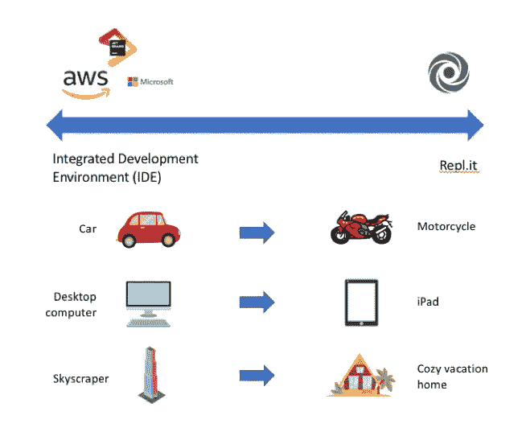
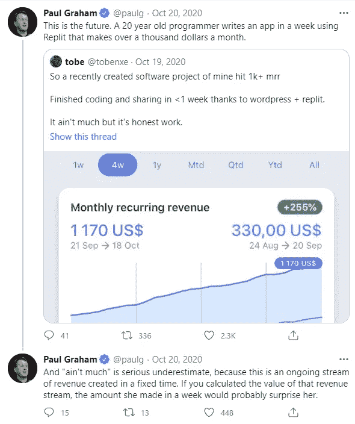
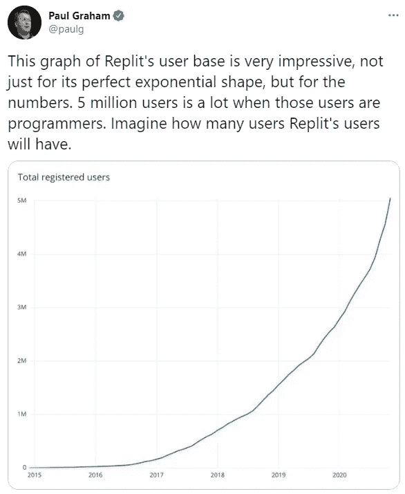
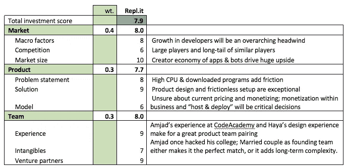

# Repl.it:授权全球编码

> 原文：<https://medium.com/geekculture/repl-it-empowering-the-globe-to-code-3c77b9ffe217?source=collection_archive---------7----------------------->

## [法典](http://medium.com/codex)

SpaceX 的 [Starlink](https://www.starlink.com/) 将通过一颗卫星将互联网延伸到全球。 [Chromebook](https://www.google.com/chromebook/) 将以低廉的价格将 CPU 送到数百万人手中。Repl.it 将为某人提供构建平台。

任何拥有这种基本技术的人都可以访问一个活跃的社区和一组资源，从世界任何地方学习编程。他们只需要一个浏览器。不下载。

现在，想象一下，如果用户开发了一个有用的应用程序/机器人，他们能够立即部署它，创造月收入。

**这就是 Repl.it 的力量**世界上任何一个有基本互联网连接的人都可以在浏览器内访问资源学习编程(50 多种语言)。在同一个工具中，用户可以构建、托管和部署。

Repl.it 通过连接和授权一个由狂热的创新者和合作者组成的全球社区，正在创造下一个潜在的编程创造者经济。

# 摘要

Repl.it 的名字来自一个常见的编程术语，叫做[读取-评估-打印循环](https://docs.repl.it/)。在其最基本的形式中，REPL 是一个交互式环境，程序员可以在其中提供输入，环境执行输入，并将结果输出给用户。这种循环允许快速和安全的实验和测试。

集成开发环境(IDE)将是最接近的比较，但是将 Repl.it 标记为 IDE 将是一个[错误。创始人 Amjad Masad 非常明确:Repl.it 不是构建大型软件的工具。在一封电子邮件交流中，Masad 说“我们将它视为一个全新的计算平台。”](http://amasad.me/replit_ide)

然而，Repl.it 作为学习编码和建立社区的工具引起了共鸣。正如 Masad 所解释的，如果你把 IDEs 和 Repl 看作是光谱的相反两端，那么 Repl.it 将与 [JetBrains](https://jetbrains.com) 、 [AWS Cloud 9](https://aws.amazon.com/cloud9/) 以及其他相对。简单地说，如果你的想法是汽车，回答是摩托车。

**Exhibit 1: IDE’s vs. REPLs**

在 Repl.it 中，您可以进行实验、学习、构建、托管和部署。虽然 Repl.it 在前三个方面非常出色，但后两个方面让它变得异常强大。有了基本级别的 CPU，世界上的任何人都可以利用社区进行创新，然后他们可以向公众托管和部署他们的应用程序/机器人。这是一个新的计算平台。

这种描述显然是有效的。2020 年 10 月 10 日，保罗·格拉厄姆(YCombinator legend)在推特上发布了一个预测:未来的年轻人将能够编写快速应用程序，并将其转化为一项业务。

Exhibit 2: @PaulG October 20th, 2020 [tweet](https://twitter.com/paulg/status/1318462546182025216?s=20)

然后在 2020 年 12 月 2 日，格雷厄姆在推特上发布了一张 Repl.it 注册用户的图表。Repl.it 的全球用户已经以指数方式增长到了 500 万。当我意识到 Repl.it 是一个令人惊叹的平台时，这条推文引起了一些点击:“想象一下 Replit 的用户会有多少用户。”抓住了这个平台的潜在爆发力。

Exhibit 3: @PaulG December 2nd, 2020 [tweet](https://twitter.com/amasad/status/1334189719186407424?s=20)

Repl.it 正在呈指数级增长，虽然它与 IDE 并不相互排斥，但在这个世界中，它会占据很大一部分市场。Masad 在跨越 IDE **(展示 4)** 中提到了这一点

> 事实证明这是一个不该问的问题。一个更好的问题是:“如果有人已经在一个在线 REPL 上学会了编码，并且它满足了他们的需求，那么他们为什么还要在本地投资呢？”因为他们是从 Repl.it 开始的，所以他们需要一个令人信服的理由来在本地安装 IDE，并且可能不得不投资购买更昂贵的设备(比如从 Chromebook 到 Mac)。
> 
> ——创始人阿姆贾德·马萨德在[跨越 IDE](http://amasad.me/leapfrog)

Repl.it 正在吸引学习型程序员，但是随着 Repl.it 变得越来越强大，许多用户想知道为什么他们会离开！

# 投资得分

Investment score estimation

总的来说，我把 Repl.it 排在很高的位置。我书中仅有的两个悬而未决的问题是:

1.  大型竞争对手之一(如亚马逊、谷歌)会尝试直接与 Repl.it 竞争吗？
2.  长期商业模式将如何形成？

全面来看，产品、团队等。坚如磐石，但这两个问题仍然有待回答，使 Repl.it 成为一个真正的全垒打！

# 结论

我真的相信它会很大。我觉得他们有很多 Slack 的属性。Repl.it 正在建立一个时髦的平台。就像 Salesforce 和 Slack 为人们建立了一个应用创新平台一样，我相信 Repl.it 也在为程序员建立同样的平台。学习、社区和较低的价格点将是切入点，但从长远来看，Repl.it 将向上游扩展功能(例如，更大规模的软件构建)，他们将随着其爆炸性的年轻用户群而扩展，为他们提供在应用和机器人市场以及企业内部赚钱的巨大机会。

# 附录:战斗卡备份

# 问题陈述

理解 IDE 和 REPL 之间的细微差别对于理解 Repl.it 正在解决的问题至关重要。目前，在三个类别中有许多可靠的 IDE 选项:

1.  特定于语言或操作系统的本地环境(例如 XCode、Android Studio)
2.  本地 IDE(例如，Microsoft Visual Studio、JetBrains)
3.  基于云的 IDE(例如，Amazon Cloud 9，JSFiddle)

特定于语言的 IDE 可能会有局限性。本地 IDE 需要大量下载才能开始。基于云的 IDE 缺少社区组件 Repl.it。当前的 IDE 都没有提供一个无摩擦的设置来加入像 Repl.it 这样的浏览器内学习程序员社区。

# 市场机会是什么？

IDE 市场中有许多大玩家(例如，Amazon、Apple、Microsoft、Google)，但是在直接 REPL 市场中，Repl.it 是明显的市场领导者。

## 增长驱动因素:

1.  **开发人员数量不断增加——**据 daxx.com[的](https://www.daxx.com/blog/development-trends/number-software-developers-world)报道，从 2018 年**(2390 万)**到 2030 年**(4500 万)**，软件开发人员的数量将大致翻一番。那是一个 **~6.5%** 的整体目标观众增长率。然而，对于 Repl.it 来说，他们的教育包以及可访问性很可能意味着**他们的潜在目标受众比严格意义上的“软件开发人员”要多得多**
2.  **远程/异地工作趋势—** Repl.it 的多人浏览器环境使其成为远程团队协作编程的绝佳资源。正如 Masad 提到的，Repl.it 与开发团队的 IDE 并不相互排斥。远程团队比以往任何时候都更需要像 Repl.it 这样的迭代团队工具。
3.  **应用程序的增长&机器人** —随着工具越来越复杂&环境的出现，企业继续寻找提高自动化的方法；iOS、Salesforce 等应用生态系统继续构建平台，为一次性应用/机器人的创建提供机会

## 挑战:

1.  **无代码工具—** 无代码工具的兴起可能会带来些许阻力。对编码的需求可能会减少像 GPT-3 这样的项目的长期性。短期内，像 Zapier 这样的工具可以为应用程序/机器人的创建提供一键替代。对 Repl.it 的生存威胁也不存在，但是无代码的显著增长可能会从 Repl.it 的潜在用户群中拿走一大块
2.  **来自大玩家的威胁——苹果、微软、亚马逊和谷歌都提供 IDE。Repl.it 和 IDE 并不相互排斥，但是 Repl.it 的成功可能会对大型玩家产生不利影响。如果他们从不尝试竞争，我会感到惊讶。**

# 这个市场有多大？

这个市场是巨大的。Repl.it 在一个充满挑战的领域发挥作用，因此对于 TAM，我们来看一下:

**注意:** Repl.it 提供了立即运行和托管应用的能力。这可能会极大地暴露他们的 TAM

## IDE 组件:

*   Market.us 估计**到 37 亿美元**并以 21%的速度增长**CAGR 到 2020 年将达到 45 亿美元**
*   微软 Visual Studio 是市场领导者，增长率为<25% (Source: 10-K; Assumption since aggregate is **~27%** ，Azure 为 **+50%** )
*   微软 Visual Studio 的专业基础包是初始许可【1,200 美元和每年**800 美元**(来源:网站和客户支持电话)
*   2018 年全球约 2400 万开发人员，2020 年约 2800 万(来源:[Daxx.com](https://www.daxx.com/blog/development-trends/number-software-developers-world))

使用微软作为对比表明，**2020 年 TAM 中 IDE 的最高端价格大约为 22–34B，**CAGR 大约为 15–20%。 Market.us 估计当前整个 IDE 市场只是自下而上分析所建议的 TAM 的一小部分。

## 非 IDE 市场

**开发商:**

*   2018 年全球约 2400 万开发人员，2020 年约 2800 万(来源:[Daxx.com](https://www.daxx.com/blog/development-trends/number-software-developers-world))
*   **~每月 5-7 美元**用于黑客计划(来源:Repl.it 网站)

**学历:**

*   **5660 万**中小学生(来源:[Educationdata.org](https://educationdata.org/k12-enrollment-statistics#:~:text=In%202019%2C%20approximately%2056.6%20million,school%20in%20the%20United%20States.&text=Among%20the%2050.8%20million%20students,1.4%20million%20were%20in%20prekindergarten))
*   平均每班 25 名学生(资料来源: [NCES](https://nces.ed.gov/surveys/sass/tables/sass1112_2013314_t1s_007.asp) )

自下而上的分析显示，TAM 要低得多，为**~ 1.8-2.4b 美元。**但是，这对于定价非常敏感。假设黑客和教育计划的价格极低，那么自下而上的分析至少会削弱 2-3 倍的实际市场规模，这是非常合理的。

**结论:**即使涨价，IDE 市场也比教育和个人市场大一个数量级。两者合计的潜在市场总额为**【25 亿美元+】T3。市场报告显示，实际市场只是自下而上分析所显示的一小部分(~ 15–20%)。为了实现规模化，Repl.it 将需要在更大的钱包(例如，企业)中找到自己的位置，他们目前正在通过他们的业务包(即将推出)接近这一目标。**

**注意:**此规模估算不包括小型应用的打包、托管和部署。这确实是他们的可寻址 TAM 可以不封顶和爆炸的地方。

*原载于*[*https://jeffburke.substack.com*](https://jeffburke.substack.com/p/replit-empowering-the-globe-to-code)*。*