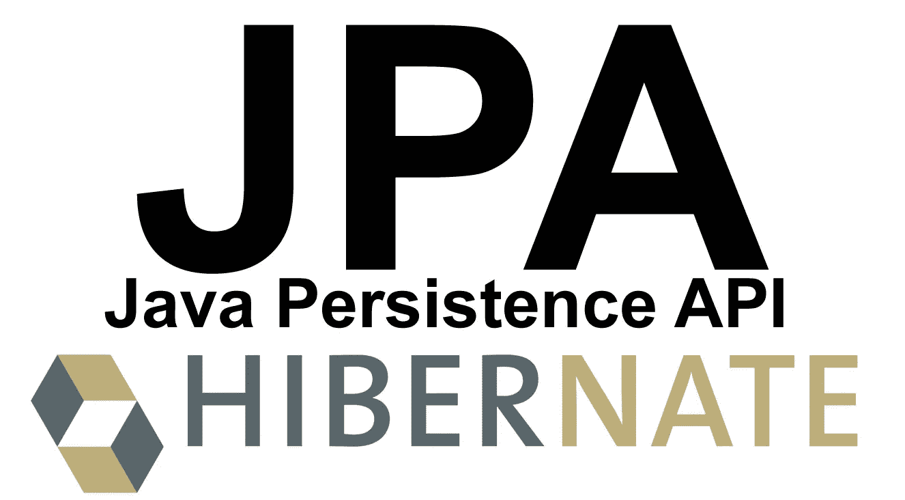

# 用 JPA 替换 JDBC

> 原文：<https://medium.com/geekculture/replace-jdbc-with-jpa-cc99dad48582?source=collection_archive---------5----------------------->

> 由于 JPA 更简单、更干净、更友好的实现，我的团队刚刚从 JDBC 迁移到 JPA。

如果您的应用程序连接到 Oracle、MySQL 和 PostgresSQL 等关系数据库，您可能会使用 JDBC 作为数据库模板。在本文中，我们将着眼于另一种选择— JPA (Java 持久性 API)。